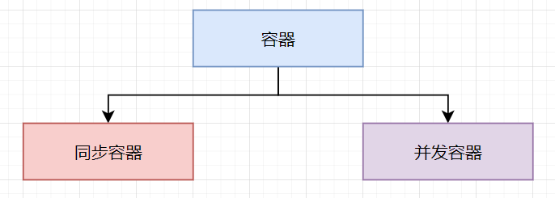

## 并发编程踩坑实录一：盘点JDK中同步容器的两大坑！！

**大家好，我是冰河~~**

关注【**冰河技术**】微信公众号，学习最牛逼的【[精通高并发系列](https://mp.weixin.qq.com/mp/appmsgalbum?__biz=Mzg4MjU0OTM1OA==&action=getalbum&album_id=1659019088070803460#wechat_redirect)】专栏。

说实话，在实际的工作过程中，我在使用JDK中的并发容器时，确实踩过不少坑。为了让小伙伴们更好的消化这些知识，今天，首先和小伙伴们分享下使用同步容器时需要注意哪些问题，后续再为大家分享使用并发容器时需要注意哪些问题，以便大家在实际工作过程中尽量少走弯路。

相信很多小伙伴都知道，并发编程一直都是一个难点，不仅仅是Java语言，其他编程语言也是如此。说它难，不只是并发编程需要我们掌握的知识点比较繁杂，包括：操作系统知识、系统调度知识、CPU、时间片、内存、同步、异步、锁、重排序、多线程、线程池、悲观锁、乐观锁等等一系列知识。

而且并发编程还可能会导致线上生产环境出现一系列的诡异问题，并且这些问题重现几率小，排查困难，需要深入理解并发编程的相关知识才能很好的解决遇到的问题。

如何更好的学习高并发编程，不用着急，关注【**冰河技术**】微信公众号，订阅【[精通高并发系列](https://mp.weixin.qq.com/mp/appmsgalbum?__biz=Mzg4MjU0OTM1OA==&action=getalbum&album_id=1659019088070803460#wechat_redirect)】就好啦，我们一起进阶，一起吃透高并发编程。

啰嗦了这么多，接下来，我们开始今天的主题，为大家分享下在使用JDK中的同步容器时，应该尽量避免哪些坑。

## 同步容器与并发容器

在JDK中，总体上可以将容器分为同步容器和并发容器。



**同步容器**一般指的是JDK1.5版本之前的线程安全的容器，同步容器有个最大的问题，就是性能差，容器中的所有方法都是用synchronized保证互斥，串行度太高。在JDK1.5之后提供了性能更高的线程安全的容器，我们称之为**并发容器**。

无论是同步容器还是并发容器，都可以将其分为四个大类，分别为：**List、Set、Map和Queue**，如下所示。


接下来，我们就简单聊聊使用JDK中的同步容器时，究竟要注意避免哪些坑。

## 同步容器的坑

在Java中，容器可以分为四大类：List、Set、Map和Queue，但是在这些容器中，有些容器并不是线程安全的，例如我们经常使用的ArrayList、HashSet、HashMap等等就不是线程安全的容器。

那么，根据我们在【[精通高并发系列](https://mp.weixin.qq.com/mp/appmsgalbum?__biz=Mzg4MjU0OTM1OA==&action=getalbum&album_id=1659019088070803460#wechat_redirect)】专栏学习的并发编程知识，**如何将一个不是线程安全的容器变成线程安全的呢？** 相信有很多小伙伴都能够想到一个办法，那就是把非线程安全的容器的方法都加上synchronized锁，使这些方法的访问都变成同步的。

没错，这确实是一种解决方案，例如，我们自定义一个 `CustomSafeHashMap`类，内部维护着一个`HashMap`，外界对`HashMap`的访问都加上了synchronized锁，以此来保证方法的原子性，例如下面的伪代码所示。

```java
public class CustomSafeHashMap<K, V>{
    private Map<K, V> innerMap = new HashMap<K, V>();
    public synchronized void put(K k, V v){
        innerMap.put(k, v);
    }
    
    public synchronized V get(K k){
        return innerMap.get(k);
    }
}
```

看到这里，一些小伙伴可能会想：**是不是所有的非线程安全的容器类都可以通过为方法添加synchronized锁来保证方法的原子性，从而使容器变得安全呢？**

是的，我们可以通过为非线程安全的容器方法添加synchronized锁来解决容器的线程安全问题。其实，在JDK中也是这么做的。例如，在JDK中提供了线程安全的List、Set和Map，它们都是通过synchronized锁保证线程安全的。

例如，我们可以通过如下方式创建线程安全的List、Set和Map。

```java
List list = Collections.synchronizedList(new ArrayList());
Set set = Collections.synchronizedSet(new HashSet());
Map map = Collections.synchronizedMap(new HashMap());
```

**那么，说了这么多，同步容器有哪些坑呢？**

### 坑一：竞态条件问题

在使用同步容器时需要注意的是，**在并发编程中，组合操作要时刻注意竞态条件**，例如下面的代码。

```java
public class CustomSafeHashMap<K, V>{
    private Map<K, V> innerMap = new HashMap<K, V>();
    public synchronized void put(K k, V v){
        innerMap.put(k, v);
    }
    
    public synchronized V get(K k){
        return innerMap.get(k);
    }
    
    public synchronized void putIfNotExists(K k, V v){
        if(!innerMap.containsKey(k)){
             innerMap.put(k, v);
        }
    }
}
```

其中，`putIfNotExists()`方法就包含组合操作，存在竞态条件。

**也就是说，在并发编程中，即使每个操作都能保证原子性，也不能保证组合操作的原子性。**

### 坑二：使用迭代器遍历容器

**一个容易被人忽略的坑就是使用迭代器遍历容器，对容器中的每个元素调用一个方法，这就存在了并发问题，这些组合操作不具备原子性。**

例如下面的代码，通过迭代器遍历同步List，对List集合中的每个元素调用format()方法。

```java
List list = Collections.synchronizedList(new ArrayList());
Iterator iterator = list.iterator(); 
while (iterator.hasNext()){
    format(iterator.next());
}
```

此时，会存在并发问题，这些组合操作并不具备原子性。

如何解决这个问题呢？一个很简单的方式就是锁住list集合，如下所示。

```java
List list = Collections.synchronizedList(new ArrayList());
synchronized(list){
    Iterator iterator = list.iterator(); 
    while (iterator.hasNext()){
         format(iterator.next()); 
    }
}
```

**这里，为何锁住list集合就能够解决并发问题呢？**

这是因为在Collections类中，其内部的包装类的公共方法锁住的对象是this，其实就是上面代码中的list，所以，我们对list加锁后，就能够保证线程的安全性了。

在Java中，同步容器一般都是基于synchronized锁实现的，有些是通过包装类实现的，例如List、Set、Map等。有些不是通过包装类实现的，例如Vector、Stack、HashTable等。

**对于这些容器的遍历操作，一定要为容器添加互斥锁保证整体的原子性。**

**好了，今天就到这儿吧，下期我们一起聊聊并发容器中的那些坑，我是冰河，我们下期见~~**

## 写在最后

> 如果你觉得冰河写的还不错，请微信搜索并关注「 **冰河技术** 」微信公众号，跟冰河学习高并发、分布式、微服务、大数据、互联网和云原生技术，「 **冰河技术** 」微信公众号更新了大量技术专题，每一篇技术文章干货满满！不少读者已经通过阅读「 **冰河技术** 」微信公众号文章，吊打面试官，成功跳槽到大厂；也有不少读者实现了技术上的飞跃，成为公司的技术骨干！如果你也想像他们一样提升自己的能力，实现技术能力的飞跃，进大厂，升职加薪，那就关注「 **冰河技术** 」微信公众号吧，每天更新超硬核技术干货，让你对如何提升技术能力不再迷茫！


