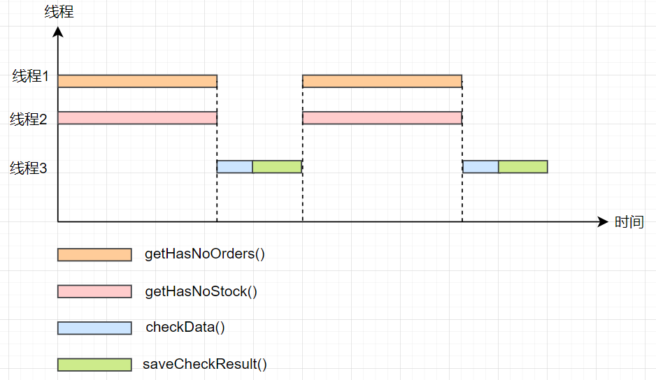
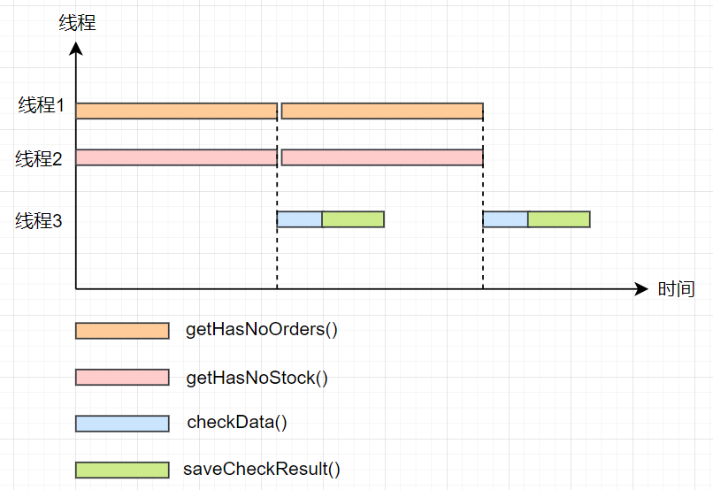
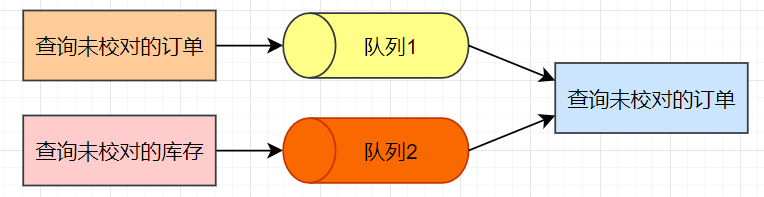

## 进一步优化：性能提升了200%！

**大家好，我是冰河~~**

在【[精通高并发系列](https://mp.weixin.qq.com/mp/appmsgalbum?__biz=Mzg4MjU0OTM1OA==&action=getalbum&album_id=1659019088070803460&scene=173&from_msgid=2247494832&from_itemidx=1&count=3&nolastread=1#wechat_redirect)】的《[性能提升了200%！（优化篇）](https://mp.weixin.qq.com/s?__biz=Mzg4MjU0OTM1OA==&mid=2247494832&idx=1&sn=a2ce25f76cfaaf3c26354af226fd26c3&chksm=cf565bb1f821d2a72dad4b9bf49a6f1b449794bdefde0fc9de5b78a4df6b9d743e347fe9993e&token=309533234&lang=zh_CN#rd)》一文中，我们主要使用了CountDownLatch这个类来优化程序的性能。在文章发表后收到很多读者的私信：为啥不用CompletableFuture呢？看到这些私信留言，其实我心里还是挺高兴的，说明小伙伴们真的看进去了，也在思考。

其实，小伙伴们说的CompletableFuture能够实现程序的优化效果，甚至比CountDownLatch这个类实现的效果更好，那为啥冰河先使用CountDownLatch这个类呢？为的就是让小伙伴们能够知道，在Java类库中有很多实用的并发编程类库，能够有效地帮助我们提升高并发环境下的系统性能。

系统的性能优化不是一蹴而就的，后续这几篇文章的安排也不是一上来就把最佳的优化方案写出来，而是想从头开始，一步步调优系统性能，最终得出一个相对来说比较完美的解决方案。还是那句话：**重在思路，落地的方案只是思路的呈现结果。**

**好啦，开始今天的正文~~**

## 前文回顾

在《[性能提升了200%！（优化篇）](https://mp.weixin.qq.com/s?__biz=Mzg4MjU0OTM1OA==&mid=2247494832&idx=1&sn=a2ce25f76cfaaf3c26354af226fd26c3&chksm=cf565bb1f821d2a72dad4b9bf49a6f1b449794bdefde0fc9de5b78a4df6b9d743e347fe9993e&token=309533234&lang=zh_CN#rd)》一文中，我们主要使用了CountDownLatch这个类来优化程序的性能，在文末提出了一个思考题：**其实，上面的代码不是最优的，你有更好的优化方法吗？** 很多小伙伴的私信其实或多或少的说出了一些方案，但是没说到真正的点子上。

这里，再向小伙伴们提出一个疑问：如果我们不使用CountDownLatch和CompletableFuture，让你对前文的程序进行优化，你有思路吗？

其实思路也很简单：最直接的方式就是创建一个计数器，将计数器的初始值设置为2，当子线程1执行完` hasNoOrders = getHasNoOrders();` 这行代码时，将计数器的值减1，当子线程2执行完 `hasNoStock = getHasNoStock();` 这行代码时，将计数器的值减1。在主线程中，等待计数器的值减为0，然后执行后续的业务操作。

CountDownLatch类的总体思路也是这样，小伙伴们可以根据这个思路自行实现程序性能的优化，我就不再这里絮叨啦。

## 能否进一步优化？

我们先来看看之前程序的优化效果图。



通过仔细的分析，我们就会发现：虽然`getHasNoOrders()`和`getHasNoStock()`这两个方法实现了并行操作，但是`getHasNoOrders()`方法和`getHasNoStock()`方法和`checkData()`方法与`saveCheckResult()`方法之间还是串行的，如果能够让他们之间的操作并行化，那么系统的性能就可以得到进一步提升了。如下图所示。




如何实现上图所示的优化呢？接下来，我们先说说进一步优化的总体思路。

## 进一步优化思路

查询未校对的订单方法`getHasNoOrders()`和查询未校对的库存方法`getHasNoStock()`能够并行执行，校对数据的方法 `checkData()`还要依赖`getHasNoOrders()`方法和`getHasNoStock()`方法的结果，很明显可以使用CompletableFuture来优化，那除了CompletableFuture还有其他的方式吗？今天，我们先不讲CompletableFuture，先来看看其他的优化方式。

大家认真思考下，上述的场景中，一个方法的执行需要等待另外两个方法的执行结果，是不是有点生产者-消费者的意思呢？

有些小伙伴可能会说：这哪是生产者和消费者模型啊？我们仔细想一下：两次查询未校对的数据就是生产者，校对数据的操作是消费者。

我们可以使用队列来保存生产者生产的数据，而消费者就从这个队列中消费数据。

由于查询未校对的订单方法`getHasNoOrders()`和查询未校对的库存方法`getHasNoStock()`是在两个不同的线程中执行的，这里，在具体实现时，我们可以使用两个队列分别保存未校对的订单数据和未校对的库存数据，校对数据的操作每次从队列1中取出未校对的订单数据，从队列2中取出未校对的库存数据，然后再执行数据的校对操作。



接下来，我们再思考一个问题：**就是如何使用两个队列实现完全的并行化。**

一个简单的方案就是在线程1中执行查询未校对订单的数据，在线程2中执行查询未校对库存的数据，当线程1和线程2分别生产完一条数据时，通知线程3执行数据的校对操作。这里，有个关键的点就是线程1和线程2的执行步调要一致，不能一个线程执行的太快，一个线程执行的太慢。

很显然，**线程1和线程2之间会存在相互等待的现象**，说到这里，小伙伴们是不是就有解决方案啦？

**我们先来说说优化的总体思路吧：** 首先，进一步优化存在两个难点：一个是线程1和线程2执行的步调要一致，另外就是线程1和线程2中每次方法执行完毕后，要通知线程3执行数据校对操作。

我们也可以使用计数器的方式实现，计数器的初始值为2，线程1执行完`getHasNoOrders()`方法时，对计数器减1，线程2执行完`getHasNoStock()`方法时，对计数器减1。如果计数器的值大于0时，则线程1等待或者线程2等待。如果计数器的值等于0，则通知线程3执行数据校对操作，并重新唤醒等待中的线程1或者线程2。同时，需要我们将计数器的值重新设置为2，以此往复实现程序的优化效果。

有小伙伴可能会说：这也太麻烦了吧！哈哈，自己实现确实挺麻烦的，不过Java并发类库中为我们准备好了一个实现上述场景的类——没错，可以使用Java并发类库中的 **CyclicBarrier** 类实现。

## 使用CyclicBarrier进一步优化

使用CyclicBarrier进一步优化的具体方案就是：首先创建一个计数器初始值为2的CyclicBarrier对象，在构造方法中传入一个回调函数，在回调函数中执行数据的校对操作，当计数器的值减为0时，就会执行这个回调函数。

在线程1中执行完`getHasNoOrders()`方法并将结果放入队列1后，执行`barrier.await()`将计数器减1，同时等待计数器的值减为0。在线程2中执行完`getHasNoStock()`方法并将结果放入队列2后，执行`barrier.await()`将计数器减1，同时等待计数器的值减为0。

当计数器的值减为0时，线程1和线程2继续向下执行，同时会调用回调函数来执行数据的校对操作。

不仅如此，CyclicBarrier类还能够自动重置计数器的值，当计数器的值减为0时，它又会被自动重置为初始值，这个功能使用起来也很方便。

接下来，我们看一下使用CyclicBarrier类优化后的核心伪代码，如下所示。

```java
// 订单队列
Vector<Order> orderQueue;
// 库存队列
Vector<Stock> stockQueue;
//创建查询未校对订单和未校对库存的线程池
Executor executor =  Executors.newFixedThreadPool(2);
//执行数据校对的线程池
Executor checkExecutor =  Executors.newFixedThreadPool(1);

final CyclicBarrier barrier =
    new CyclicBarrier(2, ()->{
        executor.execute(() -> checkDataAndSaveResult());
    });

void checkDataAndSaveResult(){
    Order o = orderQueue.remove(0);
    Stock s = stockQueue.remove(0);
     //校对数据并返回结果
    checkResult = checkData(o, a);
     //将结果信息保存到数据校对信息表中
    saveCheckResult(checkResult);
}

void checkAllOrdersAndStock(){
    //检测是否存在未对账订单
    checkOrders = checkOrders();
    while(checkOrders != null){
        executor.execute(()->{
            //查询未校对的订单信息
            hasNoOrders = getHasNoOrders();
            orderQueue.add(hasNoOrders);
            barrier.await();
        });
        executor.execute(()->{
           //查询未校对的库存记录
           hasNoStock = getHasNoStock();
           stockQueue.add(hasNoStock);
           barrier.await();
        });
    }
}
```

至此，整个程序的优化操作就完成了。

## 总结

在整个程序的优化过程中，我们开始使用了CountDownLatch优化程序，后面又使用了CyclicBarrier优化程序。它两个的区别就是：

* CountDownLatch主要的使用场景就是一个线程等待多个线程执行完毕后再执行；而CyclicBarrier主要的使用场景为多个线程相互等待。
* CountDownLatch的计数器减为0时，无法进行重置，不可复用；而CyclicBarrier的计数器减为0时，可以自动将计数器的值重置为初始值，可以复用。
* CountDownLatch无法设置回调函数；而CyclicBarrier可以设置回调函数，当计数器的值减为0时，可以自动执行回调函数的逻辑。

**好了，今天就到这儿吧，我是冰河，我们下期见~~**

## 写在最后

> 如果你觉得冰河写的还不错，请微信搜索并关注「 **冰河技术** 」微信公众号，跟冰河学习高并发、分布式、微服务、大数据、互联网和云原生技术，「 **冰河技术** 」微信公众号更新了大量技术专题，每一篇技术文章干货满满！不少读者已经通过阅读「 **冰河技术** 」微信公众号文章，吊打面试官，成功跳槽到大厂；也有不少读者实现了技术上的飞跃，成为公司的技术骨干！如果你也想像他们一样提升自己的能力，实现技术能力的飞跃，进大厂，升职加薪，那就关注「 **冰河技术** 」微信公众号吧，每天更新超硬核技术干货，让你对如何提升技术能力不再迷茫！


