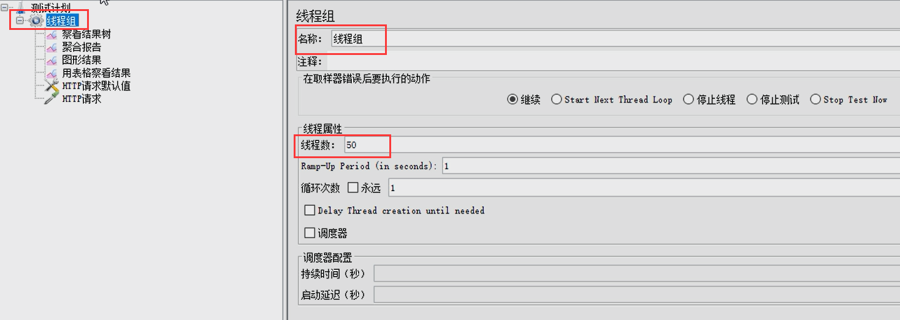
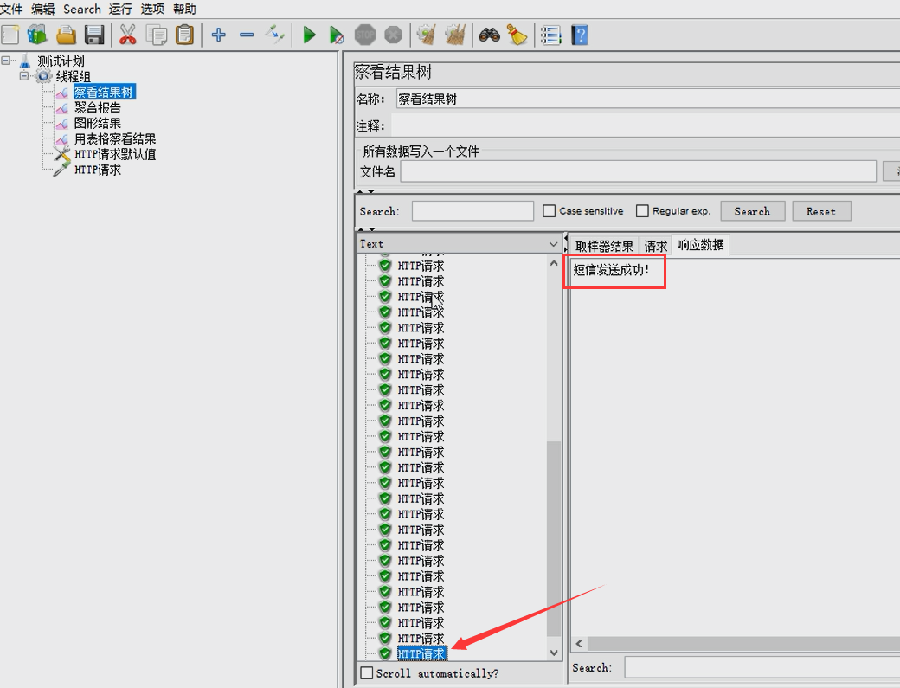

## 【高并发】亿级流量场景下如何实现分布式限流？看完我彻底懂了！！

## 写在前面

> 在互联网应用中，高并发系统会面临一个重大的挑战，那就是大量流高并发访问，比如：天猫的双十一、京东618、秒杀、抢购促销等，这些都是典型的大流量高并发场景。关于秒杀，小伙伴们可以参见我的另一篇文章《[【高并发】高并发秒杀系统架构解密，不是所有的秒杀都是秒杀！](https://mp.weixin.qq.com/s?__biz=Mzg3MzE1NTIzNA==&mid=2247484357&idx=1&sn=23e6e38143704db0fa4588186b534e13&chksm=cee51c08f992951e5b883c55b788588f9cbc822e41694b5b4a334ea5d2dc0ae62a5d64e39dc2&token=1388808518&lang=zh_CN#rd)》
>
> 关于【冰河技术】微信公众号，解锁更多【高并发】专题文章。
>
> 注意：由于原文篇幅比较长，所以被拆分为：理论、算法、实战（HTTP接口实战+分布式限流实战）三大部分。
>
> 理论篇：《[【高并发】如何实现亿级流量下的分布式限流？这些理论你必须掌握！！](https://mp.weixin.qq.com/s?__biz=Mzg3MzE1NTIzNA==&mid=2247485706&idx=1&sn=c7d71c0c6b9b15c3b330766f1083e29c&chksm=cee516c7f9929fd170ce636a63fc3764d5ef62eb7ef67a7601664d3d56b0d04c8759e666bc87&token=378924601&lang=zh_CN#rd)》
>
> 算法篇：《[【高并发】如何实现亿级流量下的分布式限流？这些算法你必须掌握！！](https://mp.weixin.qq.com/s?__biz=Mzg3MzE1NTIzNA==&mid=2247485719&idx=1&sn=8659791a07a55ae4b646679846d0264f&chksm=cee516daf9929fcc33961276715980832d0b2d875cf563121052592141f132dfa31bbd669ebf&token=378924601&lang=zh_CN#rd)》
>
> 项目源码已提交到github：https://github.com/sunshinelyz/mykit-ratelimiter

本文是在《[【高并发】亿级流量场景下如何为HTTP接口限流？看完我懂了！！](https://mp.weixin.qq.com/s?__biz=Mzg3MzE1NTIzNA==&mid=2247485730&idx=1&sn=dd48c84389aae92f0126f1c815f71d20&chksm=cee516eff9929ff932ae3d53928e227492afff5149b34351e2060e0b4d7d6124063cacb52799&token=430998188&lang=zh_CN#rd)》一文的基础上进行实现，有关项目的搭建可参见《[【高并发】亿级流量场景下如何为HTTP接口限流？看完我懂了！！](https://mp.weixin.qq.com/s?__biz=Mzg3MzE1NTIzNA==&mid=2247485730&idx=1&sn=dd48c84389aae92f0126f1c815f71d20&chksm=cee516eff9929ff932ae3d53928e227492afff5149b34351e2060e0b4d7d6124063cacb52799&token=430998188&lang=zh_CN#rd)》一文的内容。小伙伴们可以关注【冰河技术】微信公众号来阅读上述文章。

前面介绍的限流方案有一个缺陷就是：它不是全局的，不是分布式的，无法很好的应对分布式场景下的大流量冲击。那么，接下来，我们就介绍下如何实现亿级流量下的分布式限流。

分布式限流的关键就是需要将限流服务做成全局的，统一的。可以采用Redis+Lua技术实现，通过这种技术可以实现高并发和高性能的限流。

Lua是一种轻量小巧的脚本编程语言，用标准的C语言编写的开源脚本，其设计的目的是为了嵌入到应用程序中，为应用程序提供灵活的扩展和定制功能。

## Redis+Lua脚本实现分布式限流思路

我们可以使用Redia+Lua脚本的方式来对我们的分布式系统进行统一的全局限流，Redis+Lua实现的Lua脚本：

```lua
local key = KEYS[1]  --限流KEY(一秒一个)
local limit = tonumber(ARGV[1]) --限流大小
local current = tonumber(redis.call('get', key) or "0")
if current + 1 > limit then --如果超出限流大小
    return 0
else --请求数+1，并设置2秒过期
    redis.call("INCRBY", key, "1")
    redis.call("expire", key "2")
    return 1
end
```

我们可以按照如下的思路来理解上述Lua脚本代码。

（1）在Lua脚本中，有两个全局变量，用来接收Redis应用端传递的键和其他参数，分别为：KEYS、ARGV；

（2）在应用端传递KEYS时是一个数组列表，在Lua脚本中通过索引下标方式获取数组内的值。

（3）在应用端传递ARGV时参数比较灵活，可以是一个或多个独立的参数，但对应到Lua脚本中统一用ARGV这个数组接收，获取方式也是通过数组下标获取。

（4）以上操作是在一个Lua脚本中，又因为我当前使用的是Redis 5.0版本（Redis 6.0支持多线程），执行的请求是单线程的，因此，Redis+Lua的处理方式是线程安全的，并且具有原子性。

这里，需要注意一个知识点，那就是原子性操作：如果一个操作时不可分割的，是多线程安全的，我们就称为原子性操作。

接下来，我们可以使用如下Java代码来判断是否需要限流。

```java
//List设置Lua的KEYS[1]
String key = "ip:" + System.currentTimeMillis() / 1000;
List<String> keyList = Lists.newArrayList(key);

//List设置Lua的ARGV[1]
List<String> argvList = Lists.newArrayList(String.valueOf(value));

//调用Lua脚本并执行
List result = stringRedisTemplate.execute(redisScript, keyList, argvList)
```

至此，我们简单的介绍了使用Redis+Lua脚本实现分布式限流的总体思路，并给出了Lua脚本的核心代码和Java程序调用Lua脚本的核心代码。接下来，我们就动手写一个使用Redis+Lua脚本实现的分布式限流案例。

## Redis+Lua脚本实现分布式限流案例

这里，我们和在《[【高并发】亿级流量场景下如何为HTTP接口限流？看完我懂了！！](https://mp.weixin.qq.com/s?__biz=Mzg3MzE1NTIzNA==&mid=2247485730&idx=1&sn=dd48c84389aae92f0126f1c815f71d20&chksm=cee516eff9929ff932ae3d53928e227492afff5149b34351e2060e0b4d7d6124063cacb52799&token=430998188&lang=zh_CN#rd)》一文中的实现方式类似，也是通过自定义注解的形式来实现分布式、大流量场景下的限流，只不过这里我们使用了Redis+Lua脚本的方式实现了全局统一的限流模式。接下来，我们就一起手动实现这个案例。

### 创建注解

首先，我们在项目中，定义个名称为MyRedisLimiter的注解，具体代码如下所示。

```java
package io.mykit.limiter.annotation;
import org.springframework.core.annotation.AliasFor;
import java.lang.annotation.*;
/**
 * @author binghe
 * @version 1.0.0
 * @description 自定义注解实现分布式限流
 */
@Target(value = ElementType.METHOD)
@Retention(RetentionPolicy.RUNTIME)
@Documented
public @interface MyRedisLimiter {
    @AliasFor("limit")
    double value() default Double.MAX_VALUE;
    double limit() default Double.MAX_VALUE;
}
```

在MyRedisLimiter注解内部，我们为value属性添加了别名limit，在我们真正使用@MyRedisLimiter注解时，即可以使用@MyRedisLimiter(10)，也可以使用@MyRedisLimiter(value=10)，还可以使用@MyRedisLimiter(limit=10)。

### 创建切面类

创建注解后，我们就来创建一个切面类MyRedisLimiterAspect，MyRedisLimiterAspect类的作用主要是解析@MyRedisLimiter注解，并且执行限流的规则。这样，就不需要我们在每个需要限流的方法中执行具体的限流逻辑了，只需要我们在需要限流的方法上添加@MyRedisLimiter注解即可，具体代码如下所示。

```java
package io.mykit.limiter.aspect;
import com.google.common.collect.Lists;
import io.mykit.limiter.annotation.MyRedisLimiter;
import org.aspectj.lang.ProceedingJoinPoint;
import org.aspectj.lang.annotation.Around;
import org.aspectj.lang.annotation.Aspect;
import org.aspectj.lang.annotation.Pointcut;
import org.aspectj.lang.reflect.MethodSignature;
import org.slf4j.Logger;
import org.slf4j.LoggerFactory;
import org.springframework.beans.factory.annotation.Autowired;
import org.springframework.core.io.ClassPathResource;
import org.springframework.data.redis.core.StringRedisTemplate;
import org.springframework.data.redis.core.script.DefaultRedisScript;
import org.springframework.scripting.support.ResourceScriptSource;
import org.springframework.stereotype.Component;
import javax.annotation.PostConstruct;
import javax.servlet.http.HttpServletResponse;
import java.io.PrintWriter;
import java.util.List;

/**
 * @author binghe
 * @version 1.0.0
 * @description MyRedisLimiter注解的切面类
 */
@Aspect
@Component
public class MyRedisLimiterAspect {
    private final Logger logger = LoggerFactory.getLogger(MyRedisLimiter.class);
    @Autowired
    private HttpServletResponse response;
    @Autowired
    private StringRedisTemplate stringRedisTemplate;

    private DefaultRedisScript<List> redisScript;

    @PostConstruct
    public void init(){
        redisScript = new DefaultRedisScript<List>();
        redisScript.setResultType(List.class);
        redisScript.setScriptSource(new ResourceScriptSource(new ClassPathResource(("limit.lua"))));
    }

    @Pointcut("execution(public * io.mykit.limiter.controller.*.*(..))")
    public void pointcut(){

    }

    @Around("pointcut()")
    public Object process(ProceedingJoinPoint proceedingJoinPoint) throws Throwable{
        MethodSignature signature = (MethodSignature) proceedingJoinPoint.getSignature();
        //使用反射获取MyRedisLimiter注解
        MyRedisLimiter myRedisLimiter = signature.getMethod().getDeclaredAnnotation(MyRedisLimiter.class);
        if(myRedisLimiter == null){
            //正常执行方法
            return proceedingJoinPoint.proceed();
        }
        //获取注解上的参数，获取配置的速率
        double value = myRedisLimiter.value();
        //List设置Lua的KEYS[1]
        String key = "ip:" + System.currentTimeMillis() / 1000;
        List<String> keyList = Lists.newArrayList(key);

        //List设置Lua的ARGV[1]
        List<String> argvList = Lists.newArrayList(String.valueOf(value));

        //调用Lua脚本并执行
        List result = stringRedisTemplate.execute(redisScript, keyList, String.valueOf(value));
        logger.info("Lua脚本的执行结果：" + result);

        //Lua脚本返回0，表示超出流量大小，返回1表示没有超出流量大小。
        if("0".equals(result.get(0).toString())){
            fullBack();
            return null;
        }

        //获取到令牌，继续向下执行
        return proceedingJoinPoint.proceed();
    }

    private void fullBack() {
        response.setHeader("Content-Type" ,"text/html;charset=UTF8");
        PrintWriter writer = null;
        try{
            writer = response.getWriter();
            writer.println("回退失败，请稍后阅读。。。");
            writer.flush();
        }catch (Exception e){
            e.printStackTrace();
        }finally {
            if(writer != null){
                writer.close();
            }
        }
    }
}
```

上述代码会读取项目classpath目录下的limit.lua脚本文件来确定是否执行限流的操作，调用limit.lua文件执行的结果返回0则表示执行限流逻辑，否则不执行限流逻辑。既然，项目中需要使用Lua脚本，那么，接下来，我们就需要在项目中创建Lua脚本。

### 创建limit.lua脚本文件

在项目的classpath目录下创建limit.lua脚本文件，文件的内容如下所示。

```bash
local key = KEYS[1]  --限流KEY(一秒一个)
local limit = tonumber(ARGV[1]) --限流大小
local current = tonumber(redis.call('get', key) or "0")
if current + 1 > limit then --如果超出限流大小
    return 0
else --请求数+1，并设置2秒过期
    redis.call("INCRBY", key, "1")
    redis.call("expire", key "2")
    return 1
end
```

limit.lua脚本文件的内容比较简单，这里就不再赘述了。

### 接口添加注解

注解类、解析注解的切面类、Lua脚本文件都已经准备好。那么，接下来，我们在PayController类中在sendMessage2()方法上添加@MyRedisLimiter注解，并且将limit属性设置为10，如下所示。

```java
@MyRedisLimiter(limit = 10)
@RequestMapping("/boot/send/message2")
public String sendMessage2(){
    //记录返回接口
    String result = "";
    boolean flag = messageService.sendMessage("恭喜您成长值+1");
    if (flag){
        result = "短信发送成功！";
        return result;
    }
    result = "哎呀，服务器开小差了，请再试一下吧";
    return result;
}
```

此处，我们限制了sendMessage2()方法，每秒钟最多只能处理10个请求。那么。接下来，我们就使用JMeter对sendMessage2()进行测试。

## 测试分布式限流

此时，我们使用JMeter进行压测，这里，我们配置的线程数为50，也就是说：会有50个线程同时访问我们写的接口。JMeter的配置如下所示。



保存并运行Jemeter，如下所示。


运行完成后，我们来查看下JMeter的测试结果，如下所示。




从测试结果可以看出，测试中途有部分接口的访问返回了“哎呀，服务器开小差了，请再试一下吧”，说明接口被限流了。而再往后，又有部分接口成功返回了“短信发送成功！”的字样。这是因为我们设置的是接口每秒最多接受10次请求，在第一秒内访问接口时，前面的10次请求成功返回“短信发送成功！”的字样，后面再访问接口就会返回“哎呀，服务器开小差了，请再试一下吧”。而后面的请求又返回了“短信发送成功！”的字样，说明后面的请求已经是在第二秒的时候调用的接口。

我们使用Redis+Lua脚本的方式实现的限流方式，可以将Java程序进行集群部署，这种方式实现的是全局的统一的限流，无论客户端访问的是集群中的哪个节点，都会对访问进行计数并实现最终的限流效果。

这种思想就有点像分布式锁了，小伙伴们可以关注【冰河技术】微信公众号阅读我写的一篇《[【高并发】高并发分布式锁架构解密，不是所有的锁都是分布式锁！！](https://mp.weixin.qq.com/s?__biz=Mzg3MzE1NTIzNA==&mid=2247484455&idx=1&sn=fe7ac239bff99f7e1ff48de04789104c&chksm=cee51beaf99292fc6b94b683a93bf3eb9cdc663ba761edac1de8162e64c0a0d3f1dc14b58744&token=133342539&lang=zh_CN#rd)》来深入理解如何实现真正线程安全的分布式锁，此文章，以循序渐进的方式深入剖析了实现分布式锁过程中的各种坑和解决方案，让你真正理解什么才是分布式锁。

## Nginx+Lua实现分布式限流

Nginx+Lua实现分布式限流，通常会用在应用的入口处，也就是对系统的流量入口进行限流。这里，我们也以一个实际案例的形式来说明如何使用Nginx+Lua来实现分布式限流。

首先，我们需要创建一个Lua脚本，脚本文件的内容如下所示。

```lua
local locks = require "resty.lock"
 
local function acquire()
    local lock =locks:new("locks")
    local elapsed, err =lock:lock("limit_key") --互斥锁
    local limit_counter =ngx.shared.limit_counter --计数器
 
    local key = "ip:" ..os.time()
    local limit = 5 --限流大小
    local current =limit_counter:get(key)
 
    if current ~= nil and current + 1> limit then --如果超出限流大小
       lock:unlock()
       return 0
    end
    if current == nil then
       limit_counter:set(key, 1, 1) --第一次需要设置过期时间，设置key的值为1，过期时间为1秒
    else
        limit_counter:incr(key, 1) --第二次开始加1即可
    end
    lock:unlock()
    return 1
end
ngx.print(acquire())
```

实现中我们需要使用lua-resty-lock互斥锁模块来解决原子性问题(在实际工程中使用时请考虑获取锁的超时问题)，并使用ngx.shared.DICT共享字典来实现计数器。如果需要限流则返回0，否则返回1。使用时需要先定义两个共享字典（分别用来存放锁和计数器数据）。

接下来，需要在Nginx的nginx.conf配置文件中定义数据字典，如下所示。

```bash
http {
    ……
    lua_shared_dict locks 10m;
    lua_shared_dict limit_counter 10m;
}
```

## 灵魂拷问

说到这里，相信有很多小伙伴可能会问：如果应用并发量非常大，那么，Redis或者Nginx能不能扛的住呢？

可以这么说：Redis和Nginx基本都是高性能的互联网组件，对于一般互联网公司的高并发流量是完全没有问题的。为什么这么说呢？咱们继续往下看。

如果你的应用流量真的非常大，可以通过一致性哈希将分布式限流进行分片，还可以将限流降级为应用级限流；解决方案也非常多，可以根据实际情况进行调整，使用Redis+Lua的方式进行限流，是可以稳定达到对上亿级别的高并发流量进行限流的（笔者亲身经历）。

需要注意的是：面对高并发系统，尤其是这种流量上千万、上亿级别的高并发系统，我们不可能只用限流这一招，还要加上其他的一些措施，

对于分布式限流，目前遇到的场景是业务上的限流，而不是流量入口的限流。对于流量入口的限流，应该在接入层来完成。

对于秒杀场景来说，可以在流量入口处进行限流，小伙伴们可以关注【冰河技术】微信公众号，来阅读我写的《[【高并发】高并发秒杀系统架构解密，不是所有的秒杀都是秒杀！](https://mp.weixin.qq.com/s?__biz=Mzg3MzE1NTIzNA==&mid=2247484357&idx=1&sn=23e6e38143704db0fa4588186b534e13&chksm=cee51c08f992951e5b883c55b788588f9cbc822e41694b5b4a334ea5d2dc0ae62a5d64e39dc2&token=133342539&lang=zh_CN#rd)》一文，来深入理解如何架构一个高并发秒杀系统

## 重磅福利

关注「 **冰河技术** 」微信公众号，后台回复 “**设计模式**” 关键字领取《**深入浅出Java 23种设计模式**》PDF文档。回复“**Java8**”关键字领取《**Java8新特性教程**》PDF文档。回复“**限流**”关键字获取《**亿级流量下的分布式限流解决方案**》PDF文档，三本PDF均是由冰河原创并整理的超硬核教程，面试必备！！

<font color="#FF0000">**好了，今天就聊到这儿吧！别忘了点个赞，给个在看和转发，让更多的人看到，一起学习，一起进步！！**</font>

## 写在最后

> 如果你觉得冰河写的还不错，请微信搜索并关注「 **冰河技术** 」微信公众号，跟冰河学习高并发、分布式、微服务、大数据、互联网和云原生技术，「 **冰河技术** 」微信公众号更新了大量技术专题，每一篇技术文章干货满满！不少读者已经通过阅读「 **冰河技术** 」微信公众号文章，吊打面试官，成功跳槽到大厂；也有不少读者实现了技术上的飞跃，成为公司的技术骨干！如果你也想像他们一样提升自己的能力，实现技术能力的飞跃，进大厂，升职加薪，那就关注「 **冰河技术** 」微信公众号吧，每天更新超硬核技术干货，让你对如何提升技术能力不再迷茫！


