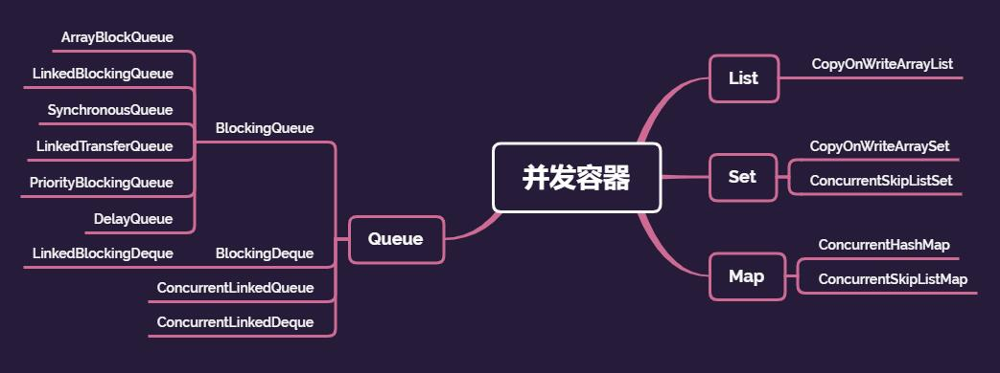
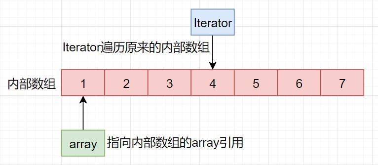
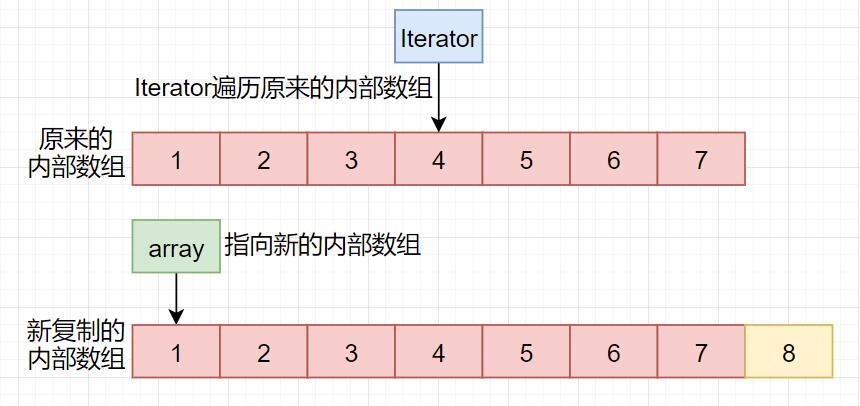
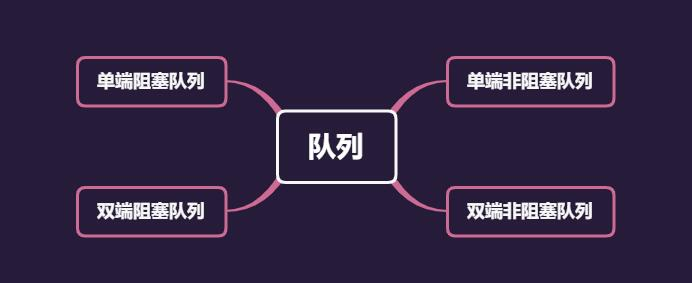
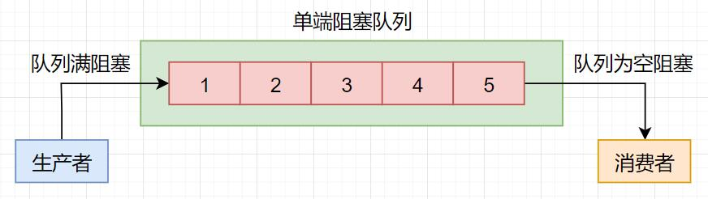
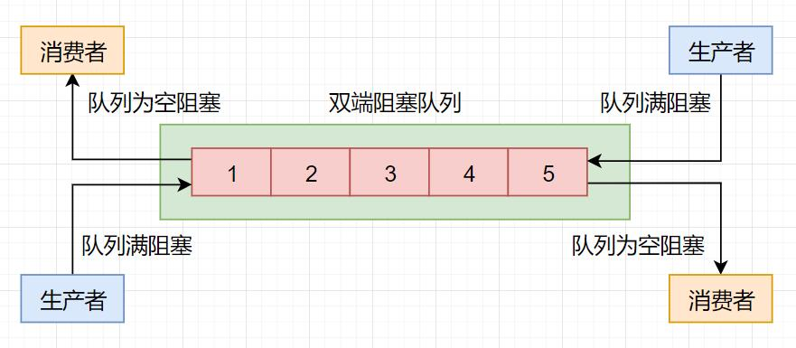
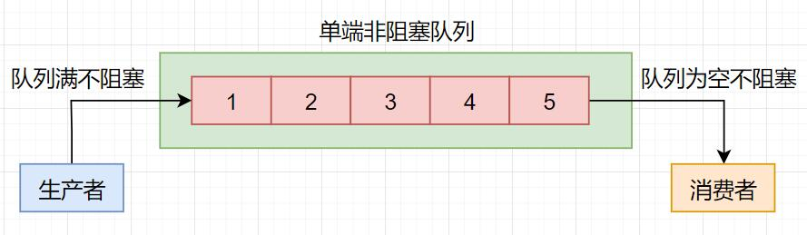
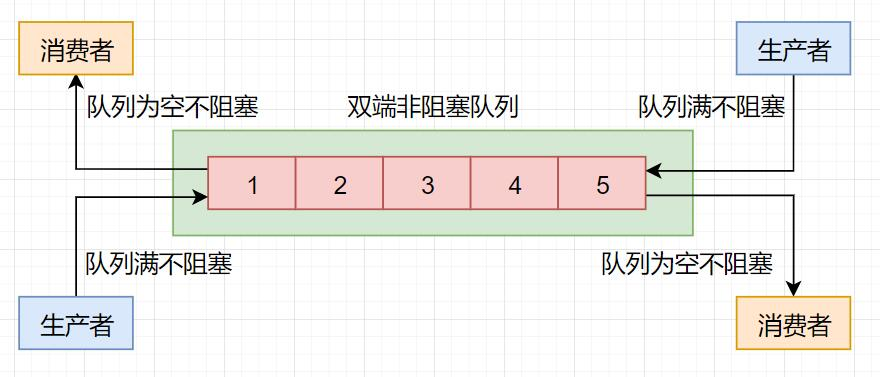

## 并发编程踩坑实录二：并发容器踩坑总结！！

**大家好，我是冰河~~**

在上一篇《[并发编程踩坑实录一：盘点JDK中同步容器的两大坑！！](https://mp.weixin.qq.com/s?__biz=Mzg4MjU0OTM1OA==&mid=2247495411&idx=1&sn=5826041180fbb0a2fb938b1cdb4fcc43&chksm=cf5659f2f821d0e4eed130c28aa757058699a9e2f92a6bbc67fc5688de362edbc50bdd396d13&token=1753433351&lang=zh_CN#rd)》中，我们主要一起学习了JDK中同步容器的两个坑，一个是在使用同步容器时可能会出现 **竞态条件** 的问题，一个是在使用同步容器时用 **迭代器遍历容器** 可能会踩坑。

其实，在JDK1.5之前的线程安全的容器，大多数都是指同步容器，使用同步容器进行并发编程时，最大的问题就是性能很差。因为同步容器中的所有方法都是使用synchronized锁进行互斥，串行度太高了，无法真正的做到并行。

所以，在JDK1.5之后，JDK中提供了并发性能更好的容器。JDK1.5及之后的版本中，提供的线程安全的容器，一般被称为并发容器。

## 并发容器

与同步容器一样，并发容器在总体上也可以分为四大类，分别为：List、Set、Map和Queue。总体上如下图所示。



接下来，我们分别介绍下这些并发容器在使用时的注意事项和避免踩到的坑。

## List

并发容器中的List相对来说比较简单，就一个CopyOnWriteArrayList。大家可以从字面的意思中就能够体会到：CopyOnWrite，在写的时候进行复制操作，也就是说在进行写操作时，会将共享变量复制一份。那这样做有什么好处呢？最大的好处就是：**读操作可以做到完全无锁化**。

在CopyOnWriteArrayList内部维护了一个数组，成员变量array指向这个数组，其核心源代码如下所示。

```java
private transient volatile Object[] array;
final Object[] getArray() {
	return array;
}
final void setArray(Object[] a) {
	array = a;
}
```

当进行操作时，都是基于array指向的这个内部数组进行的。例如，我们使用Iterator迭代器遍历这个数组时，会按照下图所示的方式进行读操作。




如果在遍历CopyOnWriteArrayList时发生写操作，例如，向数组中增加一个元素时，CopyOnWriteArrayList则会将内部的数组复制一份出来，然后会在新复制出来的数组上添加新的元素，添加完再将array指向新的数组，如下图所示。



**对于CopyOnWriteArrayList的其他写操作和添加元素的操作原理相同，这里就不再赘述了。**

使用CopyOnWriteArrayList时需要注意的是：

* CopyOnWriteArrayList只适合写操作比较少的场景，并且能够容忍读写操作在短时间内的不一致。
* CopyOnWriteArrayList的迭代器是只读的，不支持写操作。

## Set

对于Set接口来说，并发容器中主要有两个实现类，一个是CopyOnWriteArraySet，另一个是ConcurrentSkipListSet。其中，CopyOnWriteArraySet的使用场景、原理与注意事项和CopyOnWriteArrayList一致。而ConcurrentSkipListSet的使用场景、原理和注意事项和下文的ConcurrentSkipListMap一致。这里，我就不再赘述啦。

## Map

在并发容器中，Map接口的实现类主要有ConcurrentHashMap和ConcurrentSkipListMap，而ConcurrentHashMap和ConcurrentSkipListMap最大的区别就是：**ConcurrentHashMap的Key是无序的，而ConcurrentSkipListMap的Key是有序的。**

在使用ConcurrentHashMap和ConcurrentSkipListMap时，需要注意的是：ConcurrentHashMap和ConcurrentSkipListMap的Key和Value都不能为空。

这里，我们可以将Map相关的类总结成一个表格，如下所示。

| Map的实现类           | Key是否可为空 | Value是否可为空 | 是否是线程安全的 |
| --------------------- | ------------- | --------------- | ---------------- |
| HashMap               | 是            | 是              | 否               |
| TreeMap               | 否            | 是              | 否               |
| HashTable             | 否            | 否              | 是               |
| ConcurrentHashMap     | 否            | 否              | 是               |
| ConcurrentSkipListMap | 否            | 否              | 是               |

这样，大家记忆起来就方便多了。

这里，ConcurrentSkipListMap是基于“跳表”实现的，跳表的插入、删除、查询的平均时间复杂度为O(log n)，这些时间复杂度在理论上与线程数没有关系。如果要追求性能的话，可以尝试使用ConcurrentSkipListMap。

## Queue

在Java的并发容器中，Queue相对来说比较复杂。我们先来了解几个概念：

* 阻塞队列：阻塞一般就是指当队列已满时，入队操作会阻塞；当队列为空时，出队操作就会阻塞。
* 非阻塞队列：队列的入队和出队操作不会阻塞。
* 单端队列：队列的入队操作只能在队尾进行，队列的出队操作只能在队首进行。
* 双端队列：队列的入队操作和出队操作都可以在队首和队尾进行。

我们可以将上述的队列进行组合，将队列分为单端阻塞队列、双端阻塞队列、单端非阻塞队列和双端非阻塞队列。



在Java的并发容器中，会使用明显的标识来区分不同类型的队列。

* 阻塞队列一个明显的标识就是使用Blocking修饰，例如，ArrayBlockingQueue和LinkedBlockingQueue都是阻塞队列。
* 单端队列会使用Queue标识，例如ArrayBlockingQueue和LinkedBlockingQueue也是单端队列。
* 双端队列会使用Deque标识，例如LinkedBlockingDeque和ConcurrentLinkedDeque都是双端队列。

接下来，我们就分别简单聊聊这四种类型的队列。

### 单端阻塞队列

在Java的并发容器中，单端阻塞队列的主要实现是BlockingQueue，主要包括：ArrayBlockingQueue、LinkedBlockingQueue、SynchronousQueue、LinkedTransferQueue、PriorityBlockingQueue和DelayQueue。



单端阻塞队列的内部一般会有一个队列。

在实现上，内部的队列可以是数组，例如ArrayBlockingQueue，也可以是链表，例如LinkedBlockingQueue。

也可以在内部不存在队列，例如SynchronousQueue，SynchronousQueue实现了生产者的入队操作必须等待消费者的出队操作完成之后才能进行。

LinkedTransferQueue集成了LinkedBlockingQueue和SynchronousQueue的优点，并且性能比LinkedBlockingQueue好。

PriorityBlockingQueue实现了按照优先级进行出队操作，也就是说，队列元素在PriorityBlockingQueue内部可以按照某种规则进行排序。

DelayQueue是延时队列，实现了在一段时间后再出队的操作。

### 双端阻塞队列

双端阻塞队列的实现主要是LinkedBlockingDeque。示意图如下所示。



### 单端非阻塞队列

单端非阻塞队列的实现主要是ConcurrentLinkedQueue，示意图如下所示。



### 双端非阻塞队列

双端非阻塞队列的实现主要是ConcurrentLinkedDeque，示意图如下所示。



### 有界与无界队列

使用队列时，还要注意队列的有界与无界问题，也就是在使用队列时，**需要注意队列是否有容量限制**。

在实际工作中，一般推荐使用有界队列。因为无界队列很容易导致内存溢出的问题。在Java的并发容器中，只有ArrayBlockingQueue和LinkedBlockingQueue支持有界，其他的队列都是无界队列。

**在使用时，一定要注意内存溢出问题。**

## 总结

今天我们主要介绍了JDK1.5之后提供的并发容器，主要包括：List、Set、Map和Queue，而Queue又可以分为：单端阻塞队列、双端阻塞队列、单端非阻塞队列和双端非阻塞队列。对于每种并发容器，我们简单介绍了其基本原理和注意事项。

**好了，今天就到这儿吧，我是冰河，我们下期见~~**

## 写在最后

> 如果你觉得冰河写的还不错，请微信搜索并关注「 **冰河技术** 」微信公众号，跟冰河学习高并发、分布式、微服务、大数据、互联网和云原生技术，「 **冰河技术** 」微信公众号更新了大量技术专题，每一篇技术文章干货满满！不少读者已经通过阅读「 **冰河技术** 」微信公众号文章，吊打面试官，成功跳槽到大厂；也有不少读者实现了技术上的飞跃，成为公司的技术骨干！如果你也想像他们一样提升自己的能力，实现技术能力的飞跃，进大厂，升职加薪，那就关注「 **冰河技术** 」微信公众号吧，每天更新超硬核技术干货，让你对如何提升技术能力不再迷茫！


