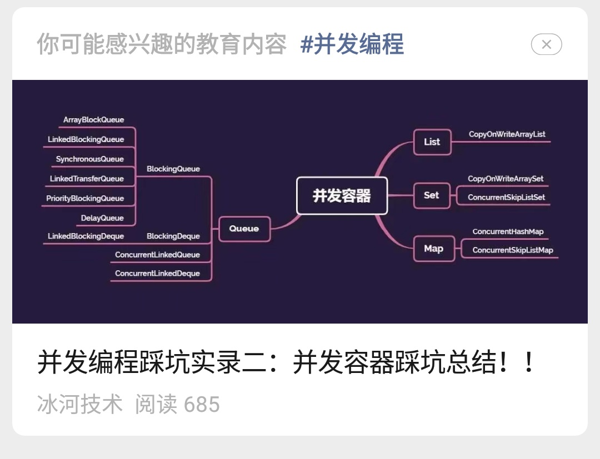
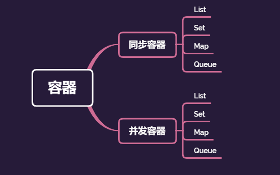

## 冰河又被腾讯推荐了！！

**大家好，我是冰河~~**

继冰河之前被腾讯大佬邀请去做技术分享后，这次你们的冰河又被腾讯推荐了。确切地说，是冰河写的「[精通高并发系列](https://mp.weixin.qq.com/mp/appmsgalbum?__biz=Mzg4MjU0OTM1OA==&action=getalbum&album_id=1659019088070803460#wechat_redirect)」文章被 **微信公众号官方** 推荐了。本来我本人是没怎么留意的，不知道大家在公众号里有没有留意过。比如，我第一次注意到文章被推荐了，就是在某个群里，一名小伙伴艾特我。

这种推荐不是每个小伙伴都能收到的。我本人目前还没收到过这种推荐。不过已经有不少小伙伴向我反馈说他们已经收到过公众号官方推荐的我写的「[精通高并发系列](https://mp.weixin.qq.com/mp/appmsgalbum?__biz=Mzg4MjU0OTM1OA==&action=getalbum&album_id=1659019088070803460#wechat_redirect)」文章了。

事后，我在想：这应该就是微信公众号官方对于文章的一种认可吧。到目前为止，我本人是没收到过这种推荐，不知道小伙伴们有没有收到过。

咱们也来说说「[精通高并发系列](https://mp.weixin.qq.com/mp/appmsgalbum?__biz=Mzg4MjU0OTM1OA==&action=getalbum&album_id=1659019088070803460#wechat_redirect)」写了哪些文章吧。从2020年疫情开始更新并发编程的文章，到发这篇文章的时候，「[精通高并发系列](https://mp.weixin.qq.com/mp/appmsgalbum?__biz=Mzg4MjU0OTM1OA==&action=getalbum&album_id=1659019088070803460#wechat_redirect)」专栏已经断断续续更新了100篇文章了。

「[精通高并发系列](https://mp.weixin.qq.com/mp/appmsgalbum?__biz=Mzg4MjU0OTM1OA==&action=getalbum&album_id=1659019088070803460#wechat_redirect)」专栏整体上涵盖 **源码分析、基础案例、实战案例、面试和系统架构** 几大部分， 我个人觉得这应该是全网最全的免费学习并发编程的专栏了吧。你们说呢？而且几个月前我把公众号里「[精通高并发系列](https://mp.weixin.qq.com/mp/appmsgalbum?__biz=Mzg4MjU0OTM1OA==&action=getalbum&album_id=1659019088070803460#wechat_redirect)」中的一部分文章整理成了《深入理解高并发编程》电子书，目前全网下载量已经突破 **45W+** ，这也说明小伙伴们对于并发编程确实是很感兴趣的。

发布电子书之后，冰河也在持续更新「[精通高并发系列](https://mp.weixin.qq.com/mp/appmsgalbum?__biz=Mzg4MjU0OTM1OA==&action=getalbum&album_id=1659019088070803460#wechat_redirect)」的文章，所以，「[精通高并发系列](https://mp.weixin.qq.com/mp/appmsgalbum?__biz=Mzg4MjU0OTM1OA==&action=getalbum&album_id=1659019088070803460#wechat_redirect)」中的文章比电子书更全了，大家可以订阅「冰河技术」 微信公众号的「[精通高并发系列](https://mp.weixin.qq.com/mp/appmsgalbum?__biz=Mzg4MjU0OTM1OA==&action=getalbum&album_id=1659019088070803460#wechat_redirect)」学习并发编程。

到合适的时候，我会再将这些文章进行分类整理成《深入理解高并发编程（第2版）》，届时内容会更加丰富，更加系统化，也会新增很多冰河实际经历过的 **高并发、大流量场景下** 的真实案例，以方便小伙伴们更好的学习并发编程。

之前也有不少小伙伴问我：「[精通高并发系列](https://mp.weixin.qq.com/mp/appmsgalbum?__biz=Mzg4MjU0OTM1OA==&action=getalbum&album_id=1659019088070803460#wechat_redirect)」的文章会一直更新吗？

我的回答是：「[精通高并发系列](https://mp.weixin.qq.com/mp/appmsgalbum?__biz=Mzg4MjU0OTM1OA==&action=getalbum&album_id=1659019088070803460#wechat_redirect)」的文章会一直更新。

这里，我再唠叨两句：当然，期间也会不断更新其他专栏的文章。期间的心酸只有自己知道，从做公众号开始，就再也没有了周末和业余时间。

别人下班后休息了，我在画图、敲代码、写文章，别人周末出去嗨了，我也在画图、敲代码、写文章。一路走来其实挺不容易的，每一篇文章都要经过：构思、写大纲、画图、敲代码验证、调试代码以保证代码的正确性，最后才是写文章将这些内容总结并整理出来。

累，确实是挺累的，不过看到自己写的文章被小伙伴们认可，更是被 **微信公众号官方** 推荐了，再多的苦和累，也值了！！

最后，小伙伴们，你们的微信里收到过 **公众号官方推荐** 的冰河写的文章吗？

**好了，今天就到这儿吧，我是冰河，我们下期见~~**

