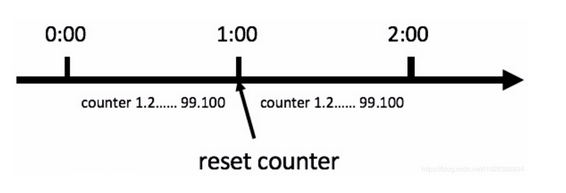
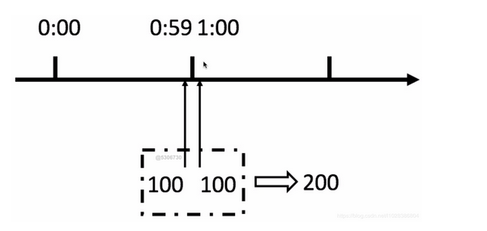
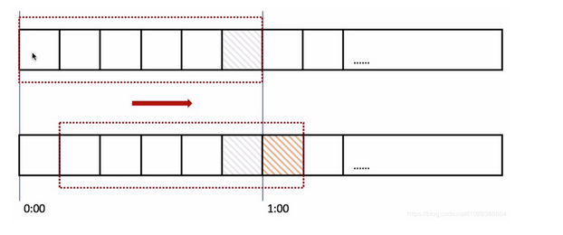
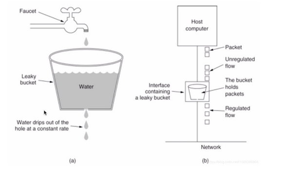
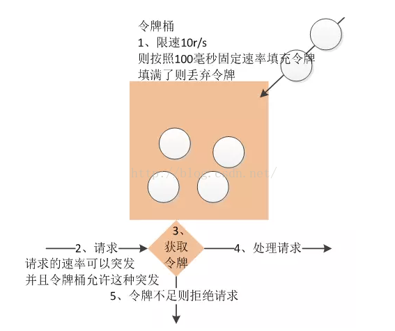
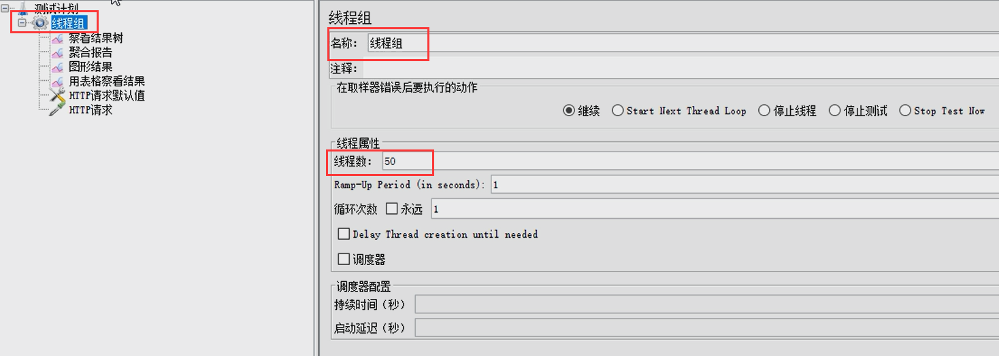
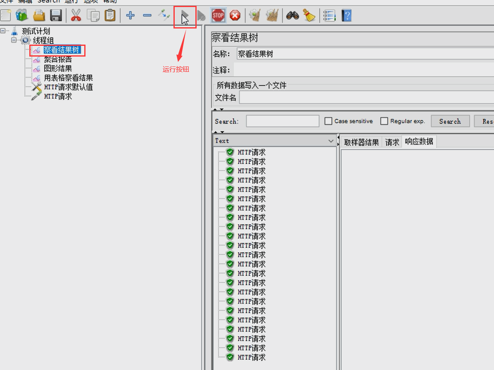
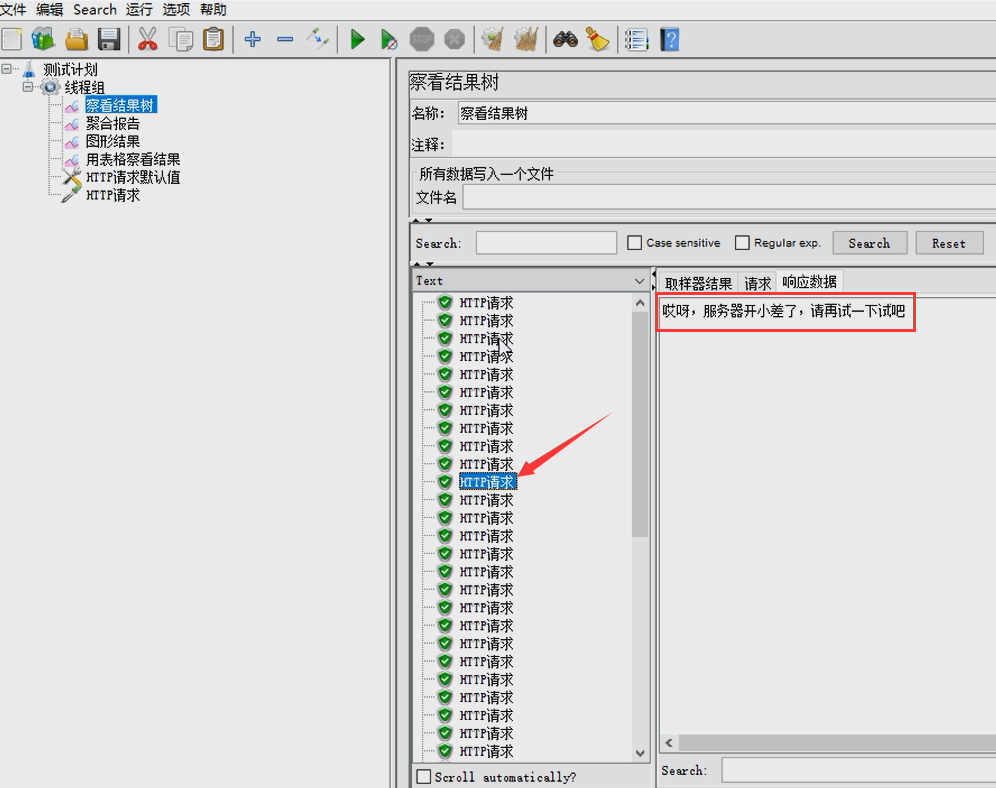
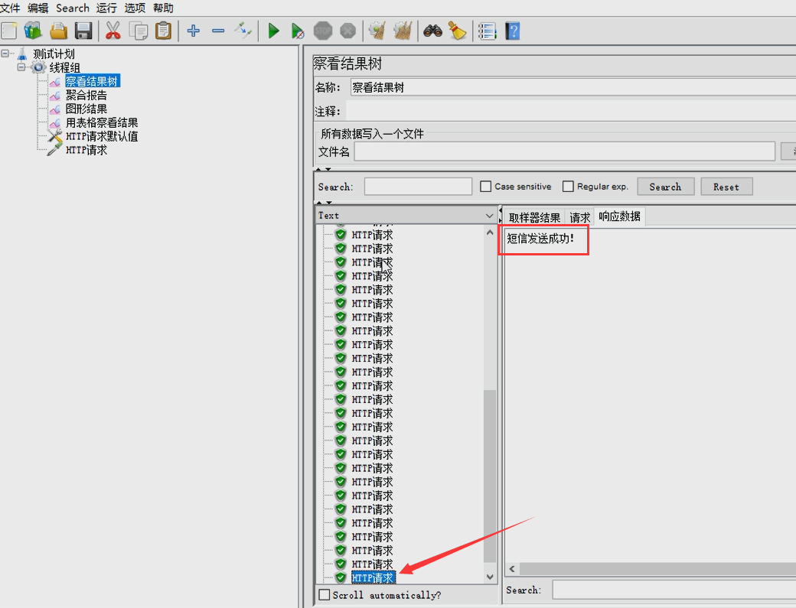

## 【高并发】如何实现亿级流量下的分布式限流？看这一篇就够了！！

## 写在前面

> 在互联网应用中，高并发系统会面临一个重大的挑战，那就是大量流高并发访问，比如：天猫的双十一、京东618、秒杀、抢购促销等，这些都是典型的大流量高并发场景。关于秒杀，小伙伴们可以参见我的另一篇文章《[【高并发】高并发秒杀系统架构解密，不是所有的秒杀都是秒杀！](https://mp.weixin.qq.com/s?__biz=Mzg3MzE1NTIzNA==&mid=2247484357&idx=1&sn=23e6e38143704db0fa4588186b534e13&chksm=cee51c08f992951e5b883c55b788588f9cbc822e41694b5b4a334ea5d2dc0ae62a5d64e39dc2&token=1388808518&lang=zh_CN#rd)》
>
> 关注【冰河技术】微信公众号，解锁更多【高并发】专题文章。

## 关于作者

互联网高级技术专家、MySQL技术专家、分布式事务架构专家。  
多年来，一直致力于分布式系统架构、微服务、分布式数据库、分布式事务与大数据技术的研究，在高并发、高可用、高可扩展性、高可维护性和大数据等领域拥有丰富的架构经验。  
可视化多数据源数据异构中间件mykit-data作者；《深入理解分布式事务：原理与实战》、《海量数据处理与大数据技术实战》和《MySQL技术大全：开发、优化与运维实战》作者；“冰河技术”微信公众号维护者。  

关注【冰河技术】微信公众号，解锁更多技术干货文章，每天推送具有深度的技术好文。

> 如果你觉得冰河写的还不错，请微信搜索并关注「 **冰河技术** 」微信公众号，跟冰河学习高并发、分布式、微服务、大数据、互联网和云原生技术，「 **冰河技术** 」微信公众号更新了大量技术专题，每一篇技术文章干货满满！不少读者已经通过阅读「 **冰河技术** 」微信公众号文章，吊打面试官，成功跳槽到大厂；也有不少读者实现了技术上的飞跃，成为公司的技术骨干！如果你也想像他们一样提升自己的能力，实现技术能力的飞跃，进大厂，升职加薪，那就关注「 **冰河技术** 」微信公众号吧，每天更新超硬核技术干货，让你对如何提升技术能力不再迷茫！


## 高并发系统限流

短时间内巨大的访问流量，我们如何让系统在处理高并发的同时还能保证自身系统的稳定性？有人会说，增加机器就可以了，因为我的系统是分布式的，所以可以只需要增加机器就可以解决问题了。但是，如果你通过增加机器还是不能解决这个问题怎么办呢？而且这种情况下又不能无限制的增加机器，服务器的硬件资源始终都是有限的，在有限的资源下，我们要应对这种大流量高并发的访问，就不得不采取一些其他的措施来保护我们的后端服务系统了，比如：缓存、异步、降级、限流、静态化等。

这里，我们先说说如何实现限流。

## 什么是限流？

在高并发系统中，限流通常指的是：对高并发访问或者请求进行限速或者对一个时间内的请求进行限速来保护我们的系统，一旦达到系统的限速规则（比如系统限制的请求速度），则可以采用下面的方式来处理这些请求。

* 拒绝服务（友好提示或者跳转到错误页面）。
* 排队或等待（比如秒杀系统）。
* 服务降级（返回默认的兜底数据）。

其实，就是对请求进行限速，比如10r/s，即每秒只允许10个请求，这样就限制了请求的速度。从某种意义上说，限流，其实就是在一定频率上进行量的限制。

限流一般用来控制系统服务请求的速率，比如：天猫双十一的限流，京东618的限流，12306的抢票等。

## 限流有哪些使用场景？

这里，我们来举一个例子，假设你做了一个商城系统，某个节假日的时候，突然发现提交订单的接口请求比平时请求量突然上涨了将近50倍，没多久提交订单的接口就超时并且抛出了异常，几乎不可用了。而且，因为订单接口超时不可用，还导致了系统其它服务出现故障。

我们该如何应对这种大流量场景呢？一种典型的处理方案就是限流。当然了，除了限流之外，还有其他的处理方案，我们这篇文章就主要讲限流。

* 对稀缺资源的秒杀、抢购；
* 对数据库的高并发读写操作，比如提交订单，瞬间往数据库插入大量的数据；

限流可以说是处理高并发问题的利器，有了限流就可以不用担心瞬间高峰流量压垮系统服务或者服务雪崩，最终做到有损服务而不是不服务。

**使用限流同样需要注意的是：限流要评估好，测试好，否则会导致正常的访问被限流。**

## 常见的限流算法

### 计数器

**计数器法**

限流算法中最简单粗暴的一种算法，例如，某一个接口1分钟内的请求不超过60次，我们可以在开始时设置一个计数器，每次请求时，这个计数器的值加1，如果这个这个计数器的值大于60并且与第一次请求的时间间隔在1分钟之内，那么说明请求过多；如果该请求与第一次请求的时间间隔大于1分钟，并且该计数器的值还在限流范围内，那么重置该计数器。

使用计数器还可以用来限制一定时间内的总并发数，比如数据库连接池、线程池、秒杀的并发数；计数器限流只要一定时间内的总请求数超过设定的阀值则进行限流，是一种简单粗暴的总数量限流，而不是平均速率限流。



这个方法有一个致命问题：临界问题——当遇到恶意请求，在0:59时，瞬间请求100次，并且在1:00请求100次，那么这个用户在1秒内请求了200次，用户可以在重置节点突发请求，而瞬间超过我们设置的速率限制，用户可能通过算法漏洞击垮我们的应用。



这个问题我们可以使用滑动窗口解决。

**滑动窗口**



在上图中，整个红色矩形框是一个时间窗口，在我们的例子中，一个时间窗口就是1分钟，然后我们将时间窗口进行划分，如上图我们把滑动窗口划分为6格，所以每一格代表10秒，每超过10秒，我们的时间窗口就会向右滑动一格，每一格都有自己独立的计数器，例如：一个请求在0:35到达， 那么0:30到0:39的计数器会+1，那么滑动窗口是怎么解决临界点的问题呢？如上图，0:59到达的100个请求会在灰色区域格子中，而1：00到达的请求会在红色格子中，窗口会向右滑动一格，那么此时间窗口内的总请求数共200个，超过了限定的100，所以此时能够检测出来触发了限流。回头看看计数器算法，会发现，其实计数器算法就是窗口滑动算法，只不过计数器算法没有对时间窗口进行划分，所以是一格。

 由此可见，当滑动窗口的格子划分越多，限流的统计就会越精确。

### 漏桶算法

算法的思路就是水（请求）先进入到漏桶里面，漏桶以恒定的速度流出，当水流的速度过大就会直接溢出，可以看出漏桶算法能强行限制数据的传输速率。如下图所示。



**漏桶算法不支持突发流量。**

### 令牌桶算法



从上图中可以看出，令牌算法有点复杂，桶里存放着令牌token。桶一开始是空的，token以固定的速率r往桶里面填充，直到达到桶的容量，多余的token会被丢弃。每当一个请求过来时，就会尝试着移除一个token，如果没有token，请求无法通过。

**令牌桶算法支持突发流量。**

### 令牌桶算法实现

Guava框架提供了令牌桶算法的实现，可直接使用这个框架的RateLimiter类创建一个令牌桶限流器，比如：每秒放置的令牌桶的数量为5，那么RateLimiter对象可以保证1秒内不会放入超过5个令牌，并且以固定速率进行放置令牌，达到平滑输出的效果。

**平滑流量示例**

这里，我写了一个使用Guava框架实现令牌桶算法的示例，如下所示。

```java
package io.binghe.limit.guava;

import com.google.common.util.concurrent.RateLimiter;

/**
 * @author binghe
 * @version 1.0.0
 * @description 令牌桶算法
 */
public class TokenBucketLimiter {
    public static void main(String[] args){
        //每秒钟生成5个令牌
        RateLimiter limiter = RateLimiter.create(5);

        //返回值表示从令牌桶中获取一个令牌所花费的时间，单位是秒
        System.out.println(limiter.acquire(1));
        System.out.println(limiter.acquire(1));
        System.out.println(limiter.acquire(1));
        System.out.println(limiter.acquire(1));
        System.out.println(limiter.acquire(1));
        System.out.println(limiter.acquire(1));
        System.out.println(limiter.acquire(1));
        System.out.println(limiter.acquire(1));
        System.out.println(limiter.acquire(1));
        System.out.println(limiter.acquire(1));
    }
}
```

代码的实现非常简单，就是使用Guava框架的RateLimiter类生成了一个每秒向桶中放入5个令牌的对象，然后不断从桶中获取令牌。我们先来运行下这段代码，输出的结果信息如下所示。

```bash
0.0
0.197294
0.191278
0.19997
0.199305
0.200472
0.200184
0.199417
0.200111
0.199759
```

从输出结果可以看出：第一次从桶中获取令牌时，返回的时间为0.0，也就是没耗费时间。之后每次从桶中获取令牌时，都会耗费一定的时间，这是为什么呢？按理说，向桶中放入了5个令牌后，再从桶中获取令牌也应该和第一次一样并不会花费时间啊！

因为在Guava的实现是这样的：我们使用`RateLimiter.create(5)`创建令牌桶对象时，表示每秒新增5个令牌，1秒等于1000毫秒，也就是每隔200毫秒向桶中放入一个令牌。

当我们运行程序时，程序运行到`RateLimiter limiter = RateLimiter.create(5);`时，就会向桶中放入一个令牌，当程序运行到第一个`System.out.println(limiter.acquire(1));`时，由于桶中已经存在一个令牌，直接获取这个令牌，并没有花费时间。然而程序继续向下执行时，由于程序会每隔200毫秒向桶中放入一个令牌，所以，获取令牌时，花费的时间几乎都是200毫秒左右。

**突发流量示例**

我们再来看一个突发流量的示例，代码示例如下所示。

```java
package io.binghe.limit.guava;

import com.google.common.util.concurrent.RateLimiter;

/**
 * @author binghe
 * @version 1.0.0
 * @description 令牌桶算法
 */
public class TokenBucketLimiter {
    public static void main(String[] args){
        //每秒钟生成5个令牌
        RateLimiter limiter = RateLimiter.create(5);

        //返回值表示从令牌桶中获取一个令牌所花费的时间，单位是秒
        System.out.println(limiter.acquire(50));
        System.out.println(limiter.acquire(5));
        System.out.println(limiter.acquire(5));
        System.out.println(limiter.acquire(5));
        System.out.println(limiter.acquire(5));
    }
}
```

上述代码表示的含义为：每秒向桶中放入5个令牌，第一次从桶中获取50个令牌，也就是我们说的突发流量，后续每次从桶中获取5个令牌。接下来，我们运行上述代码看下效果。

```bash
0.0
9.998409
0.99109
1.000148
0.999752
```

运行代码时，会发现当命令行打印出0.0后，会等很久才会打印出后面的输出结果。

程序每秒钟向桶中放入5个令牌，当程序运行到 `RateLimiter limiter = RateLimiter.create(5);` 时，就会向桶中放入令牌。当运行到 `System.out.println(limiter.acquire(50));` 时，发现很快就会获取到令牌，花费了0.0秒。接下来，运行到第一个`System.out.println(limiter.acquire(5));`时，花费了9.998409秒。小伙们可以思考下，为什么这里会花费10秒中的时间呢？

这是因为我们使用`RateLimiter limiter = RateLimiter.create(5);`代码向桶中放入令牌时，一秒钟放入5个，而`System.out.println(limiter.acquire(50));`需要获取50个令牌，也就是获取50个令牌需要花费10秒钟时间，这是因为程序向桶中放入50个令牌需要10秒钟。程序第一次从桶中获取令牌时，很快就获取到了。而第二次获取令牌时，花费了将近10秒的时间。

Guava框架支持突发流量，但是在突发流量之后再次请求时，会被限速，也就是说：在突发流量之后，再次请求时，会弥补处理突发请求所花费的时间。所以，我们的突发示例程序中，在一次从桶中获取50个令牌后，再次从桶中获取令牌，则会花费10秒左右的时间。

### Guava令牌桶算法的特点

* RateLimiter使用令牌桶算法，会进行令牌的累积，如果获取令牌的频率比较低，则不会导致等待，直接获取令牌。
* RateLimiter由于会累积令牌，所以可以应对突发流量。也就是说如果同时请求5个令牌，由于此时令牌桶中有累积的令牌，能够快速响应请求。
* RateLimiter在没有足够的令牌发放时，采用的是滞后的方式进行处理，也就是前一个请求获取令牌所需要等待的时间由下一次请求来承受和弥补，也就是代替前一个请求进行等待。（这里，小伙伴们要好好理解下）

## HTTP接口限流实战

这里，我们实现Web接口限流，具体方式为：使用自定义注解封装基于令牌桶限流算法实现接口限流。

### 不使用注解实现接口限流

#### 搭建项目

这里，我们使用SpringBoot项目来搭建Http接口限流项目，SpringBoot项目本质上还是一个Maven项目。所以，小伙伴们可以直接创建一个Maven项目，我这里的项目名称为mykit-ratelimiter-test。接下来，在pom.xml文件中添加如下依赖使项目构建为一个SpringBoot项目。

```xml
<parent>
        <groupId>org.springframework.boot</groupId>
        <artifactId>spring-boot-starter-parent</artifactId>
        <version>2.2.6.RELEASE</version>
    </parent>

    <modelVersion>4.0.0</modelVersion>
    <groupId>io.mykit.limiter</groupId>
    <artifactId>mykit-ratelimiter-test</artifactId>
    <version>1.0.0-SNAPSHOT</version>
    <packaging>jar</packaging>
    <name>mykit-ratelimiter-test</name>

    <properties>
        <guava.version>28.2-jre</guava.version>
    </properties>

    <dependencies>
        <dependency>
            <groupId>org.springframework.boot</groupId>
            <artifactId>spring-boot-starter-test</artifactId>
        </dependency>

        <dependency>
            <groupId>org.springframework.boot</groupId>
            <artifactId>spring-boot-starter-web</artifactId>
            <exclusions>
                <exclusion>
                    <groupId>org.springframework.boot</groupId>
                    <artifactId>spring-boot-starter-tomcat</artifactId>
                </exclusion>
                <exclusion>
                    <groupId>org.springframework.boot</groupId>
                    <artifactId>spring-boot-starter-logging</artifactId>
                </exclusion>
            </exclusions>
        </dependency>

        <dependency>
            <groupId>org.springframework.boot</groupId>
            <artifactId>spring-boot-starter-undertow</artifactId>
        </dependency>

        <dependency>
            <groupId>org.springframework.boot</groupId>
            <artifactId>spring-boot-configuration-processor</artifactId>
            <optional>true</optional>
        </dependency>

        <dependency>
            <groupId>org.springframework.boot</groupId>
            <artifactId>spring-boot-starter-data-redis</artifactId>
        </dependency>
        
        <dependency>
            <groupId>org.aspectj</groupId>
            <artifactId>aspectjweaver</artifactId>
        </dependency>

        <dependency>
            <groupId>org.springframework.boot</groupId>
            <artifactId>spring-boot-starter-aop</artifactId>
        </dependency>

        <dependency>
            <groupId>com.google.guava</groupId>
            <artifactId>guava</artifactId>
            <version>${guava.version}</version>
        </dependency>
    </dependencies>

    <build>
        <plugins>
            <plugin>
                <groupId>org.apache.maven.plugins</groupId>
                <artifactId>maven-compiler-plugin</artifactId>
                <version>3.1</version><!--$NO-MVN-MAN-VER$-->
                <configuration>
                    <source>${java.version}</source>
                    <target>${java.version}</target>
                </configuration>
            </plugin>
        </plugins>
    </build>
```

可以看到，我在项目中除了引用了SpringBoot相关的Jar包外，还引用了guava框架，版本为28.2-jre。

#### 创建核心类

这里，我主要是模拟一个支付接口的限流场景。首先，我们定义一个PayService接口和MessageService接口。PayService接口主要用于模拟后续的支付业务，MessageService接口模拟发送消息。接口的定义分别如下所示。

* PayService

```java
package io.mykit.limiter.service;
import java.math.BigDecimal;
/**
 * @author binghe
 * @version 1.0.0
 * @description 模拟支付
 */
public interface PayService {
    int pay(BigDecimal price);
}
```

* MessageService

```java
package io.mykit.limiter.service;
/**
 * @author binghe
 * @version 1.0.0
 * @description 模拟发送消息服务
 */
public interface MessageService {
    boolean sendMessage(String message);
}
```

接下来，创建二者的实现类，分别如下。

* MessageServiceImpl

```java
package io.mykit.limiter.service.impl;
import io.mykit.limiter.service.MessageService;
import org.slf4j.Logger;
import org.slf4j.LoggerFactory;
import org.springframework.stereotype.Service;
/**
 * @author binghe
 * @version 1.0.0
 * @description 模拟实现发送消息
 */
@Service
public class MessageServiceImpl implements MessageService {
    private final Logger logger = LoggerFactory.getLogger(MessageServiceImpl.class);
    @Override
    public boolean sendMessage(String message) {
        logger.info("发送消息成功===>>" + message);
        return true;
    }
}
```

* PayServiceImpl

```java
package io.mykit.limiter.service.impl;
import io.mykit.limiter.service.PayService;
import org.slf4j.Logger;
import org.slf4j.LoggerFactory;
import org.springframework.stereotype.Service;
import java.math.BigDecimal;
/**
 * @author binghe
 * @version 1.0.0
 * @description 模拟支付
 */
@Service
public class PayServiceImpl implements PayService {
    private final Logger logger = LoggerFactory.getLogger(PayServiceImpl.class);
    @Override
    public int pay(BigDecimal price) {
        logger.info("支付成功===>>" + price);
        return 1;
    }
}
```

由于是模拟支付和发送消息，所以，我在具体实现的方法中打印出了相关的日志，并没有实现具体的业务逻辑。

接下来，就是创建我们的Controller类PayController，在PayController类的接口pay()方法中使用了限流，每秒钟向桶中放入2个令牌，并且客户端从桶中获取令牌，如果在500毫秒内没有获取到令牌的话，我们可以则直接走服务降级处理。

PayController的代码如下所示。

```java
package io.mykit.limiter.controller;
import com.google.common.util.concurrent.RateLimiter;
import io.mykit.limiter.service.MessageService;
import io.mykit.limiter.service.PayService;
import org.slf4j.Logger;
import org.slf4j.LoggerFactory;
import org.springframework.beans.factory.annotation.Autowired;
import org.springframework.web.bind.annotation.RequestMapping;
import org.springframework.web.bind.annotation.RestController;
import java.math.BigDecimal;
import java.util.concurrent.TimeUnit;

/**
 * @author binghe
 * @version 1.0.0
 * @description 测试接口限流
 */
@RestController
public class PayController {
    private final Logger logger = LoggerFactory.getLogger(PayController.class);
    /**
     * RateLimiter的create()方法中传入一个参数，表示以固定的速率2r/s，即以每秒2个令牌的速率向桶中放入令牌
     */
    private RateLimiter rateLimiter = RateLimiter.create(2);

    @Autowired
    private MessageService messageService;
    @Autowired
    private PayService payService;
    @RequestMapping("/boot/pay")
    public String pay(){
        //记录返回接口
        String result = "";
        //限流处理，客户端请求从桶中获取令牌，如果在500毫秒没有获取到令牌，则直接走服务降级处理
        boolean tryAcquire = rateLimiter.tryAcquire(500, TimeUnit.MILLISECONDS);
        if (!tryAcquire){
            result = "请求过多，降级处理";
            logger.info(result);
            return result;
        }
        int ret = payService.pay(BigDecimal.valueOf(100.0));
        if(ret > 0){
            result = "支付成功";
            return result;
        }
        result = "支付失败，再试一次吧...";
        return result;
    }
}
```

最后，我们来创建mykit-ratelimiter-test项目的核心启动类，如下所示。

```java
package io.mykit.limiter;
import org.springframework.boot.SpringApplication;
import org.springframework.boot.autoconfigure.SpringBootApplication;

/**
 * @author binghe
 * @version 1.0.0
 * @description 项目启动类
 */
@SpringBootApplication
public class MykitLimiterApplication {

    public static void main(String[] args){
        SpringApplication.run(MykitLimiterApplication.class, args);
    }
}
```

至此，我们不使用注解方式实现限流的Web应用就基本完成了。

#### 运行项目

项目创建完成后，我们来运行项目，运行SpringBoot项目比较简单，直接运行MykitLimiterApplication类的main()方法即可。

项目运行成功后，我们在浏览器地址栏输入链接：http://localhost:8080/boot/pay。页面会输出“支付成功”的字样，说明项目搭建成功了。如下所示。


此时，我只访问了一次，并没有触发限流。接下来，我们不停的刷浏览器，此时，浏览器会输出“支付失败，再试一次吧...”的字样，如下所示。


在PayController类中还有一个sendMessage()方法，模拟的是发送消息的接口，同样使用了限流操作，具体代码如下所示。

```java
@RequestMapping("/boot/send/message")
public String sendMessage(){
    //记录返回接口
    String result = "";
    //限流处理，客户端请求从桶中获取令牌，如果在500毫秒没有获取到令牌，则直接走服务降级处理
    boolean tryAcquire = rateLimiter.tryAcquire(500, TimeUnit.MILLISECONDS);
    if (!tryAcquire){
        result = "请求过多，降级处理";
        logger.info(result);
        return result;
    }
    boolean flag = messageService.sendMessage("恭喜您成长值+1");
    if (flag){
        result = "消息发送成功";
        return result;
    }
    result = "消息发送失败，再试一次吧...";
    return result;
}
```

sendMessage()方法的代码逻辑和运行效果与pay()方法相同，我就不再浏览器访问 http://localhost:8080/boot/send/message 地址的访问效果了，小伙伴们可以自行验证。

#### 不使用注解实现限流缺点

通过对项目的编写，我们可以发现，当在项目中对接口进行限流时，不使用注解进行开发，会导致代码出现大量冗余，每个方法中几乎都要写一段相同的限流逻辑，代码十分冗余。

如何解决代码冗余的问题呢？我们可以使用自定义注解进行实现。

### 使用注解实现接口限流

使用自定义注解，我们可以将一些通用的业务逻辑封装到注解的切面中，在需要添加注解业务逻辑的方法上加上相应的注解即可。针对我们这个限流的实例来说，可以基于自定义注解实现。

#### 实现自定义注解

实现，我们来创建一个自定义注解，如下所示。

```java
package io.mykit.limiter.annotation;
import java.lang.annotation.*;
/**
 * @author binghe
 * @version 1.0.0
 * @description 实现限流的自定义注解
 */
@Target(value = ElementType.METHOD)
@Retention(RetentionPolicy.RUNTIME)
@Documented
public @interface MyRateLimiter {
    //向令牌桶放入令牌的速率
    double rate();
    //从令牌桶获取令牌的超时时间
    long timeout() default 0;
}
```

#### 自定义注解切面实现

接下来，我们还要实现一个切面类MyRateLimiterAspect，如下所示。

```java
package io.mykit.limiter.aspect;

import com.google.common.util.concurrent.RateLimiter;
import io.mykit.limiter.annotation.MyRateLimiter;
import org.aspectj.lang.ProceedingJoinPoint;
import org.aspectj.lang.annotation.Around;
import org.aspectj.lang.annotation.Aspect;
import org.aspectj.lang.annotation.Pointcut;
import org.aspectj.lang.reflect.MethodSignature;
import org.springframework.beans.factory.annotation.Autowired;
import org.springframework.stereotype.Component;

import javax.servlet.http.HttpServletResponse;
import java.io.IOException;
import java.io.PrintWriter;
import java.util.concurrent.TimeUnit;

/**
 * @author binghe
 * @version 1.0.0
 * @description 一般限流切面类
 */
@Aspect
@Component
public class MyRateLimiterAspect {

    private RateLimiter rateLimiter = RateLimiter.create(2);

    @Pointcut("execution(public * io.mykit.limiter.controller.*.*(..))")
    public void pointcut(){

    }

    /**
     * 核心切面方法
     */
    @Around("pointcut()")
    public Object process(ProceedingJoinPoint proceedingJoinPoint) throws Throwable{
        MethodSignature signature = (MethodSignature) proceedingJoinPoint.getSignature();

        //使用反射获取方法上是否存在@MyRateLimiter注解
        MyRateLimiter myRateLimiter = signature.getMethod().getDeclaredAnnotation(MyRateLimiter.class);
        if(myRateLimiter == null){
            //程序正常执行，执行目标方法
            return proceedingJoinPoint.proceed();
        }
        //获取注解上的参数
        //获取配置的速率
        double rate = myRateLimiter.rate();
        //获取客户端等待令牌的时间
        long timeout = myRateLimiter.timeout();

        //设置限流速率
        rateLimiter.setRate(rate);

        //判断客户端获取令牌是否超时
        boolean tryAcquire = rateLimiter.tryAcquire(timeout, TimeUnit.MILLISECONDS);
        if(!tryAcquire){
            //服务降级
            fullback();
            return null;
        }
        //获取到令牌，直接执行
        return proceedingJoinPoint.proceed();

    }

    /**
     * 降级处理
     */
    private void fullback() {
        response.setHeader("Content-type", "text/html;charset=UTF-8");
        PrintWriter writer = null;
        try {
            writer =  response.getWriter();
            writer.println("出错了，重试一次试试？");
            writer.flush();;
        } catch (IOException e) {
            e.printStackTrace();
        }finally {
            if(writer != null){
                writer.close();
            }
        }
    }
}
```

自定义切面的功能比较简单，我就不细说了，大家有啥问题可以关注【冰河技术】微信公众号来进行提问。

接下来，我们改造下PayController类中的sendMessage()方法，修改后的方法片段代码如下所示。

```java
@MyRateLimiter(rate = 1.0, timeout = 500)
@RequestMapping("/boot/send/message")
public String sendMessage(){
    //记录返回接口
    String result = "";
    boolean flag = messageService.sendMessage("恭喜您成长值+1");
    if (flag){
        result = "消息发送成功";
        return result;
    }
    result = "消息发送失败，再试一次吧...";
    return result;
}
```

#### 运行部署项目

部署项目比较简单，只需要运行MykitLimiterApplication类下的main()方法即可。这里，为了简单，我们还是从浏览器中直接输入链接地址来进行访问

效果如下所示。


接下来，我们不断的刷新浏览器。会出现“消息发送失败，再试一次吧..”的字样，说明已经触发限流操作。


## 基于限流算法实现限流的缺点

上面介绍的限流方式都只能用于单机部署的环境中，如果将应用部署到多台服务器进行分布式、集群，则上面限流的方式就不适用了，此时，我们需要使用分布式限流。至于在分布式场景下，如何实现限流操作，我们就在下一篇中进行介绍。

## 分布式限流实战

前面介绍的限流方案有一个缺陷就是：它不是全局的，不是分布式的，无法很好的应对分布式场景下的大流量冲击。那么，接下来，我们就介绍下如何实现亿级流量下的分布式限流。

分布式限流的关键就是需要将限流服务做成全局的，统一的。可以采用Redis+Lua技术实现，通过这种技术可以实现高并发和高性能的限流。

Lua是一种轻量小巧的脚本编程语言，用标准的C语言编写的开源脚本，其设计的目的是为了嵌入到应用程序中，为应用程序提供灵活的扩展和定制功能。

## Redis+Lua脚本实现分布式限流思路

我们可以使用Redia+Lua脚本的方式来对我们的分布式系统进行统一的全局限流，Redis+Lua实现的Lua脚本：

```lua
local key = KEYS[1]  --限流KEY(一秒一个)
local limit = tonumber(ARGV[1]) --限流大小
local current = tonumber(redis.call('get', key) or "0")
if current + 1 > limit then --如果超出限流大小
    return 0
else --请求数+1，并设置2秒过期
    redis.call("INCRBY", key, "1")
    redis.call("expire", key "2")
    return 1
end
```

我们可以按照如下的思路来理解上述Lua脚本代码。

（1）在Lua脚本中，有两个全局变量，用来接收Redis应用端传递的键和其他参数，分别为：KEYS、ARGV；

（2）在应用端传递KEYS时是一个数组列表，在Lua脚本中通过索引下标方式获取数组内的值。

（3）在应用端传递ARGV时参数比较灵活，可以是一个或多个独立的参数，但对应到Lua脚本中统一用ARGV这个数组接收，获取方式也是通过数组下标获取。

（4）以上操作是在一个Lua脚本中，又因为我当前使用的是Redis 5.0版本（Redis 6.0支持多线程），执行的请求是单线程的，因此，Redis+Lua的处理方式是线程安全的，并且具有原子性。

这里，需要注意一个知识点，那就是原子性操作：如果一个操作时不可分割的，是多线程安全的，我们就称为原子性操作。

接下来，我们可以使用如下Java代码来判断是否需要限流。

```java
//List设置Lua的KEYS[1]
String key = "ip:" + System.currentTimeMillis() / 1000;
List<String> keyList = Lists.newArrayList(key);

//List设置Lua的ARGV[1]
List<String> argvList = Lists.newArrayList(String.valueOf(value));

//调用Lua脚本并执行
List result = stringRedisTemplate.execute(redisScript, keyList, argvList)
```

至此，我们简单的介绍了使用Redis+Lua脚本实现分布式限流的总体思路，并给出了Lua脚本的核心代码和Java程序调用Lua脚本的核心代码。接下来，我们就动手写一个使用Redis+Lua脚本实现的分布式限流案例。

## Redis+Lua脚本实现分布式限流案例

这里，我们和在HTTP接口限流实战的实现方式类似，也是通过自定义注解的形式来实现分布式、大流量场景下的限流，只不过这里我们使用了Redis+Lua脚本的方式实现了全局统一的限流模式。接下来，我们就一起手动实现这个案例。

### 创建注解

首先，我们在项目中，定义个名称为MyRedisLimiter的注解，具体代码如下所示。

```java
package io.mykit.limiter.annotation;
import org.springframework.core.annotation.AliasFor;
import java.lang.annotation.*;
/**
 * @author binghe
 * @version 1.0.0
 * @description 自定义注解实现分布式限流
 */
@Target(value = ElementType.METHOD)
@Retention(RetentionPolicy.RUNTIME)
@Documented
public @interface MyRedisLimiter {
    @AliasFor("limit")
    double value() default Double.MAX_VALUE;
    double limit() default Double.MAX_VALUE;
}
```

在MyRedisLimiter注解内部，我们为value属性添加了别名limit，在我们真正使用@MyRedisLimiter注解时，即可以使用@MyRedisLimiter(10)，也可以使用@MyRedisLimiter(value=10)，还可以使用@MyRedisLimiter(limit=10)。

### 创建切面类

创建注解后，我们就来创建一个切面类MyRedisLimiterAspect，MyRedisLimiterAspect类的作用主要是解析@MyRedisLimiter注解，并且执行限流的规则。这样，就不需要我们在每个需要限流的方法中执行具体的限流逻辑了，只需要我们在需要限流的方法上添加@MyRedisLimiter注解即可，具体代码如下所示。

```java
package io.mykit.limiter.aspect;
import com.google.common.collect.Lists;
import io.mykit.limiter.annotation.MyRedisLimiter;
import org.aspectj.lang.ProceedingJoinPoint;
import org.aspectj.lang.annotation.Around;
import org.aspectj.lang.annotation.Aspect;
import org.aspectj.lang.annotation.Pointcut;
import org.aspectj.lang.reflect.MethodSignature;
import org.slf4j.Logger;
import org.slf4j.LoggerFactory;
import org.springframework.beans.factory.annotation.Autowired;
import org.springframework.core.io.ClassPathResource;
import org.springframework.data.redis.core.StringRedisTemplate;
import org.springframework.data.redis.core.script.DefaultRedisScript;
import org.springframework.scripting.support.ResourceScriptSource;
import org.springframework.stereotype.Component;
import javax.annotation.PostConstruct;
import javax.servlet.http.HttpServletResponse;
import java.io.PrintWriter;
import java.util.List;

/**
 * @author binghe
 * @version 1.0.0
 * @description MyRedisLimiter注解的切面类
 */
@Aspect
@Component
public class MyRedisLimiterAspect {
    private final Logger logger = LoggerFactory.getLogger(MyRedisLimiter.class);
    @Autowired
    private HttpServletResponse response;
    @Autowired
    private StringRedisTemplate stringRedisTemplate;

    private DefaultRedisScript<List> redisScript;

    @PostConstruct
    public void init(){
        redisScript = new DefaultRedisScript<List>();
        redisScript.setResultType(List.class);
        redisScript.setScriptSource(new ResourceScriptSource(new ClassPathResource(("limit.lua"))));
    }

    @Pointcut("execution(public * io.mykit.limiter.controller.*.*(..))")
    public void pointcut(){

    }

    @Around("pointcut()")
    public Object process(ProceedingJoinPoint proceedingJoinPoint) throws Throwable{
        MethodSignature signature = (MethodSignature) proceedingJoinPoint.getSignature();
        //使用反射获取MyRedisLimiter注解
        MyRedisLimiter myRedisLimiter = signature.getMethod().getDeclaredAnnotation(MyRedisLimiter.class);
        if(myRedisLimiter == null){
            //正常执行方法
            return proceedingJoinPoint.proceed();
        }
        //获取注解上的参数，获取配置的速率
        double value = myRedisLimiter.value();
        //List设置Lua的KEYS[1]
        String key = "ip:" + System.currentTimeMillis() / 1000;
        List<String> keyList = Lists.newArrayList(key);

        //List设置Lua的ARGV[1]
        List<String> argvList = Lists.newArrayList(String.valueOf(value));

        //调用Lua脚本并执行
        List result = stringRedisTemplate.execute(redisScript, keyList, String.valueOf(value));
        logger.info("Lua脚本的执行结果：" + result);

        //Lua脚本返回0，表示超出流量大小，返回1表示没有超出流量大小。
        if("0".equals(result.get(0).toString())){
            fullBack();
            return null;
        }

        //获取到令牌，继续向下执行
        return proceedingJoinPoint.proceed();
    }

    private void fullBack() {
        response.setHeader("Content-Type" ,"text/html;charset=UTF8");
        PrintWriter writer = null;
        try{
            writer = response.getWriter();
            writer.println("回退失败，请稍后阅读。。。");
            writer.flush();
        }catch (Exception e){
            e.printStackTrace();
        }finally {
            if(writer != null){
                writer.close();
            }
        }
    }
}
```

上述代码会读取项目classpath目录下的limit.lua脚本文件来确定是否执行限流的操作，调用limit.lua文件执行的结果返回0则表示执行限流逻辑，否则不执行限流逻辑。既然，项目中需要使用Lua脚本，那么，接下来，我们就需要在项目中创建Lua脚本。

### 创建limit.lua脚本文件

在项目的classpath目录下创建limit.lua脚本文件，文件的内容如下所示。

```bash
local key = KEYS[1]  --限流KEY(一秒一个)
local limit = tonumber(ARGV[1]) --限流大小
local current = tonumber(redis.call('get', key) or "0")
if current + 1 > limit then --如果超出限流大小
    return 0
else --请求数+1，并设置2秒过期
    redis.call("INCRBY", key, "1")
    redis.call("expire", key "2")
    return 1
end
```

limit.lua脚本文件的内容比较简单，这里就不再赘述了。

### 接口添加注解

注解类、解析注解的切面类、Lua脚本文件都已经准备好。那么，接下来，我们在PayController类中在sendMessage2()方法上添加@MyRedisLimiter注解，并且将limit属性设置为10，如下所示。

```java
@MyRedisLimiter(limit = 10)
@RequestMapping("/boot/send/message2")
public String sendMessage2(){
    //记录返回接口
    String result = "";
    boolean flag = messageService.sendMessage("恭喜您成长值+1");
    if (flag){
        result = "短信发送成功！";
        return result;
    }
    result = "哎呀，服务器开小差了，请再试一下吧";
    return result;
}
```

此处，我们限制了sendMessage2()方法，每秒钟最多只能处理10个请求。那么。接下来，我们就使用JMeter对sendMessage2()进行测试。

## 测试分布式限流

此时，我们使用JMeter进行压测，这里，我们配置的线程数为50，也就是说：会有50个线程同时访问我们写的接口。JMeter的配置如下所示。



保存并运行Jemeter，如下所示。



运行完成后，我们来查看下JMeter的测试结果，如下所示。





从测试结果可以看出，测试中途有部分接口的访问返回了“哎呀，服务器开小差了，请再试一下吧”，说明接口被限流了。而再往后，又有部分接口成功返回了“短信发送成功！”的字样。这是因为我们设置的是接口每秒最多接受10次请求，在第一秒内访问接口时，前面的10次请求成功返回“短信发送成功！”的字样，后面再访问接口就会返回“哎呀，服务器开小差了，请再试一下吧”。而后面的请求又返回了“短信发送成功！”的字样，说明后面的请求已经是在第二秒的时候调用的接口。

我们使用Redis+Lua脚本的方式实现的限流方式，可以将Java程序进行集群部署，这种方式实现的是全局的统一的限流，无论客户端访问的是集群中的哪个节点，都会对访问进行计数并实现最终的限流效果。

这种思想就有点像分布式锁了，小伙伴们可以关注【冰河技术】微信公众号阅读我写的一篇《[【高并发】高并发分布式锁架构解密，不是所有的锁都是分布式锁！！](https://mp.weixin.qq.com/s?__biz=Mzg3MzE1NTIzNA==&mid=2247484455&idx=1&sn=fe7ac239bff99f7e1ff48de04789104c&chksm=cee51beaf99292fc6b94b683a93bf3eb9cdc663ba761edac1de8162e64c0a0d3f1dc14b58744&token=133342539&lang=zh_CN#rd)》来深入理解如何实现真正线程安全的分布式锁，此文章，以循序渐进的方式深入剖析了实现分布式锁过程中的各种坑和解决方案，让你真正理解什么才是分布式锁。

## Nginx+Lua实现分布式限流

Nginx+Lua实现分布式限流，通常会用在应用的入口处，也就是对系统的流量入口进行限流。这里，我们也以一个实际案例的形式来说明如何使用Nginx+Lua来实现分布式限流。

首先，我们需要创建一个Lua脚本，脚本文件的内容如下所示。

```lua
local locks = require "resty.lock"
 
local function acquire()
    local lock =locks:new("locks")
    local elapsed, err =lock:lock("limit_key") --互斥锁
    local limit_counter =ngx.shared.limit_counter --计数器
 
    local key = "ip:" ..os.time()
    local limit = 5 --限流大小
    local current =limit_counter:get(key)
 
    if current ~= nil and current + 1> limit then --如果超出限流大小
       lock:unlock()
       return 0
    end
    if current == nil then
       limit_counter:set(key, 1, 1) --第一次需要设置过期时间，设置key的值为1，过期时间为1秒
    else
        limit_counter:incr(key, 1) --第二次开始加1即可
    end
    lock:unlock()
    return 1
end
ngx.print(acquire())
```

实现中我们需要使用lua-resty-lock互斥锁模块来解决原子性问题(在实际工程中使用时请考虑获取锁的超时问题)，并使用ngx.shared.DICT共享字典来实现计数器。如果需要限流则返回0，否则返回1。使用时需要先定义两个共享字典（分别用来存放锁和计数器数据）。

接下来，需要在Nginx的nginx.conf配置文件中定义数据字典，如下所示。

```bash
http {
    ……
    lua_shared_dict locks 10m;
    lua_shared_dict limit_counter 10m;
}
```

## 灵魂拷问

说到这里，相信有很多小伙伴可能会问：如果应用并发量非常大，那么，Redis或者Nginx能不能扛的住呢？

可以这么说：Redis和Nginx基本都是高性能的互联网组件，对于一般互联网公司的高并发流量是完全没有问题的。为什么这么说呢？咱们继续往下看。

如果你的应用流量真的非常大，可以通过一致性哈希将分布式限流进行分片，还可以将限流降级为应用级限流；解决方案也非常多，可以根据实际情况进行调整，使用Redis+Lua的方式进行限流，是可以稳定达到对上亿级别的高并发流量进行限流的（笔者亲身经历）。

需要注意的是：面对高并发系统，尤其是这种流量上千万、上亿级别的高并发系统，我们不可能只用限流这一招，还要加上其他的一些措施，

对于分布式限流，目前遇到的场景是业务上的限流，而不是流量入口的限流。对于流量入口的限流，应该在接入层来完成。

对于秒杀场景来说，可以在流量入口处进行限流，小伙伴们可以关注【冰河技术】微信公众号，来阅读我写的《[【高并发】高并发秒杀系统架构解密，不是所有的秒杀都是秒杀！](https://mp.weixin.qq.com/s?__biz=Mzg3MzE1NTIzNA==&mid=2247484357&idx=1&sn=23e6e38143704db0fa4588186b534e13&chksm=cee51c08f992951e5b883c55b788588f9cbc822e41694b5b4a334ea5d2dc0ae62a5d64e39dc2&token=133342539&lang=zh_CN#rd)》一文，来深入理解如何架构一个高并发秒杀系统

## 重磅福利

关注「 **冰河技术** 」微信公众号，后台回复 “**设计模式**” 关键字领取《**深入浅出Java 23种设计模式**》PDF文档。回复“**Java8**”关键字领取《**Java8新特性教程**》PDF文档。回复“**限流**”关键字获取《**亿级流量下的分布式限流解决方案**》PDF文档，三本PDF均是由冰河原创并整理的超硬核教程，面试必备！！

<font color="#FF0000">**好了，今天就聊到这儿吧！别忘了点个赞，给个在看和转发，让更多的人看到，一起学习，一起进步！！**</font>


## 写在最后

> 如果你觉得冰河写的还不错，请微信搜索并关注「 **冰河技术** 」微信公众号，跟冰河学习高并发、分布式、微服务、大数据、互联网和云原生技术，「 **冰河技术** 」微信公众号更新了大量技术专题，每一篇技术文章干货满满！不少读者已经通过阅读「 **冰河技术** 」微信公众号文章，吊打面试官，成功跳槽到大厂；也有不少读者实现了技术上的飞跃，成为公司的技术骨干！如果你也想像他们一样提升自己的能力，实现技术能力的飞跃，进大厂，升职加薪，那就关注「 **冰河技术** 」微信公众号吧，每天更新超硬核技术干货，让你对如何提升技术能力不再迷茫！


