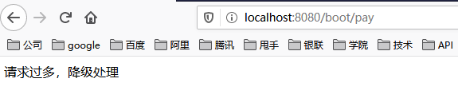
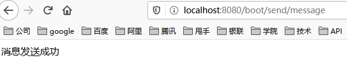
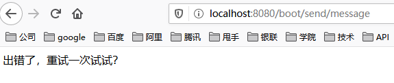

## 【高并发】亿级流量场景下如何为HTTP接口限流？看完我懂了！！

## 写在前面

> 在互联网应用中，高并发系统会面临一个重大的挑战，那就是大量流高并发访问，比如：天猫的双十一、京东618、秒杀、抢购促销等，这些都是典型的大流量高并发场景。关于秒杀，小伙伴们可以参见我的另一篇文章《[【高并发】高并发秒杀系统架构解密，不是所有的秒杀都是秒杀！](https://mp.weixin.qq.com/s?__biz=Mzg3MzE1NTIzNA==&mid=2247484357&idx=1&sn=23e6e38143704db0fa4588186b534e13&chksm=cee51c08f992951e5b883c55b788588f9cbc822e41694b5b4a334ea5d2dc0ae62a5d64e39dc2&token=1388808518&lang=zh_CN#rd)》
>
> 关于【冰河技术】微信公众号，解锁更多【高并发】专题文章。
>
> 注意：由于原文篇幅比较长，所以被拆分为：理论、算法、实战（HTTP接口实战+分布式限流实战）三大部分。
>
> 理论篇：《[【高并发】如何实现亿级流量下的分布式限流？这些理论你必须掌握！！](https://mp.weixin.qq.com/s?__biz=Mzg3MzE1NTIzNA==&mid=2247485706&idx=1&sn=c7d71c0c6b9b15c3b330766f1083e29c&chksm=cee516c7f9929fd170ce636a63fc3764d5ef62eb7ef67a7601664d3d56b0d04c8759e666bc87&token=378924601&lang=zh_CN#rd)》
>
> 算法篇：《[【高并发】如何实现亿级流量下的分布式限流？这些算法你必须掌握！！](https://mp.weixin.qq.com/s?__biz=Mzg3MzE1NTIzNA==&mid=2247485719&idx=1&sn=8659791a07a55ae4b646679846d0264f&chksm=cee516daf9929fcc33961276715980832d0b2d875cf563121052592141f132dfa31bbd669ebf&token=378924601&lang=zh_CN#rd)》
>
> 项目源码已提交到github：https://github.com/sunshinelyz/mykit-ratelimiter

## HTTP接口限流实战

这里，我们实现Web接口限流，具体方式为：使用自定义注解封装基于令牌桶限流算法实现接口限流。

## 不使用注解实现接口限流

#### 搭建项目

这里，我们使用SpringBoot项目来搭建Http接口限流项目，SpringBoot项目本质上还是一个Maven项目。所以，小伙伴们可以直接创建一个Maven项目，我这里的项目名称为mykit-ratelimiter-test。接下来，在pom.xml文件中添加如下依赖使项目构建为一个SpringBoot项目。

```xml
<parent>
        <groupId>org.springframework.boot</groupId>
        <artifactId>spring-boot-starter-parent</artifactId>
        <version>2.2.6.RELEASE</version>
    </parent>

    <modelVersion>4.0.0</modelVersion>
    <groupId>io.mykit.limiter</groupId>
    <artifactId>mykit-ratelimiter-test</artifactId>
    <version>1.0.0-SNAPSHOT</version>
    <packaging>jar</packaging>
    <name>mykit-ratelimiter-test</name>

    <properties>
        <guava.version>28.2-jre</guava.version>
    </properties>

    <dependencies>
        <dependency>
            <groupId>org.springframework.boot</groupId>
            <artifactId>spring-boot-starter-test</artifactId>
        </dependency>

        <dependency>
            <groupId>org.springframework.boot</groupId>
            <artifactId>spring-boot-starter-web</artifactId>
            <exclusions>
                <exclusion>
                    <groupId>org.springframework.boot</groupId>
                    <artifactId>spring-boot-starter-tomcat</artifactId>
                </exclusion>
                <exclusion>
                    <groupId>org.springframework.boot</groupId>
                    <artifactId>spring-boot-starter-logging</artifactId>
                </exclusion>
            </exclusions>
        </dependency>

        <dependency>
            <groupId>org.springframework.boot</groupId>
            <artifactId>spring-boot-starter-undertow</artifactId>
        </dependency>

        <dependency>
            <groupId>org.springframework.boot</groupId>
            <artifactId>spring-boot-configuration-processor</artifactId>
            <optional>true</optional>
        </dependency>

        <dependency>
            <groupId>org.springframework.boot</groupId>
            <artifactId>spring-boot-starter-data-redis</artifactId>
        </dependency>
        
        <dependency>
            <groupId>org.aspectj</groupId>
            <artifactId>aspectjweaver</artifactId>
        </dependency>

        <dependency>
            <groupId>org.springframework.boot</groupId>
            <artifactId>spring-boot-starter-aop</artifactId>
        </dependency>

        <dependency>
            <groupId>com.google.guava</groupId>
            <artifactId>guava</artifactId>
            <version>${guava.version}</version>
        </dependency>
    </dependencies>

    <build>
        <plugins>
            <plugin>
                <groupId>org.apache.maven.plugins</groupId>
                <artifactId>maven-compiler-plugin</artifactId>
                <version>3.1</version><!--$NO-MVN-MAN-VER$-->
                <configuration>
                    <source>${java.version}</source>
                    <target>${java.version}</target>
                </configuration>
            </plugin>
        </plugins>
    </build>
```

可以看到，我在项目中除了引用了SpringBoot相关的Jar包外，还引用了guava框架，版本为28.2-jre。

#### 创建核心类

这里，我主要是模拟一个支付接口的限流场景。首先，我们定义一个PayService接口和MessageService接口。PayService接口主要用于模拟后续的支付业务，MessageService接口模拟发送消息。接口的定义分别如下所示。

* PayService

```java
package io.mykit.limiter.service;
import java.math.BigDecimal;
/**
 * @author binghe
 * @version 1.0.0
 * @description 模拟支付
 */
public interface PayService {
    int pay(BigDecimal price);
}
```

* MessageService

```java
package io.mykit.limiter.service;
/**
 * @author binghe
 * @version 1.0.0
 * @description 模拟发送消息服务
 */
public interface MessageService {
    boolean sendMessage(String message);
}
```

接下来，创建二者的实现类，分别如下。

* MessageServiceImpl

```java
package io.mykit.limiter.service.impl;
import io.mykit.limiter.service.MessageService;
import org.slf4j.Logger;
import org.slf4j.LoggerFactory;
import org.springframework.stereotype.Service;
/**
 * @author binghe
 * @version 1.0.0
 * @description 模拟实现发送消息
 */
@Service
public class MessageServiceImpl implements MessageService {
    private final Logger logger = LoggerFactory.getLogger(MessageServiceImpl.class);
    @Override
    public boolean sendMessage(String message) {
        logger.info("发送消息成功===>>" + message);
        return true;
    }
}
```

* PayServiceImpl

```java
package io.mykit.limiter.service.impl;
import io.mykit.limiter.service.PayService;
import org.slf4j.Logger;
import org.slf4j.LoggerFactory;
import org.springframework.stereotype.Service;
import java.math.BigDecimal;
/**
 * @author binghe
 * @version 1.0.0
 * @description 模拟支付
 */
@Service
public class PayServiceImpl implements PayService {
    private final Logger logger = LoggerFactory.getLogger(PayServiceImpl.class);
    @Override
    public int pay(BigDecimal price) {
        logger.info("支付成功===>>" + price);
        return 1;
    }
}
```

由于是模拟支付和发送消息，所以，我在具体实现的方法中打印出了相关的日志，并没有实现具体的业务逻辑。

接下来，就是创建我们的Controller类PayController，在PayController类的接口pay()方法中使用了限流，每秒钟向桶中放入2个令牌，并且客户端从桶中获取令牌，如果在500毫秒内没有获取到令牌的话，我们可以则直接走服务降级处理。

PayController的代码如下所示。

```java
package io.mykit.limiter.controller;
import com.google.common.util.concurrent.RateLimiter;
import io.mykit.limiter.service.MessageService;
import io.mykit.limiter.service.PayService;
import org.slf4j.Logger;
import org.slf4j.LoggerFactory;
import org.springframework.beans.factory.annotation.Autowired;
import org.springframework.web.bind.annotation.RequestMapping;
import org.springframework.web.bind.annotation.RestController;
import java.math.BigDecimal;
import java.util.concurrent.TimeUnit;

/**
 * @author binghe
 * @version 1.0.0
 * @description 测试接口限流
 */
@RestController
public class PayController {
    private final Logger logger = LoggerFactory.getLogger(PayController.class);
    /**
     * RateLimiter的create()方法中传入一个参数，表示以固定的速率2r/s，即以每秒2个令牌的速率向桶中放入令牌
     */
    private RateLimiter rateLimiter = RateLimiter.create(2);

    @Autowired
    private MessageService messageService;
    @Autowired
    private PayService payService;
    @RequestMapping("/boot/pay")
    public String pay(){
        //记录返回接口
        String result = "";
        //限流处理，客户端请求从桶中获取令牌，如果在500毫秒没有获取到令牌，则直接走服务降级处理
        boolean tryAcquire = rateLimiter.tryAcquire(500, TimeUnit.MILLISECONDS);
        if (!tryAcquire){
            result = "请求过多，降级处理";
            logger.info(result);
            return result;
        }
        int ret = payService.pay(BigDecimal.valueOf(100.0));
        if(ret > 0){
            result = "支付成功";
            return result;
        }
        result = "支付失败，再试一次吧...";
        return result;
    }
}
```

最后，我们来创建mykit-ratelimiter-test项目的核心启动类，如下所示。

```java
package io.mykit.limiter;
import org.springframework.boot.SpringApplication;
import org.springframework.boot.autoconfigure.SpringBootApplication;

/**
 * @author binghe
 * @version 1.0.0
 * @description 项目启动类
 */
@SpringBootApplication
public class MykitLimiterApplication {

    public static void main(String[] args){
        SpringApplication.run(MykitLimiterApplication.class, args);
    }
}
```

至此，我们不使用注解方式实现限流的Web应用就基本完成了。

#### 运行项目

项目创建完成后，我们来运行项目，运行SpringBoot项目比较简单，直接运行MykitLimiterApplication类的main()方法即可。

项目运行成功后，我们在浏览器地址栏输入链接：http://localhost:8080/boot/pay。页面会输出“支付成功”的字样，说明项目搭建成功了。如下所示。


此时，我只访问了一次，并没有触发限流。接下来，我们不停的刷浏览器，此时，浏览器会输出“支付失败，再试一次吧...”的字样，如下所示。



在PayController类中还有一个sendMessage()方法，模拟的是发送消息的接口，同样使用了限流操作，具体代码如下所示。

```java
@RequestMapping("/boot/send/message")
public String sendMessage(){
    //记录返回接口
    String result = "";
    //限流处理，客户端请求从桶中获取令牌，如果在500毫秒没有获取到令牌，则直接走服务降级处理
    boolean tryAcquire = rateLimiter.tryAcquire(500, TimeUnit.MILLISECONDS);
    if (!tryAcquire){
        result = "请求过多，降级处理";
        logger.info(result);
        return result;
    }
    boolean flag = messageService.sendMessage("恭喜您成长值+1");
    if (flag){
        result = "消息发送成功";
        return result;
    }
    result = "消息发送失败，再试一次吧...";
    return result;
}
```

sendMessage()方法的代码逻辑和运行效果与pay()方法相同，我就不再浏览器访问 http://localhost:8080/boot/send/message 地址的访问效果了，小伙伴们可以自行验证。

#### 不使用注解实现限流缺点

通过对项目的编写，我们可以发现，当在项目中对接口进行限流时，不使用注解进行开发，会导致代码出现大量冗余，每个方法中几乎都要写一段相同的限流逻辑，代码十分冗余。

如何解决代码冗余的问题呢？我们可以使用自定义注解进行实现。

## 使用注解实现接口限流

使用自定义注解，我们可以将一些通用的业务逻辑封装到注解的切面中，在需要添加注解业务逻辑的方法上加上相应的注解即可。针对我们这个限流的实例来说，可以基于自定义注解实现。

#### 实现自定义注解

实现，我们来创建一个自定义注解，如下所示。

```java
package io.mykit.limiter.annotation;
import java.lang.annotation.*;
/**
 * @author binghe
 * @version 1.0.0
 * @description 实现限流的自定义注解
 */
@Target(value = ElementType.METHOD)
@Retention(RetentionPolicy.RUNTIME)
@Documented
public @interface MyRateLimiter {
    //向令牌桶放入令牌的速率
    double rate();
    //从令牌桶获取令牌的超时时间
    long timeout() default 0;
}
```

#### 自定义注解切面实现

接下来，我们还要实现一个切面类MyRateLimiterAspect，如下所示。

```java
package io.mykit.limiter.aspect;

import com.google.common.util.concurrent.RateLimiter;
import io.mykit.limiter.annotation.MyRateLimiter;
import org.aspectj.lang.ProceedingJoinPoint;
import org.aspectj.lang.annotation.Around;
import org.aspectj.lang.annotation.Aspect;
import org.aspectj.lang.annotation.Pointcut;
import org.aspectj.lang.reflect.MethodSignature;
import org.springframework.beans.factory.annotation.Autowired;
import org.springframework.stereotype.Component;

import javax.servlet.http.HttpServletResponse;
import java.io.IOException;
import java.io.PrintWriter;
import java.util.concurrent.TimeUnit;

/**
 * @author binghe
 * @version 1.0.0
 * @description 一般限流切面类
 */
@Aspect
@Component
public class MyRateLimiterAspect {

    private RateLimiter rateLimiter = RateLimiter.create(2);

    @Pointcut("execution(public * io.mykit.limiter.controller.*.*(..))")
    public void pointcut(){

    }

    /**
     * 核心切面方法
     */
    @Around("pointcut()")
    public Object process(ProceedingJoinPoint proceedingJoinPoint) throws Throwable{
        MethodSignature signature = (MethodSignature) proceedingJoinPoint.getSignature();

        //使用反射获取方法上是否存在@MyRateLimiter注解
        MyRateLimiter myRateLimiter = signature.getMethod().getDeclaredAnnotation(MyRateLimiter.class);
        if(myRateLimiter == null){
            //程序正常执行，执行目标方法
            return proceedingJoinPoint.proceed();
        }
        //获取注解上的参数
        //获取配置的速率
        double rate = myRateLimiter.rate();
        //获取客户端等待令牌的时间
        long timeout = myRateLimiter.timeout();

        //设置限流速率
        rateLimiter.setRate(rate);

        //判断客户端获取令牌是否超时
        boolean tryAcquire = rateLimiter.tryAcquire(timeout, TimeUnit.MILLISECONDS);
        if(!tryAcquire){
            //服务降级
            fullback();
            return null;
        }
        //获取到令牌，直接执行
        return proceedingJoinPoint.proceed();

    }

    /**
     * 降级处理
     */
    private void fullback() {
        response.setHeader("Content-type", "text/html;charset=UTF-8");
        PrintWriter writer = null;
        try {
            writer =  response.getWriter();
            writer.println("出错了，重试一次试试？");
            writer.flush();;
        } catch (IOException e) {
            e.printStackTrace();
        }finally {
            if(writer != null){
                writer.close();
            }
        }
    }
}
```

自定义切面的功能比较简单，我就不细说了，大家有啥问题可以关注【冰河技术】微信公众号来进行提问。

接下来，我们改造下PayController类中的sendMessage()方法，修改后的方法片段代码如下所示。

```java
@MyRateLimiter(rate = 1.0, timeout = 500)
@RequestMapping("/boot/send/message")
public String sendMessage(){
    //记录返回接口
    String result = "";
    boolean flag = messageService.sendMessage("恭喜您成长值+1");
    if (flag){
        result = "消息发送成功";
        return result;
    }
    result = "消息发送失败，再试一次吧...";
    return result;
}
```

#### 运行部署项目

部署项目比较简单，只需要运行MykitLimiterApplication类下的main()方法即可。这里，为了简单，我们还是从浏览器中直接输入链接地址来进行访问

效果如下所示。



接下来，我们不断的刷新浏览器。会出现“消息发送失败，再试一次吧..”的字样，说明已经触发限流操作。



## 基于限流算法实现限流的缺点

上面介绍的限流方式都只能用于单机部署的环境中，如果将应用部署到多台服务器进行分布式、集群，则上面限流的方式就不适用了，此时，我们需要使用分布式限流。至于在分布式场景下，如何实现限流操作，我们就在下一篇中进行介绍。

## 重磅福利

关注「 **冰河技术** 」微信公众号，后台回复 “**设计模式**” 关键字领取《**深入浅出Java 23种设计模式**》PDF文档。回复“**Java8**”关键字领取《**Java8新特性教程**》PDF文档。两本PDF均是由冰河原创并整理的超硬核教程，面试必备！！

<font color="#FF0000">**好了，今天就聊到这儿吧！别忘了点个赞，给个在看和转发，让更多的人看到，一起学习，一起进步！！**</font>

## 写在最后

> 如果你觉得冰河写的还不错，请微信搜索并关注「 **冰河技术** 」微信公众号，跟冰河学习高并发、分布式、微服务、大数据、互联网和云原生技术，「 **冰河技术** 」微信公众号更新了大量技术专题，每一篇技术文章干货满满！不少读者已经通过阅读「 **冰河技术** 」微信公众号文章，吊打面试官，成功跳槽到大厂；也有不少读者实现了技术上的飞跃，成为公司的技术骨干！如果你也想像他们一样提升自己的能力，实现技术能力的飞跃，进大厂，升职加薪，那就关注「 **冰河技术** 」微信公众号吧，每天更新超硬核技术干货，让你对如何提升技术能力不再迷茫！


