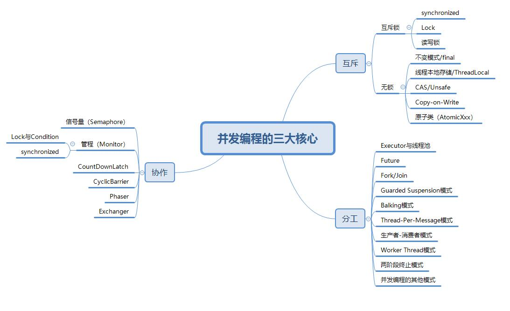

## 【高并发】又一个朋友面试栽在了Thread类的stop()方法和interrupt()方法上！

## 写在前面

> 新一轮的面试已经过去，可能是疫情的原因吧，很多童鞋纷纷留言说今年的面试题难度又提高了，尤其是对并发编程的知识。我细想了下，也许有那么点疫情的原因吧，但无论面试的套路怎么变，只要掌握了核心知识和底层原理，吊打面试官应该不难吧。玩笑归玩笑，学习知识并不只是为了应付面试，更应该将这些知识运用到实际的工作中。

一个工作了几年的朋友今天打电话和我聊天，说前段时间出去面试，面试官问他做过的项目，他讲起业务来那是头头是道，犹如滔滔江水连绵不绝，可面试官最后问了一个问题：Thread类的stop()方法和interrupt方法有啥区别。这一问不要紧，当场把那个朋友打懵了！结果可想而知。。。

事后，我也是感慨颇多，现在的程序员只知道做些简单的CRUD吗？哎，不多说了，今天就简单的说说Thread类的stop()方法和interrupt()方法到底有啥区别吧！

## stop()方法

**stop()方法会真的杀死线程。**如果线程持有ReentrantLock锁，被stop()的线程并不会自动调用ReentrantLock的unlock()去释放锁，那其他线程就再也没机会获得ReentrantLock锁， 这样其他线程就再也不能执行ReentrantLock锁锁住的代码逻辑。 所以该方法就不建议使用了， 类似的方法还有suspend()和resume()方法， 这两个方法同样也都不建议使用了， 所以这里也就不多介绍了。

## interrupt()方法

interrupt()方法仅仅是通知线程，线程有机会执行一些后续操作，同时也可以无视这个通知。被interrupt的线程，有两种方式接收通知：**一种是异常， 另一种是主动检测。**

### 通过异常接收通知

当线程A处于WAITING、 TIMED_WAITING状态时， 如果其他线程调用线程A的interrupt()方法，则会使线程A返回到RUNNABLE状态，同时线程A的代码会触发InterruptedException异常。线程转换到WAITING、TIMED_WAITING状态的触发条件，都是调用了类似wait()、join()、sleep()这样的方法， 我们看这些方法的签名时，发现都会throws InterruptedException这个异常。这个异常的触发条件就是：其他线程调用了该线程的interrupt()方法。

当线程A处于RUNNABLE状态时，并且阻塞在java.nio.channels.InterruptibleChannel上时， 如果其他线程调用线程A的interrupt()方法，线程A会触发java.nio.channels.ClosedByInterruptException这个异常；当阻塞在java.nio.channels.Selector上
时，如果其他线程调用线程A的interrupt()方法，线程A的java.nio.channels.Selector会立即返回。

### 主动检测通知

如果线程处于RUNNABLE状态，并且没有阻塞在某个I/O操作上，例如中断计算基因组序列的线程A，此时就得依赖线程A主动检测中断状态了。如果其他线程调用线程A的interrupt()方法， 那么线程A可以通过isInterrupted()方法， 来检测自己是不是被中断了。

## 写在最后

> 如果觉得文章对你有点帮助，请微信搜索并关注「 **冰河技术** 」微信公众号，跟冰河学习高并发编程技术。

最后，附上并发编程需要掌握的核心技能知识图，祝大家在学习并发编程时，少走弯路。

> 如果你觉得冰河写的还不错，请微信搜索并关注「 **冰河技术** 」微信公众号，跟冰河学习高并发、分布式、微服务、大数据、互联网和云原生技术，「 **冰河技术** 」微信公众号更新了大量技术专题，每一篇技术文章干货满满！不少读者已经通过阅读「 **冰河技术** 」微信公众号文章，吊打面试官，成功跳槽到大厂；也有不少读者实现了技术上的飞跃，成为公司的技术骨干！如果你也想像他们一样提升自己的能力，实现技术能力的飞跃，进大厂，升职加薪，那就关注「 **冰河技术** 」微信公众号吧，每天更新超硬核技术干货，让你对如何提升技术能力不再迷茫！

