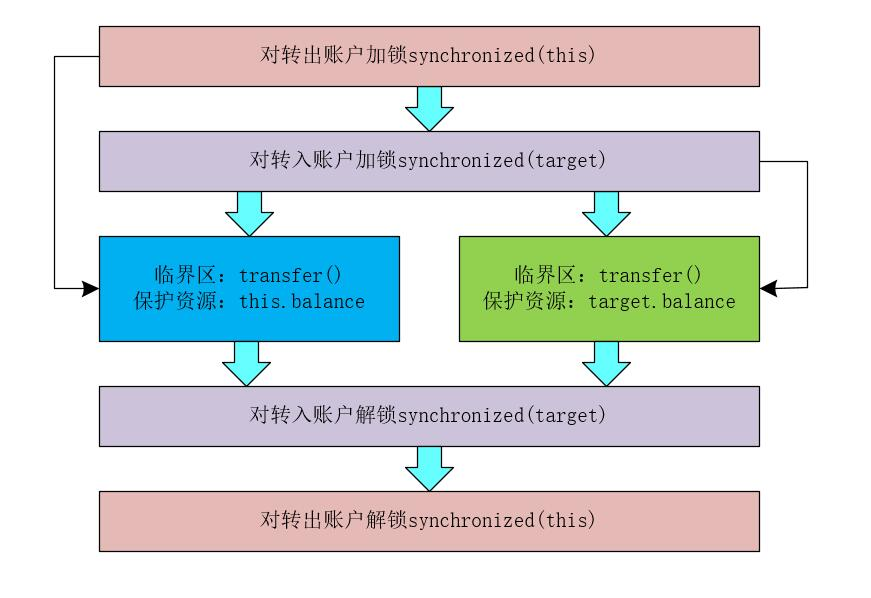

## 【高并发】优化加锁方式时竟然死锁了！！

## 写在前面

> 今天，在优化程序的加锁方式时，竟然出现了死锁！！到底是为什么呢？！经过仔细的分析之后，终于找到了原因。

## 为何需要优化加锁方式？

在《[【高并发】高并发环境下诡异的加锁问题（你加的锁未必安全）](https://blog.csdn.net/l1028386804/article/details/105448664)》一文中，我们在转账类TansferAccount中使用TansferAccount.class对象对程序加锁，如下所示。

```java
public class TansferAccount{
    private Integer balance;
    public void transfer(TansferAccount target, Integer transferMoney){
        synchronized(TansferAccount.class){
        	if(this.balance >= transferMoney){
                this.balance -= transferMoney;
                target.balance += transferMoney;
            }   
        }
    }
}
```

这种方式确实解决了转账操作的并发问题，<font color="#FF0000">**但是这种方式在高并发环境下真的可取吗？**</font>试想，如果我们在高并发环境下使用上述代码来处理转账操作，因为TansferAccount.class对象是JVM在加载TansferAccount类的时候创建的，所有的TansferAccount实例对象都会共享一个TansferAccount.class对象。也就是说，<font color="#FF0000">**所有TansferAccount实例对象执行transfer()方法时，都是互斥的！！**</font>换句话说，<font color = "#FF0000">**所有的转账操作都是串行的！！**</font>

如果所有的转账操作都是串行执行的话，造成的后果就是：账户A为账户B转账完成后，才能进行账户C为账户D的转账操作。如果全世界的网民一起执行转账操作的话，这些转账操作都串行执行，那么，程序的性能是完全无法接受的！！！

其实，<font color="#FF0000">**账户A为账户B转账的操作和账户C为账户D转账的操作完全可以并行执行。**</font>所以，我们必须优化加锁方式，提升程序的性能！！

## 初步优化加锁方式

既然直接TansferAccount.class对程序加锁在高并发环境下不可取，那么，我们到底应该怎么做呢？！

仔细分析下上面的代码业务，上述代码的转账操作中，涉及到转出账户this和转入账户target，所以，我们可以分别对转出账户this和转入账户target加锁，只有两个账户加锁都成功时，才执行转账操作。这样就能够做到<font color="#FF0000">**账户A为账户B转账的操作和账户C为账户D转账的操作完全可以并行执行。**</font>

我们可以将优化后的逻辑用下图表示。



根据上面的分析，我们可以将TansferAccount的代码优化成如下所示。

```java
public class TansferAccount{
    //账户的余额
    private Integer balance;
    //转账操作
    public void transfer(TansferAccount target, Integer transferMoney){
        //对转出账户加锁
        synchronized(this){
            //对转入账户加锁
            synchronized(target){
                if(this.balance >= transferMoney){
                    this.balance -= transferMoney;
                    target.balance += transferMoney;
                }   
            }
        }
    }
}
```

此时，上面的代码看上去没啥问题，<font color="#FF0000">**但真的是这样吗？**</font> 我也希望程序是完美的，但是往往却不是我们想的那样啊！没错，上面的程序会出现 <font color="#FF0000">**死锁，**</font>  为什么会出现死锁啊？ 接下来，我们就开始分析一波。

## 死锁的问题分析

TansferAccount类中的代码看上去比较完美，但是优化后的加锁方式竟然会导致死锁！！！这是我亲测得出的结论！！

关于死锁我们可以结合改进的TansferAccount类举一个简单的场景：假设有线程A和线程B两个线程同时运行在两个不同的CPU上，线程A执行账户A向账户B转账的操作，线程B执行账户B向账户A转账的操作。当线程A和线程B执行到 synchronized(this)代码时，线程A获得了账户A的锁，线程B获得了账户B的锁。当执行到synchronized(target)代码时，线程A尝试获得账户B的锁时，发现账户B已经被线程B锁定，此时线程A开始等待线程B释放账户B的锁；而线程B尝试获得账户A的锁时，发现账户A已经被线程A锁定，此时线程B开始等待线程A释放账户A的锁。

<font color="#FF0000">**这样，线程A持有账户A的锁并等待线程B释放账户B的锁，线程B持有账户B的锁并等待线程A释放账户A的锁，死锁发生了！！**</font>

## 死锁的必要条件

在如何解决死锁之前，我们先来看下发生死锁时有哪些必要的条件。如果要发生死锁，则必须存在以下四个必要条件，四者缺一不可。

* ### **互斥条件**

**在一段时间内某资源仅为一个线程所占有。此时若有其他线程请求该资源，则请求线程只能等待。**

* ### **不可剥夺条件**

线程所获得的资源在未使用完毕之前，不能被其他线程强行夺走，即只能由获得该资源的线程自己来释放（只能是主动释放)。

* ### **请求与保持条件**

线程已经保持了至少一个资源，但又提出了新的资源请求，而该资源已被其他线程占有，此时请求线程被阻塞，但对自己已获得的资源保持不放。

* ### **循环等待条件**

既然死锁的发生必须存在上述四个条件，那么，大家是不是就能够想到如何预防死锁了呢？

## 死锁的预防

并发编程中，一旦发生了死锁的现象，则基本没有特别好的解决方法，一般情况下只能重启应用来解决。因此，<font color="#FF0000">**解决死锁的最好方法就是预防死锁。**</font>

发生死锁时，必然会存在死锁的四个必要条件。也就是说，如果我们在写程序时，只要“破坏”死锁的四个必要条件中的一个，就能够避免死锁的发生。接下来，我们就一起来探讨下如何“破坏”这四个必要条件。

* ### **破坏互斥条件**

互斥条件是我们没办法破坏的，因为我们使用锁为的就是线程之间的互斥。这一点需要特别注意！！！！

* ### **破坏不可剥夺条件**

破坏不可剥夺的条件的核心就是让当前线程自己主动释放占有的资源，关于这一点，synchronized是做不到的，我们可以使用java.util.concurrent包下的Lock来解决。此时，我们需要将TansferAccount类的代码修改成类似如下所示。

```java
public class TansferAccount{
    private Lock thisLock = new ReentrantLock();
    private Lock targetLock = new ReentrantLock();
    //账户的余额
    private Integer balance;
    //转账操作
    public void transfer(TansferAccount target, Integer transferMoney){
        boolean isThisLock = thisLock.tryLock();
        if(isThisLock){
            try{
                boolean isTargetLock = targetLock.tryLock();
                if(isTargetLock){
                    try{
                         if(this.balance >= transferMoney){
                            this.balance -= transferMoney;
                            target.balance += transferMoney;
                        }   
                    }finally{
                        targetLock.unlock
                    }
                }
            }finally{
                thisLock.unlock();
            }
        }
    }
}
```

其中Lock中有两个tryLock方法，分别如下所示。

* tryLock()方法

tryLock()方法是有返回值的，它表示用来尝试获取锁，如果获取成功，则返回true，如果获取失败（即锁已被其他线程获取），则返回false，也就说这个方法无论如何都会立即返回。在拿不到锁时不会一直在那等待。

* tryLock(long time, TimeUnit  unit)方法

tryLock(long time, TimeUnit  unit)方法和tryLock()方法是类似的，只不过区别在于这个方法在拿不到锁时会等待一定的时间，在时间期限之内如果还拿不到锁，就返回false。如果一开始拿到锁或者在等待期间内拿到了锁，则返回true。

* ### **破坏请求与保持条件**

破坏请求与保持条件，我们可以一次性申请所需要的所有资源，例如在我们完成转账操作的过程中，我们一次性申请账户A和账户B，两个账户都申请成功后，再执行转账的操作。此时，我们需要再创建一个申请资源的类ResourcesRequester，这个类的作用就是申请资源和释放资源。同时，TansferAccount类中需要持有一个ResourcesRequester类的单例对象，当我们需要执行转账操作时，首先向ResourcesRequester同时申请转出账户和转入账户两个资源，申请成功后，再锁定两个资源；当转账操作完成后，释放锁并释放ResourcesRequester类申请的转出账户和转入账户资源。

ResourcesRequester类的代码如下所示。

```java
public class ResourcesRequester{
    //存放申请资源的集合
    private List<Object> resources = new ArrayList<Object>();
    //一次申请所有的资源
    public synchronized boolean applyResources(Object source, Object target){
        if(resources.contains(source) || resources.contains(target)){
            return false;
        }
        resources.add(source);
        resources.add(targer);
        return true;
    }
    
    //释放资源
    public synchronized void releaseResources(Object source, Object target){
        resources.remove(source);
        resources.remove(target);
    }
}
```

此时，TansferAccount类的代码如下所示。

```java
public class TansferAccount{
    //账户的余额
    private Integer balance;
    //ResourcesRequester类的单例对象
    private ResourcesRequester requester;
   
    //转账操作
    public void transfer(TansferAccount target, Integer transferMoney){
        //自旋申请转出账户和转入账户，直到成功
        while(!requester.applyResources(this, target)){
            //循环体为空
            ;
        }
        try{
            //对转出账户加锁
            synchronized(this){
                //对转入账户加锁
                synchronized(target){
                    if(this.balance >= transferMoney){
                        this.balance -= transferMoney;
                        target.balance += transferMoney;
                    }   
                }
            }
        }finally{
            //最后释放账户资源
            requester.releaseResources(this, target);
        }

    }
}
```

* ### **破坏循环等待条件**

破坏循环等待条件，则可以通过对资源排序，按照一定的顺序来申请资源，然后按照顺序来锁定资源，可以有效的避免死锁。

例如，在我们的转账操作中，往往每个账户都会有一个唯一的id值，我们在锁定账户资源时，可以按照id值从小到大的顺序来申请账户资源，并按照id从小到大的顺序来锁定账户，此时，程序就不会再进行循环等待了。

程序代码如下所示。

```java
public class TansferAccount{
    //账户的id
    private Integer id;
    //账户的余额
    private Integer balance;
    //转账操作
    public void transfer(TansferAccount target, Integer transferMoney){
        TansferAccount beforeAccount = this;
        TansferAccount afterAccount = target;
        if(this.id > target.id){
            beforeAccount = target;
            afterAccount = this;
        }
        //对转出账户加锁
        synchronized(beforeAccount){
            //对转入账户加锁
            synchronized(afterAccount){
                if(this.balance >= transferMoney){
                    this.balance -= transferMoney;
                    target.balance += transferMoney;
                }   
            }
        }
    }
}
```

## 总结

在并发编程中，使用细粒度锁来锁定多个资源时，要时刻注意死锁的问题。另外，避免死锁最简单的方法就是阻止循环等待条件，将系统中所有的资源设置标志位、排序，规定所有的线程申请资源必须以一定的顺序来操作进而避免死锁。

## 写在最后

> 如果觉得文章对你有点帮助，请微信搜索并关注「 **冰河技术** 」微信公众号，跟冰河学习高并发编程技术。

最后，附上并发编程需要掌握的核心技能知识图，祝大家在学习并发编程时，少走弯路。


> 如果你觉得冰河写的还不错，请微信搜索并关注「 **冰河技术** 」微信公众号，跟冰河学习高并发、分布式、微服务、大数据、互联网和云原生技术，「 **冰河技术** 」微信公众号更新了大量技术专题，每一篇技术文章干货满满！不少读者已经通过阅读「 **冰河技术** 」微信公众号文章，吊打面试官，成功跳槽到大厂；也有不少读者实现了技术上的飞跃，成为公司的技术骨干！如果你也想像他们一样提升自己的能力，实现技术能力的飞跃，进大厂，升职加薪，那就关注「 **冰河技术** 」微信公众号吧，每天更新超硬核技术干货，让你对如何提升技术能力不再迷茫！


