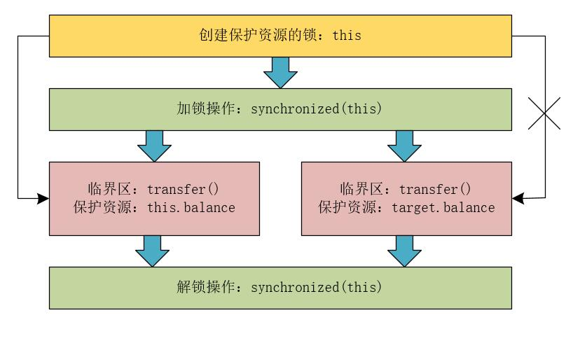
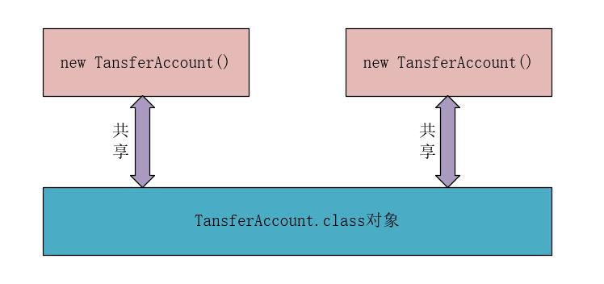
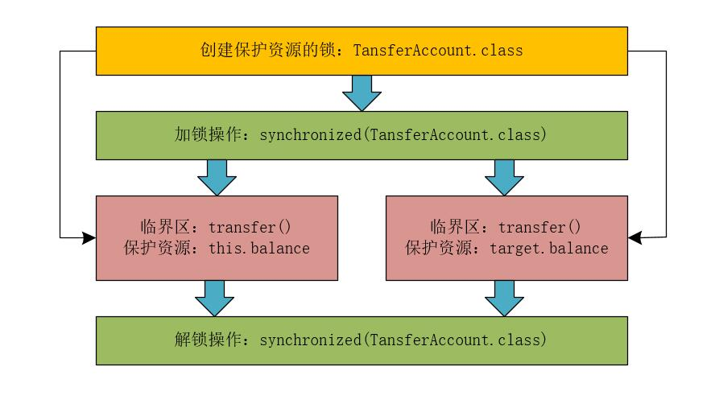

## 【高并发】高并发环境下诡异的加锁问题（你加的锁未必安全）

## 声明

<font color="#FF0000">**特此声明：文中有关支付宝账户的说明，只是用来举例，实际支付宝账户要比文中描述的复杂的多。也与文中描述的完全不同。**</font>

## 前言

> 很多网友留言说：在编写多线程并发程序时，我明明对共享资源加锁了啊？为什么还是出问题呢？问题到底出在哪里呢？其实，我想说的是：你的加锁姿势正确吗？你真的会使用锁吗？错误的加锁方式不但不能解决并发问题，而且还会带来各种诡异的Bug问题，有时难以复现！

在上一篇《[【高并发】如何使用互斥锁解决多线程的原子性问题？这次终于明白了！](https://blog.csdn.net/l1028386804/article/details/105281143)》一文中，我们知道在并发编程中，不能使用多把锁保护同一个资源，因为这样达不到线程互斥的效果，存在线程安全的问题。相反，却可以使用同一把锁保护多个资源。那么，如何使用同一把锁保护多个资源呢？又如何判断我们对程序加的锁到底是不是安全的呢？我们就一起来深入探讨这些问题！

## 分析场景

我们在分析多线程中如何使用同一把锁保护多个资源时，可以将其结合具体的业务场景来看，比如：需要保护的多个资源之间有没有直接的业务关系。如果需要保护的资源之间没有直接的业务关系，那么如何对其加锁；如果有直接的业务关系，那么如何对其加锁？接下来，我们就顺着这两个方向进行深入说明。

## 没有直接业务关系的场景

例如，我们的支付宝账户，有针对余额的付款操作，也有针对账户密码的修改操作。<font color="#FF0000">**本质上，这两种操作之间没有直接的业务关系，此时，我们可以为账户的余额和账户密码分配不同的锁来解决并发问题。**</font>

例如，在支付宝账户AlipayAccount类中，有两个成员变量，分别是账户的余额balance和账户的密码password。付款操作的pay()方法和查看余额操作的getBalance()方法会访问账户中的成员变量balance，对此，我们可以创建一个balanceLock锁对象来保护balance资源；另外，更改密码操作的updatePassword()方法和查看密码的getPassowrd()方法会访问账户中的成员变量password，对此，我们可以创建一个passwordLock锁对象来保护password资源。

具体的代码如下所示。

```java
public class AlipayAccount{
    //保护balance资源的锁对象
    private final Object balanceLock = new Object();
    //保护password资源的锁对象
    private final Object passwordLock = new Object();
    //账户余额
    private Integer balance;
    //账户的密码
    private String password;
    
    //支付方法
    public void pay(Integer money){
        synchronized(balanceLock){
            if(this.balance >= money){
                this.balance -= money;
            }
        }
    }
    //查看账户中的余额
    public Integer getBalance(){
        synchronized(balanceLock){
            return this.balance;
        }
    }
    
    //修改账户的密码
    public void updatePassword(String password){
        synchronized(passwordLock){
            this.password = password;
        }
    }
    
    //查看账户的密码
    public String getPassword(){
        synchronized(passwordLock){
            return this.password;
        }
    }
}
```

这里，我们也可以使用一把互斥锁来保护balance资源和password资源，例如都使用balanceLock锁对象，也可以都使用passwordLock锁对象，甚至也都可以使用this对象或者干脆每个方法前加一个synchronized关键字。

但是，如果都使用同一个锁对象的话，那么，程序的性能就太差了。会导致没有直接业务关系的各种操作都串行执行，这就违背了我们并发编程的初衷。实际上，我们使用两个锁对象分别保护balance资源和password资源，付款和修改账户密码是可以并行的。

## 存在直接业务关系的场景

例如，我们使用支付宝进行转账操作。假设账户A给账户B转账100，A账户减少100元，B账户增加100元。两个账户在业务中有直接的业务关系。例如，下面的TansferAccount类，有一个成员变量balance和一个转账的方法transfer()，代码如下所示。

```java
public class TansferAccount{
    private Integer balance;
    public void transfer(TansferAccount target, Integer transferMoney){
        if(this.balance >= transferMoney){
            this.balance -= transferMoney;
            target.balance += transferMoney;
        }
    }
}
```

在上面的代码中，如何保证转账操作不会出现并发问题呢？很多时候我们的第一反应就是给transfer()方法加锁，如下代码所示。

```java
public class TansferAccount{
    private Integer balance;
    public synchronized void transfer(TansferAccount target, Integer transferMoney){
        if(this.balance >= transferMoney){
            this.balance -= transferMoney;
            target.balance += transferMoney;
        }
    }
}
```

我们仔细分析下，<font color="#FF0000">**上面的代码真的是安全的吗？！**</font>其实，在这段代码中，synchronized临界区中存在两个不同的资源，分别是转出账户的余额this.balance和转入账户的余额target.balance，这里只用到了一把锁synchronized(this)。说到这里，大家有没有一种豁然开朗的感觉。没错，<font color="#FF0000">**问题就出现在synchronized(this)这把锁上，这把锁只能保护this.balance资源，而无法保护target.balance资源。**</font>

我们可以使用下图来表示这个逻辑。



从上图我们也可以发现，<font color="#FF0000">**this锁对象只能保护this.balance资源，而不能保护target.balance资源。**</font>

接下来，我们再看一个场景：假设存在A、B、C三个账户，余额都是200，此时我们使用两个线程分别执行两个转账操作：账户A给账户B转账100，账户B给账户C转账100。理论上，账户A的余额为100，账户B的余额为200，账户C的余额为300。

真的是这样吗？我们假设线程A和线程B同时在两个不同的CPU上执行，线程A执行账户A给账户B转账100的操作，线程B执行账户B给账户C转账100的操作。两个线程之间是互斥的吗？显然不是，按照TansferAccount的代码来看，线程A锁定的是账户A的实例，线程B锁定的是账户B的实例。所以，线程A和线程B能够同时进入transfer()方法。此时，线程A和线程B都能够读取到账户B的余额为200。<font color="#FF0000">**两个线程都完成转账操作后，B的账户余额可能为300，也可能为100，但是不可能为200。**</font>

这是为什么呢？线程A和线程B同时读取到账户B的余额为200，如果线程A的转账操作晚于线程B的转账操作对balance的写入，则账户B的余额为300；如果线程A的转账操作早于线程B的转账操作对balance的写入，则账户B的余额为100。无论如何账户B的余额都不会是200。

<font color="#FF0000">**综上所示，TansferAccount的代码根本无法解决并发问题！**</font>

## 正确的加锁

<font color="#FF0000">**如果我们希望对转账操作中涉及的多个资源加锁，那我们的锁就必须要覆盖所有需要保护的资源。**</font>

在前面的TansferAccount类中，this是对象级别的锁，这就导致了线程A和线程B执行过程中所获取到的锁是不同的，那么如何让两个线程共享同一把锁呢？！

其中，方案有很多，一种简单的方式，就是在TansferAccount类的构造方法中传入一个balanceLock锁对象，以后在创建TansferAccount类对象的时候，每次传入相同的balanceLock锁对象，并在transfer方法中使用balanceLock锁对象加锁即可。这样，所有创建的TansferAccount类对象就会共享balanceLock锁。代码如下所示。

```java
public class TansferAccount{
    private Integer balance;
    private Object balanceLock;
    private TansferAccount(){}
    public TansferAccount(Object balanceLock){
        this.balanceLock = balanceLock;
    }
    public void transfer(TansferAccount target, Integer transferMoney){
        synchronized(this.balanceLock){
             if(this.balance >= transferMoney){
                this.balance -= transferMoney;
                target.balance += transferMoney;
            }   
        }
    }
}
```

<font color="#FF0000">**那么，问题又来了：这样解决问题真的完美吗？！**</font>

上述代码虽然解决了转账操作的并发问题，但是它真的就完美了吗？！仔细分析后，我们发现，并不是想象中的那么完美。因为它要求创建TansferAccount对象的时候，必须传入同一个balanceLock对象，如果传入的不是同一个balanceLock对象，就不能保证并发带来的线程安全问题了！在实际的项目中，创建TansferAccount对象的操作可能被分散在多个不同的项目工程中，这样很难保证传入的balanceLock对象是同一个对象。

<font color="#FF0000">**所以，在创建TansferAccount对象时传入同一个balanceLock锁对象的方案，虽然能够解决转账的并发问题，但是却无法在实际项目中被有效的采用！**</font>

还有没有其他的方案呢？答案是有！别忘了JVM在加锁类的时候，会为类创建一个Class对象，而这个Class对象对于类的实例对象来说是共享的，也就是说，无论创建多少个类的实例对象，这个Class对象都是同一个，这是由JVM来保证的。



说到这里，我们就能够想到使用如下方式对转账操作加锁。

```java
public class TansferAccount{
    private Integer balance;
    public void transfer(TansferAccount target, Integer transferMoney){
        synchronized(TansferAccount.class){
        	if(this.balance >= transferMoney){
                this.balance -= transferMoney;
                target.balance += transferMoney;
            }   
        }
    }
}
```

我们可以使用下图表示这个逻辑。



这样，无论创建多少个TansferAccount对象，都会共享同一把锁，解决了转账的并发问题。

## 写在最后

> 如果觉得文章对你有点帮助，请微信搜索并关注「 **冰河技术** 」微信公众号，跟冰河学习高并发编程技术。

最后，附上并发编程需要掌握的核心技能知识图，祝大家在学习并发编程时，少走弯路。


> 如果你觉得冰河写的还不错，请微信搜索并关注「 **冰河技术** 」微信公众号，跟冰河学习高并发、分布式、微服务、大数据、互联网和云原生技术，「 **冰河技术** 」微信公众号更新了大量技术专题，每一篇技术文章干货满满！不少读者已经通过阅读「 **冰河技术** 」微信公众号文章，吊打面试官，成功跳槽到大厂；也有不少读者实现了技术上的飞跃，成为公司的技术骨干！如果你也想像他们一样提升自己的能力，实现技术能力的飞跃，进大厂，升职加薪，那就关注「 **冰河技术** 」微信公众号吧，每天更新超硬核技术干货，让你对如何提升技术能力不再迷茫！


