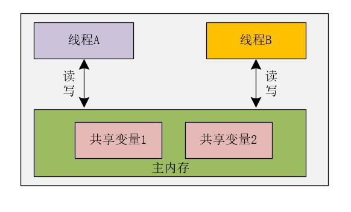
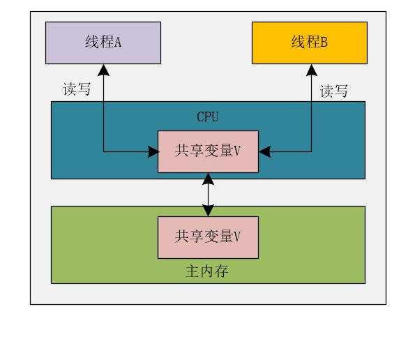
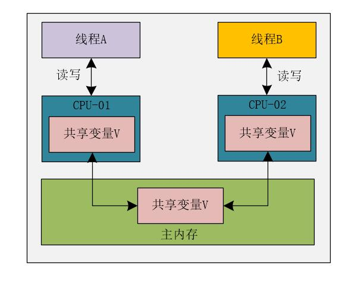
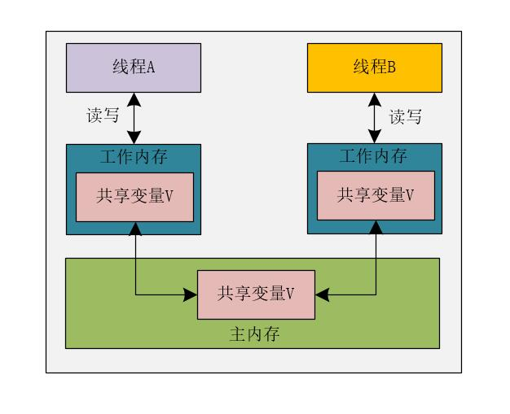
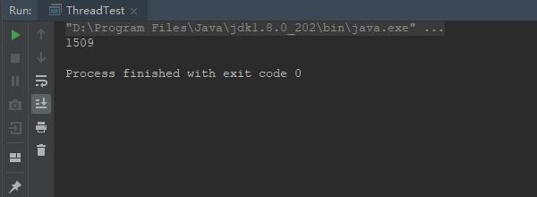

## 【高并发】解密诡异并发问题的第一个幕后黑手——可见性问题

## 写在前面

> 大冰：小菜童鞋，昨天讲解的内容复习了吗？
>
> 小菜：复习了，大冰哥。
>
> 大冰：那你说说我们昨天都讲了哪些内容呢？
>
> 小菜：昨天讲了并发编程的难点，由这些难点引出我们需要了解导致这些问题的“幕后黑手”。对于并发编程来说，计算机和操作系统的制作商为了提升计算机和系统的性能，为CPU增加了缓存，为操作系统增加了进程和线程，优化了CPU指令的执行顺序。而这些优化措施恰恰是导致并发编程频繁出现诡异问题的根源。
>
> 大冰：很好，小菜童鞋，掌握的不错，今天，我们就深入讲讲由缓存导致的可见性问题，这就是并发问题的三大“幕后黑手”之一，这个知识点非常重要，好好听。

## 可见性

> 对于什么是可见性，比较官方的解释就是：一个线程对共享变量的修改，另一个线程能够立刻看到。

说的直白些，就是两个线程共享一个变量，无论哪一个线程修改了这个变量，则另外的一个线程都能够看到上一个线程对这个变量的修改。这里的共享变量，指的是多个线程都能够访问和修改这个变量的值，那么，这个变量就是共享变量。

例如，线程A和线程B，它们都是直接修改主内存中的共享变量，无论是线程A修改了共享变量，还是线程B修改了共享变量，则另一个线程从主内存中读取出来的变量值，一定是修改过的值，这就是线程的可见性。



## 可见性问题

> 可见性问题，可以这样理解：一个线程修改了共享变量，另一个线程不能立刻看到，这是由CPU添加了缓存导致的问题。

理解了什么是可见性，再来看可见性问题就比较好理解了。既然可见性是一个线程修改了共享变量后，另一个线程能够立刻看到对共享变量的修改，如果不能立刻看到，这就会产生可见性的问题。

### 单核CPU不存在可见性问题

理解可见性问题我们还需要注意一点，那就是**在单核CPU上不存在可见性问题。**这是为什么呢？

因为**在单核CPU上，无论创建了多少个线程，同一时刻只会有一个线程能够获取到CPU的资源来执行任务**，即使这个单核的CPU已经添加了缓存。这些线程都是运行在同一个CPU上，操作的是同一个CPU的缓存，只要其中一个线程修改了共享变量的值，那另外的线程就一定能够访问到修改后的变量值。



### 多核CPU存在可见性问题

单核CPU由于同一时刻只会有一个线程执行，而每个线程执行的时候操作的都是同一个CPU的缓存，所以，单核CPU不存在可见性问题。但是到了多核CPU上，就会出现可见性问题了。

这是因为在多核CPU上，每个CPU的内核都有自己的缓存。当多个不同的线程运行在不同的CPU内核上时，这些线程操作的是不同的CPU缓存。一个线程对其绑定的CPU的缓存的写操作，对于另外一个线程来说，不一定是可见的，这就造成了线程的可见性问题。



例如，上面的图中，由于CPU是多核的，线程A操作的是CPU-01上的缓存，线程B操作的是CPU-02上的缓存，此时，线程A对变量V的修改对线程B是不可见的，反之亦然。

### Java中的可见性问题

使用Java语言编写并发程序时，如果线程使用变量时，会把主内存中的数据复制到线程的私有内存，也就是工作内存中，每个线程读写数据时，都是操作自己的工作内存中的数据。



此时，Java中线程读写共享变量的模型与多核CPU类似，原因是Java并发程序运行在多核CPU上时，线程的私有内存，也就是工作内存就相当于多核CPU中每个CPU内核的缓存了。

由上图，同样可以看出，线程A对共享变量的修改，线程B不一定能够立刻看到，这也就会造成可见性的问题。

## 代码示例

我们使用一个Java程序来验证多线程的可见性问题，在这个程序中，定义了一个long类型的成员变量count，有一个名称为addCount的方法，这个方法中对count的值进行加1操作。同时，在execute方法中，分别启动两个线程，每个线程调用addCount方法1000次，等待两个线程执行完毕后，返回count的值，代码如下所示。

```java
package io.mykit.concurrent.lab01;

/**
 * @author binghe
 * @version 1.0.0
 * @description 测试可见性
 */
public class ThreadTest {

    private long count = 0;

    private void addCount(){
        count ++;
    }

    public long execute() throws InterruptedException {
        Thread threadA = new Thread(() -> {
            for(int i = 0; i < 1000; i++){
                addCount();
            }
        });

        Thread threadB = new Thread(() -> {
            for(int i = 0; i < 1000; i++){
                addCount();
            }
        });

        //启动线程
        threadA.start();
        threadB.start();

        //等待线程执行完成
        threadA.join();
        threadB.join();
        return count;
    }

    public static void main(String[] args) throws InterruptedException {
        ThreadTest threadTest = new ThreadTest();
        long count = threadTest.execute();
        System.out.println(count);
    }
}
```

我们运行下这个程序，结果如下图所示。



可以看到这个程序的结果是1509，而不是我们期望的2000。这是为什么呢？让我们一起来分析下这个程序。

首先，变量count属于ThreadTest类的成员变量，这个成员变量对于线程A和线程B来说，是一个共享变量。假设线程A和线程B同时执行，它们同时将count=0读取到各自的工作内存中，每个线程第一次执行完count++操作后，同时将count的值写入内存，此时，内存中count的值为1，而不是我们想象的2。而在整个计算的过程中，线程A和线程B都是基于各自工作内存中的count值进行计算。这就导致了最终的count值小于2000。

**归根结底：可见性的问题是CPU的缓存导致的。**

## 总结

可见性是一个线程对共享变量的修改，另一个线程能够立刻看到，如果不能立刻看到，就可能会产生可见性问题。在单核CPU上是不存在可见性问题的，可见性问题主要存在于运行在多核CPU上的并发程序。归根结底，可见性问题还是由CPU的缓存导致的，而缓存导致的可见性问题是导致诸多诡异的并发编程问题的“幕后黑手”之一。我们只有深入理解了缓存导致的可见性问题，并在实际工作中时刻注意避免可见性问题，才能更好的编写出高并发程序。

> 如果觉得文章对你有点帮助，请微信搜索并关注「 **冰河技术** 」微信公众号，跟冰河学习高并发编程技术。

## 结尾

> 大冰：这就是今天我们讲的第一个“幕后黑手”——缓存导致的可见性问题，小菜童鞋，今天讲的知识干货比较多，你可能听一遍不是很懂，回去后一定要认真复习啊！
>
> 小菜：好的，大冰哥。今天讲的内容确实都是干货啊，我回去要多看几遍才行啊！

最后，附上并发编程需要掌握的核心技能知识图，祝大家在学习并发编程时，少走弯路。


## 写在最后

> 如果你觉得冰河写的还不错，请微信搜索并关注「 **冰河技术** 」微信公众号，跟冰河学习高并发、分布式、微服务、大数据、互联网和云原生技术，「 **冰河技术** 」微信公众号更新了大量技术专题，每一篇技术文章干货满满！不少读者已经通过阅读「 **冰河技术** 」微信公众号文章，吊打面试官，成功跳槽到大厂；也有不少读者实现了技术上的飞跃，成为公司的技术骨干！如果你也想像他们一样提升自己的能力，实现技术能力的飞跃，进大厂，升职加薪，那就关注「 **冰河技术** 」微信公众号吧，每天更新超硬核技术干货，让你对如何提升技术能力不再迷茫！


