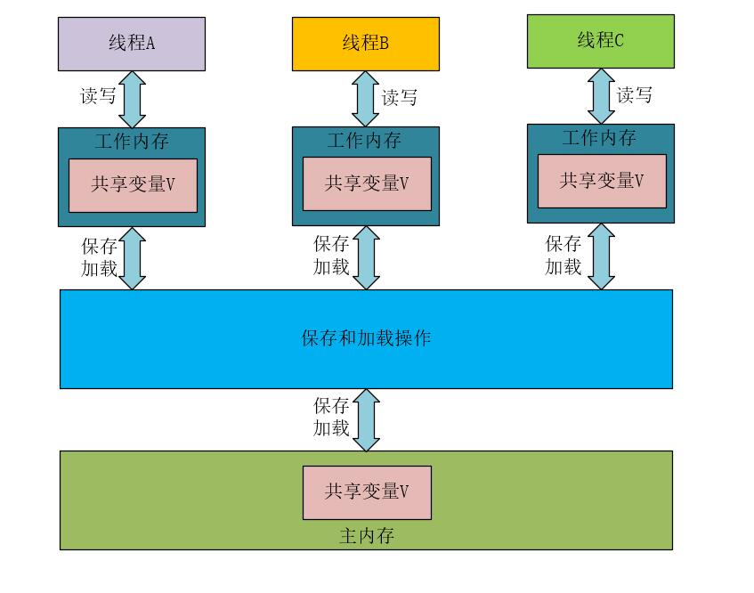
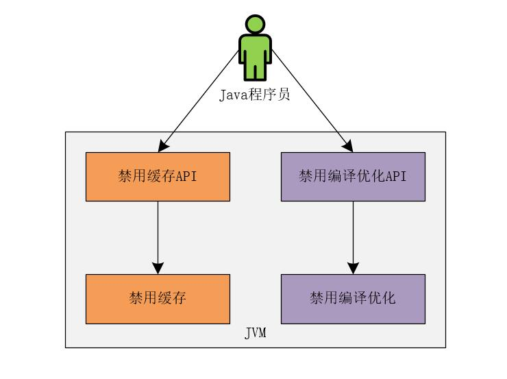
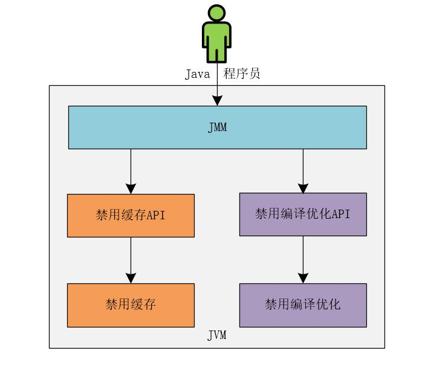
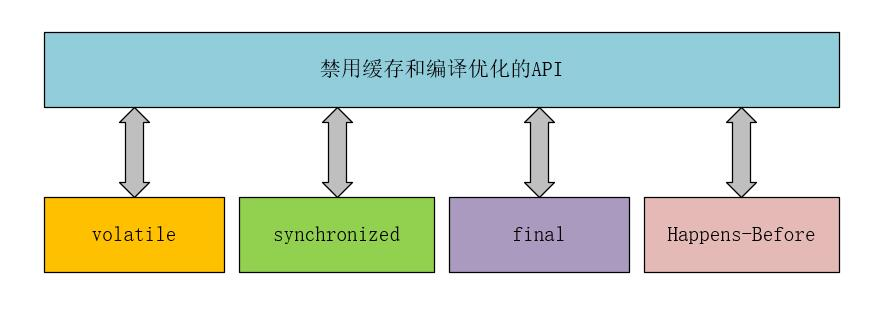
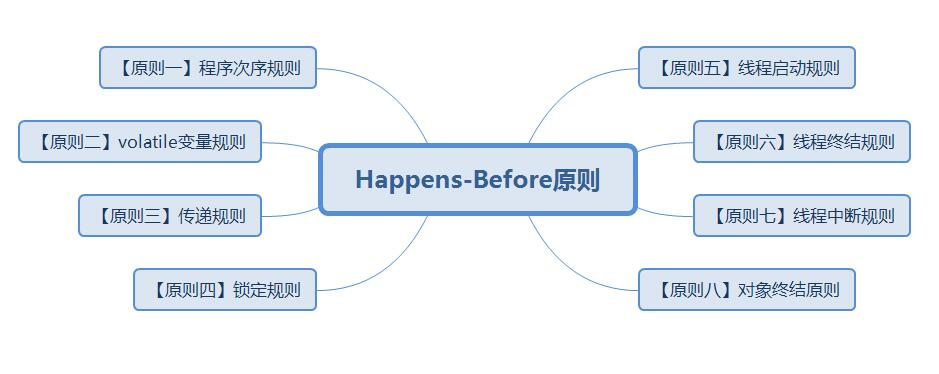

## 【高并发】如何解决可见性和有序性问题？这次彻底懂了！

## 写在前面

> 大冰：小菜童鞋，目前，我们把所有可见性问题、原子性问题和有序性问题都介绍完了，感觉自己有啥进步吗？
>
> 小菜：大冰哥，通过前面的学习，感觉自己进步确实挺大的，原来学习并发编程包含的知识点这么多，我之前以为只是简单的创建一个线程而已，怪不得上次我没有通过面试呢！
>
> 大冰：是的，并发编程包含的知识点很多，我们慢慢学习。之前，我们介绍了可见性问题、原子性问题和有序性问题，那么今天，我们就来讲讲如何解决可见性和有序性问题。

## 问题排查

我们之前通过：

《[【高并发】一文解密诡异并发问题的第一个幕后黑手——可见性问题](https://blog.csdn.net/l1028386804/article/details/105069270)》

《[【高并发】解密导致并发问题的第二个幕后黑手——原子性问题（文末有福利）](https://blog.csdn.net/l1028386804/article/details/105089283)》

《[【高并发】解密导致并发问题的第三个幕后黑手——有序性问题](https://blog.csdn.net/l1028386804/article/details/105105903)》

详细介绍了导致并发编程出现各种诡异问题的三个“幕后黑手”，接下来，我们就开始手撕这三个“幕后黑手”，让并发编程不再困难！

今天，我们先来看看在Java中是如何解决线程的可见性和有序性问题的，说到这，就不得不提一个Java的核心技术，那就是——**Java的内存模型**。

如果编写的并发程序出现问题时，很难通过调试来解决相应的问题，此时，需要一行行的检查代码，这个时候，如果充分理解并掌握了Java的内存模型，你就能够很快分析并定位出问题所在。

## 什么是Java内存模型？

在内存里，Java内存模型规定了所有的变量都存储在主内存（物理内存）中，每条线程还有自己的工作内存，线程对变量的所有操作都必须在工作内存中进行。不同的线程无法访问其他线程的工作内存里的内容。我们可以使用下图来表示在逻辑上 **线程、主内存、工作内存**的三者交互关系。



现在，我们都理解了缓存导致了可见性问题，编译优化导致了有序性问题。也就是说解决可见性和有序性问题的最直接的办法就是**禁用缓存和编译优化**。但是，如果只是简单的禁用了缓存和编译优化，那我们写的所谓的高并发程序的性能也就高不到哪去了！甚至会和单线程程序的性能没什么两样！有时，由于竞争锁的存在，可能会比单线程程序的性能还要低。

那么，既然不能完全禁用缓存和编译优化，那如何解决可见性和有序性的问题呢？其实，合理的方案应该是**按照需要禁用缓存和编译优化**。什么是按需禁用缓存和编译优化呢？简单点来说，就是需要禁用的时候禁用，不需要禁用的时候就不禁用。有些人可能会说，这不废话吗？其实不然，我们继续向下看。

何时禁用和不禁用缓存和编译优化，可以根据编写高并发程序的开发人员的要求来合理的确定（**这里需要重点理解**）。所以，可以这么说，为了解决可见性和有序性问题，Java只需要提供给Java程序员按照需要禁用缓存和编译优化的方法即可。



Java内存模型是一个非常复杂的规范，网上关于Java内存模型的文章很多，但是大多数说的都是理论，理论说多了就成了废话。这里，我不会太多的介绍Java内存模型那些晦涩难懂的理论知识。 其实，作为开发人员，我们可以这样理解Java的内存模型：**Java内存模型规范了Java虚拟机（JVM）如何提供按需禁用缓存和编译优化的方法**。



说的具体一些，这些方法包括：volatile、synchronized和final关键字，以及Java内存模型中的Happens-Before规则。



## volatile为何能保证线程间可见？

volatile关键字不是Java特有的，在C语言中也存在volatile关键字，这个关键字最原始的意义就是禁用CPU缓存。

例如，我们在程序中使用volatile关键字声明了一个变量，如下所示。

```java
volatile int count = 0
```

此时，Java对这个变量的读写，不能使用CPU缓存，必须从内存中读取和写入。


接下来，我们一起来看一个代码片段，如下所示。

**【示例一】**

```java
class VolatileExample {
  int x = 0;
  volatile boolean v = false;
  public void writer() {
    x = 1;
    v = true;
  }

  public void reader() {
    if (v == true) {
      //x的值是多少呢？
    }
  }
}
```

以上示例来源于：http://www.cs.umd.edu/~pugh/java/memoryModel/jsr-133-faq.html#finalWrong

这里，假设线程A执行writer()方法，按照volatile会将v=true写入内存；线程B执行reader()方法，按照volatile，线程B会从内存中读取变量v，如果线程B读取到的变量v为true，那么，此时的变量x的值是多少呢？？

这个示例程序给人的直觉就是x的值为1，其实，x的值具体是多少和JDK的版本有关，如果使用的JDK版本低于1.5，则x的值可能为1，也可能为0。如果使用1.5及1.5以上版本的JDK，则x的值就是1。

看到这个，就会有人提出问题了？这是为什么呢？其实，答案就是在JDK1.5版本中的Java内存模型中引入了Happens-Before原则。

## Happens-Before原则

我们可以将Happens-Before原则总结成如下图所示。



接下来，我们就结合案例程序来说明Java内存模型中的Happens-Before原则。

### 【原则一】程序次序规则

**在一个线程中，按照代码的顺序，前面的操作Happens-Before于后面的任意操作。**

例如【示例一】中的程序x=1会在v=true之前执行。这个规则比较符合单线程的思维：在同一个线程中，程序在前面对某个变量的修改一定是对后续操作可见的。

### 【原则二】volatile变量规则

**对一个volatile变量的写操作，Happens-Before于后续对这个变量的读操作。**

也就是说，对一个使用了volatile变量的写操作，先行发生于后面对这个变量的读操作。这个需要大家重点理解。

### 【原则三】传递规则

**如果A Happens-Before B，并且B Happens-Before C，则A Happens-Before C。**

我们结合【原则一】、【原则二】和【原则三】再来看【示例一】程序，此时，我们可以得出如下结论：

（1）x = 1 Happens-Before 写变量v = true，符合【原则一】程序次序规则。

（2）写变量v = true Happens-Before 读变量v = true，符合【原则二】volatile变量规则。

再根据【原则三】传递规则，我们可以得出结论：x = 1 Happens-Before 读变量v=true。

也就是说，如果线程B读取到了v=true，那么，线程A设置的x = 1对线程B就是可见的。换句话说，就是此时的线程B能够访问到x=1。

其实，Java 1.5版本的 java.util.concurrent并发工具就是靠volatile语义来实现可见性的。

### 【原则四】锁定规则

**对一个锁的解锁操作 Happens-Before于后续对这个锁的加锁操作。**

例如，下面的代码，在进入synchronized代码块之前，会自动加锁，在代码块执行完毕后，会自动释放锁。

**【示例二】**

```java
public class Test{
    private int x = 0;
    public void initX{
        synchronized(this){ //自动加锁
            if(this.x < 10){
                this.x = 10;
            }
        } //自动释放锁
    }
}
```

我们可以这样理解这段程序：假设变量x的值为10，线程A执行完synchronized代码块之后将x变量的值修改为10，并释放synchronized锁。当线程B进入synchronized代码块时，能够获取到线程A对x变量的写操作，也就是说，线程B访问到的x变量的值为10。

### 【原则五】线程启动规则

**如果线程A调用线程B的start()方法来启动线程B，则start()操作Happens-Before于线程B中的任意操作。**

我们也可以这样理解线程启动规则：线程A启动线程B之后，线程B能够看到线程A在启动线程B之前的操作。

我们来看下面的代码。

**【示例三】**

```java
//在线程A中初始化线程B
Thread threadB = new Thread(()->{
    //此处的变量x的值是多少呢？答案是100
});
//线程A在启动线程B之前将共享变量x的值修改为100
x = 100;
//启动线程B
threadB.start();
```

上述代码是在线程A中执行的一个代码片段，根据【原则五】线程的启动规则，线程A启动线程B之后，线程B能够看到线程A在启动线程B之前的操作，在线程B中访问到的x变量的值为100。

### 【原则六】线程终结规则

**线程A等待线程B完成（在线程A中调用线程B的join()方法实现），当线程B完成后（线程A调用线程B的join()方法返回），则线程A能够访问到线程B对共享变量的操作。**

例如，在线程A中进行的如下操作。

**【示例四】**

```java
Thread threadB = new Thread(()-{
    //在线程B中，将共享变量x的值修改为100
    x = 100;
});
//在线程A中启动线程B
threadB.start();
//在线程A中等待线程B执行完成
threadB.join();
//此处访问共享变量x的值为100
```

### 【原则七】线程中断规则

**对线程interrupt()方法的调用Happens-Before于被中断线程的代码检测到中断事件的发生。**

例如，下面的程序代码。在线程A中中断线程B之前，将共享变量x的值修改为100，则当线程B检测到中断事件时，访问到的x变量的值为100。

**【示例五】**

```java
    //在线程A中将x变量的值初始化为0
    private int x = 0;

    public void execute(){
        //在线程A中初始化线程B
        Thread threadB = new Thread(()->{
            //线程B检测自己是否被中断
            if (Thread.currentThread().isInterrupted()){
                //如果线程B被中断，则此时X的值为100
                System.out.println(x);
            }
        });
        //在线程A中启动线程B
        threadB.start();
        //在线程A中将共享变量X的值修改为100
        x = 100;
        //在线程A中中断线程B
        threadB.interrupt();
    }
```

### 【原则八】对象终结原则

**一个对象的初始化完成Happens-Before于它的finalize()方法的开始。**

例如，下面的程序代码。

**【示例六】**

```java
public class TestThread {

   public TestThread(){
       System.out.println("构造方法");
   }

    @Override
    protected void finalize() throws Throwable {
        System.out.println("对象销毁");
    }

    public static void main(String[] args){
        new TestThread();
        System.gc();
    }
}
```

运行结果如下所示。

```java
构造方法
对象销毁
```

## 再说final关键字

使用final关键字修饰的变量，是不会被改变的。但是在Java 1.5之前的版本中，使用final修饰的变量也会出现错误的情况，在Java 1.5版本之后，Java内存模型对使用final关键字修饰的变量的重排序进行了一定的约束。只要我们能够提供正确的构造函数就不会出现问题。

例如，下面的程序代码，在构造函数中将this赋值给了全局变量global.obj，**此时对象初始化还没有完成，此时对象初始化还没有完成，此时对象初始化还没有完成**，重要的事情说三遍！！线程通过global.obj读取的x值可能为0。

**【示例七】**

```java
final x = 0;
public FinalFieldExample() { // bad!
  x = 3;
  y = 4;
  // bad construction - allowing this to escape
  global.obj = this;
}
```

以上示例来源于：http://www.cs.umd.edu/~pugh/java/memoryModel/jsr-133-faq.html#finalWrong

## Java内存模式的底层实现

主要是通过内存屏障(memory barrier)禁止重排序的， 即时编译器根据具体的底层体系架构， 将这些内存屏障替换成具体的 CPU 指令。 对于编译器而言，内存屏障将限制它所能做的重排序优化。 而对于处理器而言， 内存屏障将会导致缓存的刷新操作。 比如， 对于volatile， 编译器将在volatile字段的读写操作前后各插入一些内存屏障。  

> 如果觉得文章对你有点帮助，请微信搜索并关注「 **冰河技术** 」微信公众号，跟冰河学习高并发编程技术。

## 写在最后

> 大冰：这就是今天的主要内容了，今天的内容非常重要，是从根源上深刻理解如何解决线程的可见性和有序性问题，小菜童鞋，回去后一定要好好复习下。
>
> 小菜：好的，大冰哥，回去我一定好好复习。

最后，附上并发编程需要掌握的核心技能知识图，祝大家在学习并发编程时，少走弯路。


## 写在最后

> 如果你觉得冰河写的还不错，请微信搜索并关注「 **冰河技术** 」微信公众号，跟冰河学习高并发、分布式、微服务、大数据、互联网和云原生技术，「 **冰河技术** 」微信公众号更新了大量技术专题，每一篇技术文章干货满满！不少读者已经通过阅读「 **冰河技术** 」微信公众号文章，吊打面试官，成功跳槽到大厂；也有不少读者实现了技术上的飞跃，成为公司的技术骨干！如果你也想像他们一样提升自己的能力，实现技术能力的飞跃，进大厂，升职加薪，那就关注「 **冰河技术** 」微信公众号吧，每天更新超硬核技术干货，让你对如何提升技术能力不再迷茫！


