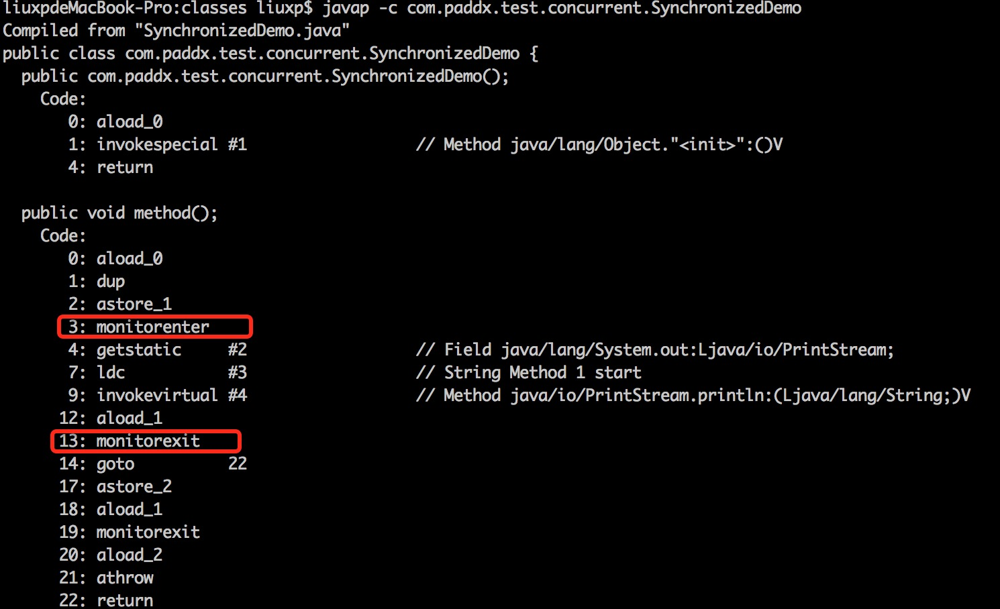

## 【高并发】synchronized原理是什么？这次彻底懂了！！

转自：https://www.cnblogs.com/paddix/p/5367116.html

## 一、synchronized的基本使用

synchronized是Java中解决并发问题的一种最常用的方法，也是最简单的一种方法。synchronized的作用主要有三个：

（1）确保线程互斥的访问同步代码。

（2）保证共享变量的修改能够及时可见。

（3）有效解决重排序问题。

从语法上讲，synchronized总共有三种用法：

（1）修饰普通方法。

（2）修饰静态方法。

（3）修饰代码块。

接下来，我就通过几个例子程序来说明一下这三种使用方式（为了便于比较，三段代码除了synchronized的使用方式不同以外，其他基本保持一致）。

### 1、没有同步的情况

代码段一：

```java
package com.paddx.test.concurrent;

public class SynchronizedTest {
    public void method1(){
        System.out.println("Method 1 start");
        try {
            System.out.println("Method 1 execute");
            Thread.sleep(3000);
        } catch (InterruptedException e) {
            e.printStackTrace();
        }
        System.out.println("Method 1 end");
    }

    public void method2(){
        System.out.println("Method 2 start");
        try {
            System.out.println("Method 2 execute");
            Thread.sleep(1000);
        } catch (InterruptedException e) {
            e.printStackTrace();
        }
        System.out.println("Method 2 end");
    }

    public static void main(String[] args) {
        final SynchronizedTest test = new SynchronizedTest();

        new Thread(new Runnable() {
            @Override
            public void run() {
                test.method1();
            }
        }).start();

        new Thread(new Runnable() {
            @Override
            public void run() {
                test.method2();
            }
        }).start();
    }
}
```

执行结果如下，线程1和线程2同时进入执行状态，线程2执行速度比线程1快，所以线程2先执行完成，这个过程中线程1和线程2是同时执行的。

```bash
Method 1 start
Method 1 execute
Method 2 start
Method 2 execute
Method 2 end
Method 1 end
```

###  2、对普通方法同步

代码段二

```java
package com.paddx.test.concurrent;

public class SynchronizedTest {
    public synchronized void method1(){
        System.out.println("Method 1 start");
        try {
            System.out.println("Method 1 execute");
            Thread.sleep(3000);
        } catch (InterruptedException e) {
            e.printStackTrace();
        }
        System.out.println("Method 1 end");
    }

    public synchronized void method2(){
        System.out.println("Method 2 start");
        try {
            System.out.println("Method 2 execute");
            Thread.sleep(1000);
        } catch (InterruptedException e) {
            e.printStackTrace();
        }
        System.out.println("Method 2 end");
    }

    public static void main(String[] args) {
        final SynchronizedTest test = new SynchronizedTest();

        new Thread(new Runnable() {
            @Override
            public void run() {
                test.method1();
            }
        }).start();

        new Thread(new Runnable() {
            @Override
            public void run() {
                test.method2();
            }
        }).start();
    }
}
```

执行结果如下，跟代码段一比较，可以很明显的看出，线程2需要等待线程1的method1执行完成才能开始执行method2方法。

```bash
Method 1 start
Method 1 execute
Method 1 end
Method 2 start
Method 2 execute
Method 2 end
```

### 3、静态方法（类）同步

代码段三：

```java
package com.paddx.test.concurrent;
 
 public class SynchronizedTest {
     public static synchronized void method1(){
         System.out.println("Method 1 start");
         try {
             System.out.println("Method 1 execute");
             Thread.sleep(3000);
         } catch (InterruptedException e) {
             e.printStackTrace();
         }
         System.out.println("Method 1 end");
     }
 
     public static synchronized void method2(){
         System.out.println("Method 2 start");
         try {
             System.out.println("Method 2 execute");
             Thread.sleep(1000);
         } catch (InterruptedException e) {
             e.printStackTrace();
         }
         System.out.println("Method 2 end");
     }
 
     public static void main(String[] args) {
         final SynchronizedTest test = new SynchronizedTest();
         final SynchronizedTest test2 = new SynchronizedTest();
 
         new Thread(new Runnable() {
             @Override
             public void run() {
                 test.method1();
             }
         }).start();
 
         new Thread(new Runnable() {
             @Override
             public void run() {
                 test2.method2();
             }
         }).start();
     }
 }
```

执行结果如下，对静态方法的同步本质上是对类的同步（静态方法本质上是属于类的方法，而不是对象上的方法），所以即使test和test2属于不同的对象，但是它们都属于SynchronizedTest类的实例，所以也只能顺序的执行method1和method2，不能并发执行。

```bash
Method 1 start
Method 1 execute
Method 1 end
Method 2 start
Method 2 execute
Method 2 end
```

### 4、代码块同步

代码段四：

```java
package com.paddx.test.concurrent;

public class SynchronizedTest {
    public void method1(){
        System.out.println("Method 1 start");
        try {
            synchronized (this) {
                System.out.println("Method 1 execute");
                Thread.sleep(3000);
            }
        } catch (InterruptedException e) {
            e.printStackTrace();
        }
        System.out.println("Method 1 end");
    }

    public void method2(){
        System.out.println("Method 2 start");
        try {
            synchronized (this) {
                System.out.println("Method 2 execute");
                Thread.sleep(1000);
            }
        } catch (InterruptedException e) {
            e.printStackTrace();
        }
        System.out.println("Method 2 end");
    }

    public static void main(String[] args) {
        final SynchronizedTest test = new SynchronizedTest();

        new Thread(new Runnable() {
            @Override
            public void run() {
                test.method1();
            }
        }).start();

        new Thread(new Runnable() {
            @Override
            public void run() {
                test.method2();
            }
        }).start();
    }
}
```

执行结果如下，虽然线程1和线程2都进入了对应的方法开始执行，但是线程2在进入同步块之前，需要等待线程1中同步块执行完成。

```bash
Method 1 start
Method 1 execute
Method 2 start
Method 1 end
Method 2 execute
Method 2 end
```

## 二、synchronized 原理

如果对上面的执行结果还有疑问，也先不用急，我们先来了解synchronized的原理，再回头上面的问题就一目了然了。我们先通过反编译下面的代码来看看synchronized是如何实现对代码块进行同步的：

```java
package com.paddx.test.concurrent;

public class SynchronizedDemo {
    public void method() {
        synchronized (this) {
            System.out.println("Method 1 start");
        }
    }
}
```



关于这两条指令的作用，我们直接参考JVM规范中描述：

monitorenter ：

```bash
Each object is associated with a monitor. A monitor is locked if and only if it has an owner. The thread that executes monitorenter attempts to gain ownership of the monitor associated with objectref, as follows:
• If the entry count of the monitor associated with objectref is zero, the thread enters the monitor and sets its entry count to one. The thread is then the owner of the monitor.
• If the thread already owns the monitor associated with objectref, it reenters the monitor, incrementing its entry count.
• If another thread already owns the monitor associated with objectref, the thread blocks until the monitor's entry count is zero, then tries again to gain ownership
```

这段话的大概意思为：

每个对象有一个监视器锁（monitor）。当monitor被占用时就会处于锁定状态，线程执行monitorenter指令时尝试获取monitor的所有权，过程如下：

1、如果monitor的进入数为0，则该线程进入monitor，然后将进入数设置为1，该线程即为monitor的所有者。

2、如果线程已经占有该monitor，只是重新进入，则进入monitor的进入数加1.

3.如果其他线程已经占用了monitor，则该线程进入阻塞状态，直到monitor的进入数为0，再重新尝试获取monitor的所有权。

monitorexit：　

```bash
The thread that executes monitorexit must be the owner of the monitor associated with the instance referenced by objectref.
The thread decrements the entry count of the monitor associated with objectref. If as a result the value of the entry count is zero, the thread exits the monitor and is no longer its owner. Other threads that are blocking to enter the monitor are allowed to attempt to do so.
```

这段话的大概意思为：

执行monitorexit的线程必须是objectref所对应的monitor的所有者。

指令执行时，monitor的进入数减1，如果减1后进入数为0，那线程退出monitor，不再是这个monitor的所有者。其他被这个monitor阻塞的线程可以尝试去获取这个 monitor 的所有权。 

通过这两段描述，我们应该能很清楚的看出synchronized的实现原理，synchronized的语义底层是通过一个monitor的对象来完成，其实wait/notify等方法也依赖于monitor对象，这就是为什么只有在同步的块或者方法中才能调用wait/notify等方法，否则会抛出java.lang.IllegalMonitorStateException的异常的原因。

我们再来看一下同步方法的反编译结果：

```java
package com.paddx.test.concurrent;

public class SynchronizedMethod {
    public synchronized void method() {
        System.out.println("Hello World!");
    }
}
```

反编译结果：


从反编译的结果来看，方法的同步并没有通过指令monitorenter和monitorexit来完成（理论上其实也可以通过这两条指令来实现），不过相对于普通方法，其常量池中多了ACC_SYNCHRONIZED标示符。JVM就是根据该标示符来实现方法的同步的：当方法调用时，调用指令将会检查方法的 ACC_SYNCHRONIZED  访问标志是否被设置，如果设置了，执行线程将先获取monitor，获取成功之后才能执行方法体，方法执行完后再释放monitor。在方法执行期间，其他任何线程都无法再获得同一个monitor对象。 其实本质上没有区别，只是方法的同步是一种隐式的方式来实现，无需通过字节码来完成。

## 三、运行结果解释

有了对synchronized原理的认识，再来看上面的程序就可以迎刃而解了。

**1、代码段2结果**

虽然method1和method2是不同的方法，但是这两个方法都进行了同步，并且是通过同一个对象去调用的，所以调用之前都需要先去竞争同一个对象上的锁（monitor），也就只能互斥的获取到锁，因此，method1和method2只能顺序的执行。

**2、代码段3结果**

虽然test和test2属于不同对象，但是test和test2属于同一个类的不同实例，由于method1和method2都属于静态同步方法，所以调用的时候需要获取同一个类上monitor（每个类只对应一个class对象），所以也只能顺序的执行。

**3、代码段4结果**

对于代码块的同步实质上需要获取synchronized关键字后面括号中对象的monitor，由于这段代码中括号的内容都是this，而method1和method2又是通过同一的对象去调用的，所以进入同步块之前需要去竞争同一个对象上的锁，因此只能顺序执行同步块。

## 四 总结

synchronized是Java并发编程中最常用的用于保证线程安全的方式，其使用相对也比较简单。但是如果能够深入了解其原理，对监视器锁等底层知识有所了解，一方面可以帮助我们正确的使用synchronized关键字，另一方面也能够帮助我们更好的理解并发编程机制，有助我们在不同的情况下选择更优的并发策略来完成任务。对平时遇到的各种并发问题，也能够从容的应对。

> 如果觉得文章对你有点帮助，请微信搜索并关注「 **冰河技术** 」微信公众号，跟冰河学习高并发编程技术。

最后，附上并发编程需要掌握的核心技能知识图，祝大家在学习并发编程时，少走弯路。


## 写在最后

> 如果你觉得冰河写的还不错，请微信搜索并关注「 **冰河技术** 」微信公众号，跟冰河学习高并发、分布式、微服务、大数据、互联网和云原生技术，「 **冰河技术** 」微信公众号更新了大量技术专题，每一篇技术文章干货满满！不少读者已经通过阅读「 **冰河技术** 」微信公众号文章，吊打面试官，成功跳槽到大厂；也有不少读者实现了技术上的飞跃，成为公司的技术骨干！如果你也想像他们一样提升自己的能力，实现技术能力的飞跃，进大厂，升职加薪，那就关注「 **冰河技术** 」微信公众号吧，每天更新超硬核技术干货，让你对如何提升技术能力不再迷茫！


