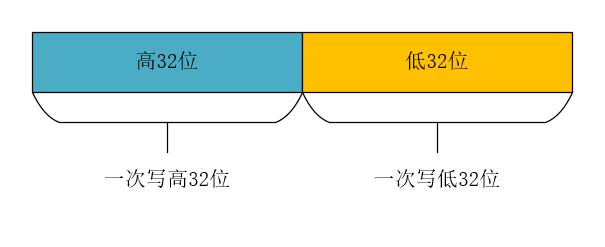
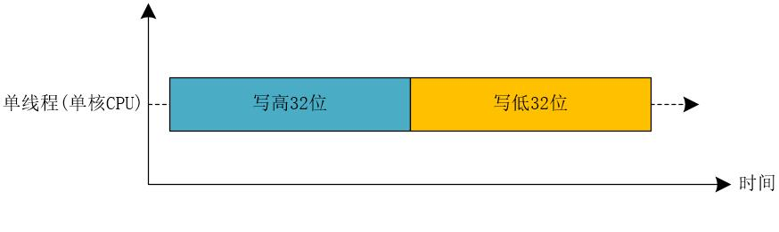
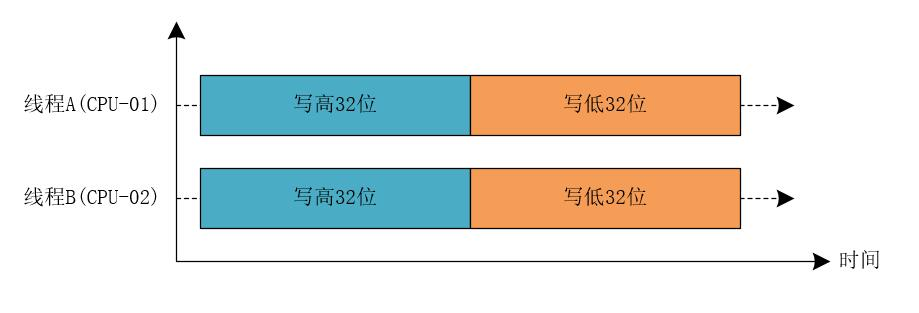

## 【高并发】为何在32位多核CPU上执行long型变量的写操作会出现诡异的Bug问题？看完这篇我懂了！

## 写在前面

> 大冰：小菜童鞋，前几天讲的知识点复习了吗？
>
> 小菜：复习了，大冰哥，我回去关注了你的公众号，收藏和转发了你的文章，看了好几遍呢！！
>
> 大冰：好的，一定要好好复习啊，今天，我们来分析一个诡异的问题：**为何在32位多核CPU上执行long型变量的写操作会出现诡异的Bug问题呢？**今天的内容很重要，它能够帮助你更加深刻的理解线程的原子性问题，一定要好好听！

## 诡异的问题

**我们在32位多核CPU的计算机上以多线程的方式读写long类型的共享变量时，线程已经将变量成功写入了内存，但是重新读取出来的数据和之前写入的数据不一致，这到底是为什么呢？**

## 原因分析

其实，造成这个问题的根本原因就是线程的原子性问题，而线程的原子性问题最终的“幕后黑手”是线程切换，如果能够禁用线程切换就能够解决这个问题了！在操作系统层面来看，操作系统做线程切换需要依赖CPU的中断机制，所以说，禁止CPU发生中断就能够禁止线程切换。

**这种方案在单核CPU上是可行的，但是并不适合多核CPU。**

其实，就分析为何在32位多核CPU上执行long型变量的写操作会出现诡异的Bug问题，我们需要从数据类型占用的存储空间来分析。long型变量是64位的，在32位CPU上执行写操作会被拆分成两次写操作（分别是写高32位和写低32位）。我们可以用下图来表示。

### 32位单核CPU

在32位单核CPU场景下，同一时刻只有一个线程执行，禁止CPU中断，也就是说，在单核CPU上，操作系统不会重新调度线程，实际上，也就是禁止了线程切换。如果一个线程获取到CPU资源，就可以一直执行下去，直到线程结束为止。在这个线程中，对于long型变量的两次写操作，要么都被执行，要么都没有被执行，两次写操作具有原子性，不会出现写入的数据和读取的数据不一致的情况。

我们可以简单的使用下图来表示32位单核CPU写long型数据这个过程。

由上图我们可以看出，在32位单核CPU中，禁止了线程切换之后，所有的线程都是串行执行的，对于long型变量的两次写操作，要么都被执行，要么都没有被执行，两次写操作具有原子性，不会出现写入的数据和读取的数据不一致的情况。

### 32位多核CPU

在32位多核CPU场景下，同一时刻，可能有两个甚至更多的线程在同时执行。假设有两个线程分别是线程A和线程B，线程A执行在CPU-01上，线程B执行在CPU-02上，此时，禁用CPU中断，只能保证在每个CPU上执行的线程是连续的，并不能保证同一时刻只有一个线程执行，如果线程A和线程B同时写long型变量的高32位的话，那么，就有可能出现诡异的Bug问题，也就是说，**明明已经将变量成功写入内存了，但是重新读取出来的数据却不是自己写入的！！**

我们可以简单的使用下图来表示32位多核CPU并发写long型数据这个过程。

由上图我们可以看出，在32位多核CPU中，如果有多个线程同时对long类型的数据进行写操作，即使中断CPU操作，也只能保证在每个CPU上执行的线程是连续的，并不能保证同一时刻只有一个线程执行。如果多个线程同时写long型变量的高32位的话，那么，就有可能出现诡异的Bug问题。

## 总结

**long型变量是64位的，在32位CPU上执行写操作，会被拆分成写高32位和写低32位两部分，如果此时有多个线程同时写long型变量的高32位的话，就有可能出现诡异的Bug问题。**

**注意：不只是long型变量，在32位多核CPU上并发写64位数据类型的数据，都会出现类似的诡异问题！！！**

> 如果觉得文章对你有点帮助，请微信搜索并关注「 **冰河技术** 」微信公众号，跟冰河学习高并发编程技术。

## 写在最后

> 大冰：这就是今天的主要内容了，今天的内容非常重要，它能够帮助你更加深刻的理解并发编程的原子性问题，小菜童鞋，回去后一定要好好复习下。
>
> 小菜：好的，大冰哥，回去我一定好好复习。

最后，附上并发编程需要掌握的核心技能知识图，祝大家在学习并发编程时，少走弯路。

## 写在最后

> 如果你觉得冰河写的还不错，请微信搜索并关注「 **冰河技术** 」微信公众号，跟冰河学习高并发、分布式、微服务、大数据、互联网和云原生技术，「 **冰河技术** 」微信公众号更新了大量技术专题，每一篇技术文章干货满满！不少读者已经通过阅读「 **冰河技术** 」微信公众号文章，吊打面试官，成功跳槽到大厂；也有不少读者实现了技术上的飞跃，成为公司的技术骨干！如果你也想像他们一样提升自己的能力，实现技术能力的飞跃，进大厂，升职加薪，那就关注「 **冰河技术** 」微信公众号吧，每天更新超硬核技术干货，让你对如何提升技术能力不再迷茫！

