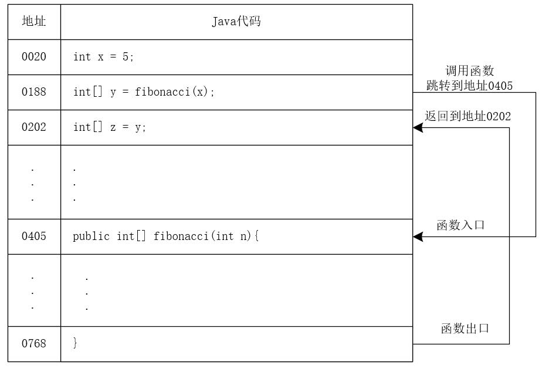
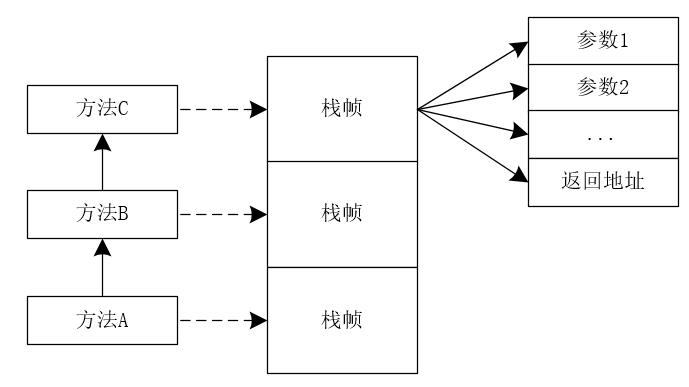
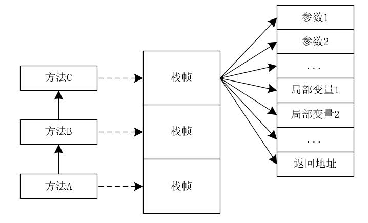
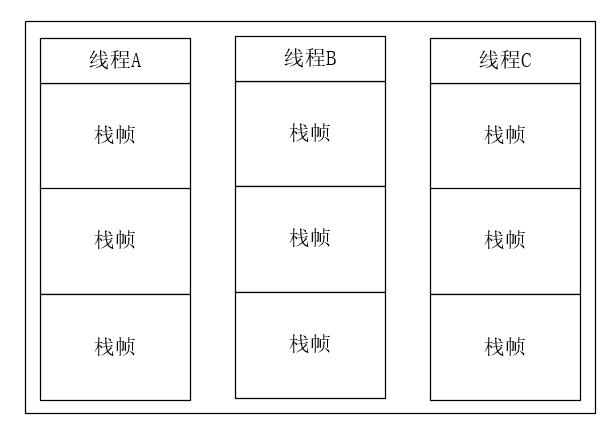

## 【高并发】面试官问我：为什么局部变量是线程安全的？

## 写在前面

> 相信很多小伙伴都知道局部变量是线程安全的，那你知道为什么局部变量是线程安全的吗？

## 前言

多个线程同时访问共享变量时，会导致并发问题。那么，如果将变量放在方法内部，是不是还会存在并发问题呢？如果不存在并发问题，那么为什么不会存在并发问题呢？

## 著名的斐波那契数列

记得上学的时候，我们都会遇到这样一种题目，打印斐波那契数列。斐波那契数列是这样的一个数列：1、1、2、3、5、8、13、21、34...，也就是说第1项和第2项是1，从第3项开始，每一项都等于前2项之和。我们可以使用下面的代码来生成斐波那契数列。

```java
//生成斐波那契数列
public int[] fibonacci(int n){
    //存放结果的数组
    int[] result = new int[n];
    //数组的第1项和第2项为1
    result[0] = result[1] = 1;
    //计算第3项到第n项
    for(int i = 2; i < n; i++){
        result[i] = result[i-2] + result[i-1];
    }
    return result;
}
```

假设此时有很多个线程同时调用fibonacci()方法来生成斐波那契数列，<font color="#FF0000">**对于方法中的局部变量result，会不会存在线程安全的问题呢？答案是：不会！！**</font>

接下来，我们就深入分析下为什么局部变量不会存在线程安全的问题！

## 方法是如何被执行的？

我们以下面的三行代码为例。

```java
int x = 5;
int[] y = fibonacci(x);
int[] z = y;
```

当我们调用fibonacci(x)时，CPU要先找到fibonacci()方法的地址，然后跳转到这个地址去执行代码，执行完毕后，需要返回并找到调用方法的下一条语句的地址，也就是int[] z = y的地址，再跳到这个地址去执行。我们可以将这个过程简化成下图所示。



这里需要注意的是：CPU会通过堆栈寄存器找到调用方法的参数和返回地址。

例如，有三个方法A、B、C，调用关系为A调用B，B调用C。在运行时，会构建出相应的调用栈，我们可以用下图简单的表示这个调用栈。



每个方法在调用栈里都会有自己独立的栈帧，每个栈帧里都有对应方法需要的参数和返回地址。当调用方法时，会创建新的栈帧，并压入调用栈；当方法返回时，对应的栈帧就会被自动弹出。

我们可以这样说：<font color="#FF0000">**栈帧是在调用方法时创建，方法返回时“消亡”。**</font>

## 局部变量存放在哪里？

局部变量的作用域在方法内部，当方法执行完，局部变量也就没用了。可以这么说，方法返回时，局部变量也就“消亡”了。此时，我们会联想到调用栈的栈帧。没错，<font color="#FF0000">**局部变量就是存放在调用栈里的。**</font>此时，我们可以将方法的调用栈用下图表示。



很多人都知道，局部变量会存放在栈里。<font color="#FF0000">**如果一个变量需要跨越方法的边界，就必须创建在堆里。**</font>

## 调用栈与线程

两个线程就可以同时用不同的参数调用相同的方法。<font color="#FF0000">**那么问题来了，调用栈和线程之间是什么关系呢？答案是：每个线程都有自己独立的调用栈。**</font>我们可以使用下图来简单的表示这种关系。



此时，我们在看下文中开头的问题：<font color="#FF0000">**Java方法内部的局部变量是否存在并发问题？答案是不存在并发问题！因为每个线程都有自己的调用栈，局部变量保存在线程各自的调用栈里，不会共享，自然也就不存在并发问题。**</font>

## 线程封闭

方法里的局部变量，因为不会和其他线程共享，所以不会存在并发问题。这种解决问题的技术也叫做线程封闭。官方的解释为：仅在单线程内访问数据。由于不存在共享，所以即使不设置同步，也不会出现并发问题！

## 重磅福利

微信搜一搜【冰河技术】微信公众号，关注这个有深度的程序员，每天阅读超硬核技术干货，公众号内回复【PDF】有我准备的一线大厂面试资料和我原创的超硬核PDF技术文档，以及我为大家精心准备的多套简历模板（不断更新中），希望大家都能找到心仪的工作，学习是一条时而郁郁寡欢，时而开怀大笑的路，加油。如果你通过努力成功进入到了心仪的公司，一定不要懈怠放松，职场成长和新技术学习一样，不进则退。如果有幸我们江湖再见！       

另外，我开源的各个PDF，后续我都会持续更新和维护，感谢大家长期以来对冰河的支持！！

## 写在最后

> 如果你觉得冰河写的还不错，请微信搜索并关注「 **冰河技术** 」微信公众号，跟冰河学习高并发、分布式、微服务、大数据、互联网和云原生技术，「 **冰河技术** 」微信公众号更新了大量技术专题，每一篇技术文章干货满满！不少读者已经通过阅读「 **冰河技术** 」微信公众号文章，吊打面试官，成功跳槽到大厂；也有不少读者实现了技术上的飞跃，成为公司的技术骨干！如果你也想像他们一样提升自己的能力，实现技术能力的飞跃，进大厂，升职加薪，那就关注「 **冰河技术** 」微信公众号吧，每天更新超硬核技术干货，让你对如何提升技术能力不再迷茫！


