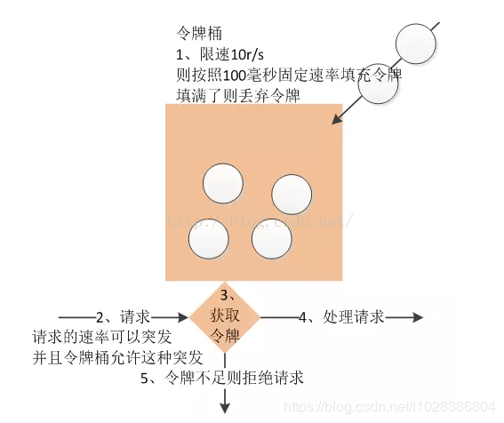
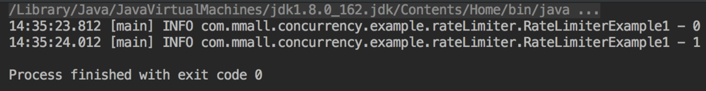
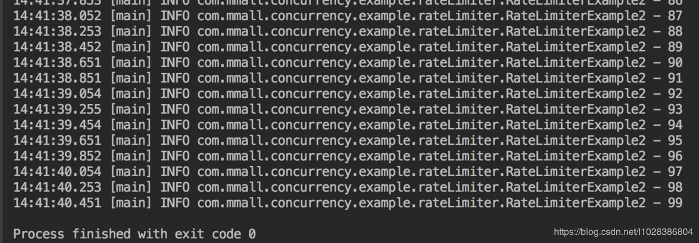

## 【高并发】高并发下常见的限流方案，看这一篇就够了！！

## 写在前面

> 本文转自涛哥的《亿级流量网站架构核心技术》，啥也不说了，向开涛大神致敬！

在开发高并发系统时有三把利器用来保护系统：缓存、降级和限流。缓存的目的是提升系统访问速度和增大系统能处理的容量，可谓是抗高并发流量的银弹；而降级是当服务出问题或者影响到核心流程的性能则需要暂时屏蔽掉，待高峰或者问题解决后再打开；而有些场景并不能用缓存和降级来解决，比如稀缺资源（秒杀、抢购）、写服务（如评论、下单）、频繁的复杂查询（评论的最后几页），因此需有一种手段来限制这些场景的并发/请求量，即限流。

 限流的目的是通过对并发访问/请求进行限速或者一个时间窗口内的的请求进行限速来保护系统，一旦达到限制速率则可以拒绝服务（定向到错误页或告知资源没有了）、排队或等待（比如秒杀、评论、下单）、降级（返回兜底数据或默认数据，如商品详情页库存默认有货）。

 一般开发高并发系统常见的限流有：限制总并发数（比如数据库连接池、线程池）、限制瞬时并发数（如nginx的limit_conn模块，用来限制瞬时并发连接数）、限制时间窗口内的平均速率（如Guava的RateLimiter、nginx的limit_req模块，限制每秒的平均速率）；其他还有如限制远程接口调用速率、限制MQ的消费速率。另外还可以根据网络连接数、网络流量、CPU或内存负载等来限流。

 先有缓存这个银弹，后有限流来应对618、双十一高并发流量，在处理高并发问题上可以说是如虎添翼，不用担心瞬间流量导致系统挂掉或雪崩，最终做到有损服务而不是不服务；限流需要评估好，不可乱用，否则会正常流量出现一些奇怪的问题而导致用户抱怨。

 在实际应用时也不要太纠结算法问题，因为一些限流算法实现是一样的只是描述不一样；具体使用哪种限流技术还是要根据实际场景来选择，不要一味去找最佳模式，白猫黑猫能解决问题的就是好猫。
 因在实际工作中遇到过许多人来问如何进行限流，因此本文会详细介绍各种限流手段。那么接下来我们从限流算法、应用级限流、分布式限流、接入层限流来详细学习下限流技术手段。

## 限流算法

常见的限流算法有：令牌桶、漏桶。计数器也可以进行粗暴限流实现

#### 令牌桶算法

令牌桶算法是一个存放固定容量令牌的桶，按照固定速率往桶里添加令牌。令牌桶算法的描述如下：

- 假设限制2r/s，则按照500毫秒的固定速率往桶中添加令牌；
- 桶中最多存放b个令牌，当桶满时，新添加的令牌被丢弃或拒绝；
- 当一个n个字节大小的数据包到达，将从桶中删除n个令牌，接着数据包被发送到网络上；
- 如果桶中的令牌不足n个，则不会删除令牌，且该数据包将被限流（要么丢弃，要么缓冲区等待）。



#### 漏桶算法

漏桶作为计量工具（The Leaky Bucket Algorithm as a Meter）时，可以用于流量整形（Traffic Shaping）和流量控制（TrafficPolicing），漏桶算法的描述如下：

- 一个固定容量的漏桶，按照常量固定速率流出水滴；
- 如果桶是空的，则不需流出水滴；
- 可以以任意速率流入水滴到漏桶；
- 如果流入水滴超出了桶的容量，则流入的水滴溢出了（被丢弃），而漏桶容量是不变的。

#### 令牌桶和漏桶对比

- 令牌桶是按照固定速率往桶中添加令牌，请求是否被处理需要看桶中令牌是否足够，当令牌数减为零时则拒绝新的请求；
- 漏桶则是按照常量固定速率流出请求，流入请求速率任意，当流入的请求数累积到漏桶容量时，则新流入的请求被拒绝；
- 令牌桶限制的是平均流入速率（允许突发请求，只要有令牌就可以处理，支持一次拿3个令牌，4个令牌），并允许一定程度突发流量；
- 漏桶限制的是常量流出速率（即流出速率是一个固定常量值，比如都是1的速率流出，而不能一次是1，下次又是2），从而平滑突发流入速率；
- 令牌桶允许一定程度的突发，而漏桶主要目的是平滑流入速率；
- 两个算法实现可以一样，但是方向是相反的，对于相同的参数得到的限流效果是一样的。

另外有时候我们还使用计数器来进行限流，主要用来限制总并发数，比如数据库连接池、线程池、秒杀的并发数；只要全局总请求数或者一定时间段的总请求数设定的阀值则进行限流，是简单粗暴的总数量限流，而不是平均速率限流。

到此基本的算法就介绍完了，接下来我们首先看看应用级限流。

## 单机限流

```java
// 令牌桶算法实现 tryAcquire
@Slf4j
public class RateLimiterExample1 {
 
    private static RateLimiter rateLimiter = RateLimiter.create(5);
 
    public static void main(String[] args) throws Exception {
 
        for (int index = 0; index < 100; index++) {
            if (rateLimiter.tryAcquire(190, TimeUnit.MILLISECONDS)) {
                handle(index);
            }
        }
    }
 
    private static void handle(int i) {
       log.info("{}", i);
    }
}
```



```java
// 令牌桶算法实现 acquire
@Slf4j
public class RateLimiterExample2 {
 
    private static RateLimiter rateLimiter = RateLimiter.create(5);
 
    public static void main(String[] args) throws Exception {
 
        for (int index = 0; index < 100; index++) {
            rateLimiter.acquire();
            handle(index);
        }
    }
 
    private static void handle(int i) {
       log.info("{}", i);
    }
}
```



## 应用级限流

#### 限流总并发/连接/请求数

对于一个应用系统来说一定会有极限并发/请求数，即总有一个TPS/QPS阀值，如果超了阀值则系统就会不响应用户请求或响应的非常慢，因此我们最好进行过载保护，防止大量请求涌入击垮系统。

如果你使用过Tomcat，其Connector其中一种配置有如下几个参数：

- acceptCount：如果Tomcat的线程都忙于响应，新来的连接会进入队列排队，如果超出排队大小，则拒绝连接；
- maxConnections：瞬时最大连接数，超出的会排队等待；
- maxThreads：Tomcat能启动用来处理请求的最大线程数，如果请求处理量一直远远大于最大线程数则可能会僵死。

详细的配置请参考官方文档。另外如MySQL（如max_connections）、Redis（如tcp-backlog）都会有类似的限制连接数的配置。

#### 限流总资源数

如果有的资源是稀缺资源（如数据库连接、线程），而且可能有多个系统都会去使用它，那么需要限制应用；可以使用池化技术来限制总资源数：连接池、线程池。比如分配给每个应用的数据库连接是100，那么本应用最多可以使用100个资源，超出了可以等待或者抛异常。

#### 限流某个接口的总并发/请求数

如果接口可能会有突发访问情况，但又担心访问量太大造成崩溃，如抢购业务；这个时候就需要限制这个接口的总并发/请求数总请求数了；因为粒度比较细，可以为每个接口都设置相应的阀值。可以使用Java中的AtomicLong进行限流：

```java
try {
    if(atomic.incrementAndGet() > 限流数) {
        //拒绝请求
    }
    //处理请求
} finally {
    atomic.decrementAndGet();
}
```

适合对业务无损的服务或者需要过载保护的服务进行限流，如抢购业务，超出了大小要么让用户排队，要么告诉用户没货了，对用户来说是可以接受的。而一些开放平台也会限制用户调用某个接口的试用请求量，也可以用这种计数器方式实现。这种方式也是简单粗暴的限流，没有平滑处理，需要根据实际情况选择使用；

#### 限流某个接口的时间窗请求数

即一个时间窗口内的请求数，如想限制某个接口/服务每秒/每分钟/每天的请求数/调用量。如一些基础服务会被很多其他系统调用，比如商品详情页服务会调用基础商品服务调用，但是怕因为更新量比较大将基础服务打挂，这时我们要对每秒/每分钟的调用量进行限速；一种实现方式如下所示

```java
LoadingCache<Long, AtomicLong> counter =
        CacheBuilder.newBuilder()
                .expireAfterWrite(2, TimeUnit.SECONDS)
                .build(new CacheLoader<Long, AtomicLong>() {
                    @Override
                    public AtomicLong load(Long seconds) throws Exception {
                        return new AtomicLong(0);
                    }
                });
long limit = 1000;
while(true) {
    //得到当前秒
    long currentSeconds = System.currentTimeMillis() / 1000;
    if(counter.get(currentSeconds).incrementAndGet() > limit) {
        System.out.println("限流了:" + currentSeconds);
        continue;
    }
    //业务处理
}
```

我们使用Guava的Cache来存储计数器，过期时间设置为2秒（保证1秒内的计数器是有的），然后我们获取当前时间戳然后取秒数来作为KEY进行计数统计和限流，这种方式也是简单粗暴，刚才说的场景够用了。

#### 平滑限流某个接口的请求数

之前的限流方式都不能很好地应对突发请求，即瞬间请求可能都被允许从而导致一些问题；因此在一些场景中需要对突发请求进行整形，整形为平均速率请求处理（比如5r/s，则每隔200毫秒处理一个请求，平滑了速率）。这个时候有两种算法满足我们的场景：令牌桶和漏桶算法。Guava框架提供了令牌桶算法实现，可直接拿来使用。

Guava RateLimiter提供了令牌桶算法实现：平滑突发限流(SmoothBursty)和平滑预热限流(SmoothWarmingUp)实现。

**SmoothBursty**

```java
RateLimiter limiter = RateLimiter.create(5);
System.out.println(limiter.acquire());
System.out.println(limiter.acquire());
System.out.println(limiter.acquire());
System.out.println(limiter.acquire());
System.out.println(limiter.acquire());
System.out.println(limiter.acquire());
```

将得到类似如下的输出：

```java
0.0
0.198239
0.196083
0.200609
0.199599
0.19961
```

* RateLimiter.create(5)表示桶容量为5且每秒新增5个令牌，即每隔200毫秒新增一个令牌；

* limiter.acquire()表示消费一个令牌，如果当前桶中有足够令牌则成功（返回值为0），如果桶中没有令牌则暂停一段时间，比如发令牌间隔是200毫秒，则等待200毫秒后再去消费令牌（如上测试用例返回的为0.198239，差不多等待了200毫秒桶中才有令牌可用），这种实现将突发请求速率平均为了固定请求速率。

再看一个突发示例

```java
RateLimiter limiter = RateLimiter.create(5);
System.out.println(limiter.acquire(5));
System.out.println(limiter.acquire(1));
System.out.println(limiter.acquire(1))
```

将得到类似如下的输出：

```java
0.0
0.98745
0.183553
0.199909
```

limiter.acquire(5)表示桶的容量为5且每秒新增5个令牌，令牌桶算法允许一定程度的突发，所以可以一次性消费5个令牌，但接下来的limiter.acquire(1)将等待差不多1秒桶中才能有令牌，且接下来的请求也整形为固定速率了。

```java
RateLimiter limiter = RateLimiter.create(5);
System.out.println(limiter.acquire(10));
System.out.println(limiter.acquire(1));
System.out.println(limiter.acquire(1));
```

将得到类似如下的输出：

```java
0.0
1.997428
0.192273
0.200616
```

同上边的例子类似，第一秒突发了10个请求，令牌桶算法也允许了这种突发（允许消费未来的令牌），但接下来的limiter.acquire(1)将等待差不多2秒桶中才能有令牌，且接下来的请求也整形为固定速率了。

 接下来再看一个突发的例子：

```java
RateLimiter limiter = RateLimiter.create(2);
 
System.out.println(limiter.acquire());
Thread.sleep(2000L);
System.out.println(limiter.acquire());
System.out.println(limiter.acquire());
System.out.println(limiter.acquire());
System.out.println(limiter.acquire());
System.out.println(limiter.acquire());
```

将得到类似如下的输出：

```java
0.0
0.0
0.0
0.0
0.499876
0.495799
```

1、创建了一个桶容量为2且每秒新增2个令牌；

2、首先调用limiter.acquire()消费一个令牌，此时令牌桶可以满足（返回值为0）；

3、然后线程暂停2秒，接下来的两个limiter.acquire()都能消费到令牌，第三个limiter.acquire()也同样消费到了令牌，到第四个时就需要等待500毫秒了。

 此处可以看到我们设置的桶容量为2（即允许的突发量），这是因为SmoothBursty中有一个参数：最大突发秒数（maxBurstSeconds）默认值是1s，突发量/桶容量=速率*maxBurstSeconds，所以本示例桶容量/突发量为2，例子中前两个是消费了之前积攒的突发量，而第三个开始就是正常计算的了。令牌桶算法允许将一段时间内没有消费的令牌暂存到令牌桶中，留待未来使用，并允许未来请求的这种突发。

SmoothBursty通过平均速率和最后一次新增令牌的时间计算出下次新增令牌的时间的，另外需要一个桶暂存一段时间内没有使用的令牌（即可以突发的令牌数）。另外RateLimiter还提供了tryAcquire方法来进行无阻塞或可超时的令牌消费。

因为SmoothBursty允许一定程度的突发，会有人担心如果允许这种突发，假设突然间来了很大的流量，那么系统很可能扛不住这种突发。因此需要一种平滑速率的限流工具，从而系统冷启动后慢慢的趋于平均固定速率（即刚开始速率小一些，然后慢慢趋于我们设置的固定速率）。Guava也提供了SmoothWarmingUp来实现这种需求，其可以认为是漏桶算法，但是在某些特殊场景又不太一样。

SmoothWarmingUp创建方式：RateLimiter.create(doublepermitsPerSecond, long warmupPeriod, TimeUnit unit)
 permitsPerSecond表示每秒新增的令牌数，warmupPeriod表示在从冷启动速率过渡到平均速率的时间间隔。

示例如下：

```java
RateLimiter limiter = RateLimiter.create(5,1000, TimeUnit.MILLISECONDS);
for(inti =1; i < 5;i++) {
    System.out.println(limiter.acquire());
}
Thread.sleep(1000L);
for(inti =1; i < 5;i++) {
    System.out.println(limiter.acquire());
}
```

将得到类似如下的输出：

```java
0.0
0.51767
0.357814
0.219992
0.199984
0.0
0.360826
0.220166
0.199723
0.199555
```

速率是梯形上升速率的，也就是说冷启动时会以一个比较大的速率慢慢到平均速率；然后趋于平均速率（梯形下降到平均速率）。可以通过调节warmupPeriod参数实现一开始就是平滑固定速率。

到此应用级限流的一些方法就介绍完了。假设将应用部署到多台机器，应用级限流方式只是单应用内的请求限流，不能进行全局限流。因此我们需要分布式限流和接入层限流来解决这个问题。

## 分布式限流

分布式限流最关键的是要将限流服务做成原子化，而解决方案可以使使用Redis+lua或者nginx+lua技术进行实现，通过这两种技术可以实现的高并发和高性能。

首先我们来使用redis+lua实现时间窗内某个接口的请求数限流，实现了该功能后可以改造为限流总并发/请求数和限制总资源数。Lua本身就是一种编程语言，也可以使用它实现复杂的令牌桶或漏桶算法。

#### redis+lua实现的lua脚本

```lua
local key = KEYS[1] --限流KEY（一秒一个）
local limit = tonumber(ARGV[1])        --限流大小
local current = tonumber(redis.call("INCRBY", key, "1")) --请求数+1
if current > limit then --如果超出限流大小
   return 0
elseif current == 1 then  --只有第一次访问需要设置2秒的过期时间
   redis.call("expire", key,"2")
end
return 1
```

如上操作因是在一个lua脚本中，又因Redis是单线程模型，因此是线程安全的。如上方式有一个缺点就是当达到限流大小后还是会递增的，可以改造成如下方式实现：

```lua
local key = KEYS[1] --限流KEY（一秒一个）
local limit = tonumber(ARGV[1])        --限流大小
local current = tonumber(redis.call('get', key) or "0")
if current + 1 > limit then --如果超出限流大小
   return 0
else  --请求数+1，并设置2秒过期
   redis.call("INCRBY", key,"1")
   redis.call("expire", key,"2")
   return 1
end
```

如下是Java中判断是否需要限流的代码：

```java
public static booleanacquire()throwsException {
    String luaScript = Files.toString(newFile("limit.lua"), Charset.defaultCharset());
    Jedis jedis = newJedis("192.168.147.52",6379);
    String key = "ip:"+ System.currentTimeMillis()/1000;//此处将当前时间戳取秒数
    Stringlimit ="3";//限流大小
    return(Long)jedis.eval(luaScript,Lists.newArrayList(key), Lists.newArrayList(limit)) ==1;
}
```

因为Redis的限制（Lua中有写操作不能使用带随机性质的读操作，如TIME）不能在Redis Lua中使用TIME获取时间戳，因此只好从应用获取然后传入，在某些极端情况下（机器时钟不准的情况下），限流会存在一些小问题。

使用Nginx+Lua实现的Lua脚本：

```lua
local locks = require "resty.lock"
 
local function acquire()
    local lock =locks:new("locks")
    local elapsed, err =lock:lock("limit_key") --互斥锁
    local limit_counter =ngx.shared.limit_counter --计数器
 
    local key = "ip:" ..os.time()
    local limit = 5 --限流大小
    local current =limit_counter:get(key)
 
    if current ~= nil and current + 1> limit then --如果超出限流大小
       lock:unlock()
       return 0
    end
    if current == nil then
       limit_counter:set(key, 1, 1) --第一次需要设置过期时间，设置key的值为1，过期时间为1秒
    else
        limit_counter:incr(key, 1) --第二次开始加1即可
    end
    lock:unlock()
    return 1
end
ngx.print(acquire())
```

实现中我们需要使用lua-resty-lock互斥锁模块来解决原子性问题(在实际工程中使用时请考虑获取锁的超时问题)，并使用ngx.shared.DICT共享字典来实现计数器。如果需要限流则返回0，否则返回1。使用时需要先定义两个共享字典（分别用来存放锁和计数器数据）：

```bash
http {
    ……
    lua_shared_dict locks 10m;
    lua_shared_dict limit_counter 10m;
}
```

有人会纠结如果应用并发量非常大那么redis或者nginx是不是能抗得住；不过这个问题要从多方面考虑：你的流量是不是真的有这么大，是不是可以通过一致性哈希将分布式限流进行分片，是不是可以当并发量太大降级为应用级限流；对策非常多，可以根据实际情况调节；像在京东使用Redis+Lua来限流抢购流量，一般流量是没有问题的。

对于分布式限流目前遇到的场景是业务上的限流，而不是流量入口的限流；流量入口限流应该在接入层完成，而接入层笔者一般使用Nginx。

## 写在最后

> 如果觉得文章对你有点帮助，请微信搜索并关注「 **冰河技术** 」微信公众号，跟冰河学习高并发编程技术。

最后，附上并发编程需要掌握的核心技能知识图，祝大家在学习并发编程时，少走弯路。


## 写在最后

> 如果你觉得冰河写的还不错，请微信搜索并关注「 **冰河技术** 」微信公众号，跟冰河学习高并发、分布式、微服务、大数据、互联网和云原生技术，「 **冰河技术** 」微信公众号更新了大量技术专题，每一篇技术文章干货满满！不少读者已经通过阅读「 **冰河技术** 」微信公众号文章，吊打面试官，成功跳槽到大厂；也有不少读者实现了技术上的飞跃，成为公司的技术骨干！如果你也想像他们一样提升自己的能力，实现技术能力的飞跃，进大厂，升职加薪，那就关注「 **冰河技术** 」微信公众号吧，每天更新超硬核技术干货，让你对如何提升技术能力不再迷茫！


