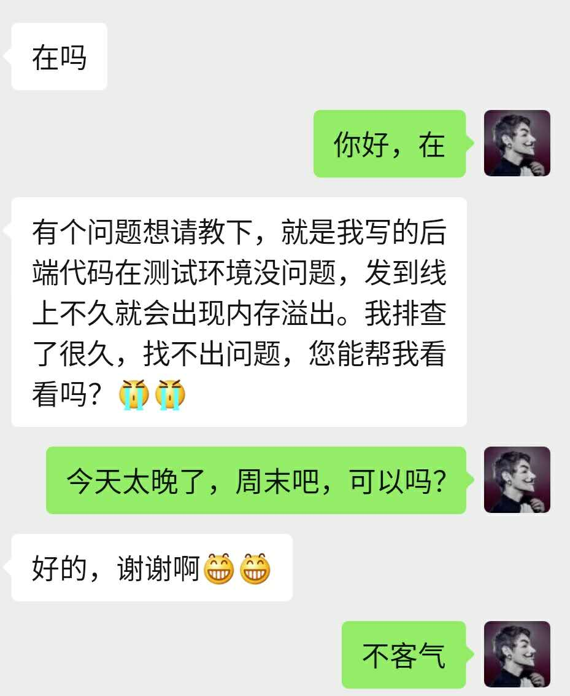

## 你敢信？String类型竟然是导致生产环境频繁内存溢出的罪魁祸首！！

## 写在前面

> 最近，一名小伙伴跟我说：他写的程序在测试环境一点问题没有，但是发到生产环境却会频繁出现内存溢出的情况，这个问题都困扰他一周多了。于是乎，周末我便开始帮他排查各种问题。

## 小伙伴的疑问



## 问题确定

排查问题的整个过程相当耗时，这里，我就直接说定位到的问题吧。后面，我会单独写一篇详细的排查问题过程的文章！

在排查问题的过程中，我发现这位小伙伴使用的JDK还是1.6版本。开始，我也没想那么多，继续排查他写的代码，也没找出什么问题。但是一旦启动生产环境的程序，没过多久，JVM就抛出了内存溢出的异常。

这就奇怪了，怎么回事呢？

启动程序时加上合理的JVM参数，问题依然存在。。。

没办法，继续看他的代码吧！无意间，我发现他写的代码中，大量使用了String类的substring()方法来截取字符串。于是，我便跟到JDK中的代码查看传递进来的参数。

这无意间点进来的一次查看，竟然找到了问题所在！！

## JDK1.6中String类的坑

经过分析，竟然发现了JDK1.6中String类的一个大坑！为啥说它是个坑呢？就是因为它的substring()方法会把人坑惨！不多说了，我们先来看下JDK1.6中的String类的substring()方法。

```java
public String substring(int bedinIndex, int endIndex){
    if(beginIndex < 0){
        throw new StringIndexOutOfBoundsException(beginIndex);
    }
    if(endIndex > count){
        throw new StringIndexOutOfBoundsException(endIndex);
    }
    if(beginIndex > endIndex){
          throw new StringIndexOutOfBoundsException(endIndex - beginIndex);
    }
    return ((beginIndex == 0) && (endIndex == count)) ? this : new String(offset + beginIndex, endIndex - beginIndex, value);
}
```

接下来，我们来看看JDK1.6中的String类的一个构造方法，如下所示。

```java
String(int offset, int count, char[] value){
    this.value = value;
    this.offset = offset;
    this.count = count;
}
```

看到，这里，相信细心的小伙伴已经发现了问题，导致问题的罪魁祸首就是下面的一行代码。

```java
this.value = value;
```

**在JDK1.6中，使用 String 类的构造函数创建子字符串的时候，并不只是简单的拷贝所需要的对象，而是每次都会把整个value引用进来。如果原来的字符串比较大，即使这个字符串不再被应用，这个字符串所分配的内存也不会被释放。** 这也是我经过长时间的分析代码得出的结论，确实是太坑了！！

既然问题找到了，那我们就要解决这个问题。

## 升级JDK

既然JDK1.6中的String类存在如此巨大的坑，那最直接有效的方式就是升级JDK。于是，我便跟小伙伴说明了情况，让他将JDK升级到JDK1.8。

同样的，我们也来看下JDK1.8中的String类的substring()方法。

```java
public String substring(int beginIndex, int endIndex) {
    if (beginIndex < 0) {
        throw new StringIndexOutOfBoundsException(beginIndex);
    }
    if (endIndex > value.length) {
        throw new StringIndexOutOfBoundsException(endIndex);
    }
    int subLen = endIndex - beginIndex;
    if (subLen < 0) {
        throw new StringIndexOutOfBoundsException(subLen);
    }
    return ((beginIndex == 0) && (endIndex == value.length)) ? this
        : new String(value, beginIndex, subLen);
}
```

在JDK1.8中的String类的substring()方法中，也调用了String类的构造方法来生成子字符串，我们来看看这个构造方法，如下所示。

```java
public String(char value[], int offset, int count) {
    if (offset < 0) {
        throw new StringIndexOutOfBoundsException(offset);
    }
    if (count <= 0) {
        if (count < 0) {
            throw new StringIndexOutOfBoundsException(count);
        }
        if (offset <= value.length) {
            this.value = "".value;
            return;
        }
    }
    // Note: offset or count might be near -1>>>1.
    if (offset > value.length - count) {
        throw new StringIndexOutOfBoundsException(offset + count);
    }
    this.value = Arrays.copyOfRange(value, offset, offset+count);
}
```

在JDK1.8中，当我们需要一个子字符串的时候，substring 生成了一个新的字符串，这个字符串通过构造函数的 Arrays.copyOfRange 函数进行构造。这个是没啥问题。

## 优化JVM启动参数

这里，为了更好的提升系统的性能，我也帮这位小伙伴优化了JVM启动参数。

**经小伙伴授权，** 我简单列下他们的业务规模和服务器配置：整套系统采用分布式架构，架构中的各业务服务采用集群部署，日均访问量上亿，日均交易订单50W~100W，订单系统的各服务器节点配置为4核8G。目前已将JDK升级到1.8版本。

根据上述条件，我给出了JVM调优后的参数配置。

```java
-Xms3072M -Xmx3072M -Xmn2048M -Xss1M -XX:MetaspaceSize=256M -XX:MaxMetaspaceSize=256M
```

至于，为啥会给出上述JVM参数配置，后续我会单独写文章来具体分析如何根据实际业务场景来进行JVM参数调优。

经过分析和解决问题，小伙伴的程序在生产环境下运行的很平稳，至少目前还未出现内存溢出的情况！！

## 结论

如果在程序中创建了比较大的对象，并且我们基于这个大对象生成了一些其他的信息，此时，一定要释放和这个大对象的引用关系，否则，就会埋下内存溢出的隐患。

JVM优化的目标就是：**尽可能让对象都在新生代里分配和回收，尽量别让太多对象频繁进入老年代，避免频繁对老年代进行垃圾回收，同时给系统充足的内存大小，避免新生代频繁的进行垃圾回收。**

## 重磅福利

微信搜一搜【冰河技术】微信公众号，关注这个有深度的程序员，每天阅读超硬核技术干货，公众号内回复【PDF】有我准备的一线大厂面试资料和我原创的超硬核PDF技术文档，以及我为大家精心准备的多套简历模板（不断更新中），希望大家都能找到心仪的工作，学习是一条时而郁郁寡欢，时而开怀大笑的路，加油。如果你通过努力成功进入到了心仪的公司，一定不要懈怠放松，职场成长和新技术学习一样，不进则退。如果有幸我们江湖再见！       

另外，我开源的各个PDF，后续我都会持续更新和维护，感谢大家长期以来对冰河的支持！！

## 写在最后

> 如果你觉得冰河写的还不错，请微信搜索并关注「 **冰河技术** 」微信公众号，跟冰河学习高并发、分布式、微服务、大数据、互联网和云原生技术，「 **冰河技术** 」微信公众号更新了大量技术专题，每一篇技术文章干货满满！不少读者已经通过阅读「 **冰河技术** 」微信公众号文章，吊打面试官，成功跳槽到大厂；也有不少读者实现了技术上的飞跃，成为公司的技术骨干！如果你也想像他们一样提升自己的能力，实现技术能力的飞跃，进大厂，升职加薪，那就关注「 **冰河技术** 」微信公众号吧，每天更新超硬核技术干货，让你对如何提升技术能力不再迷茫！


