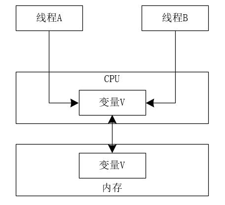
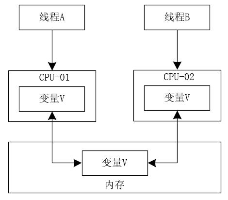
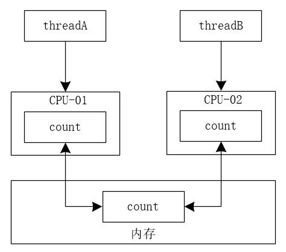
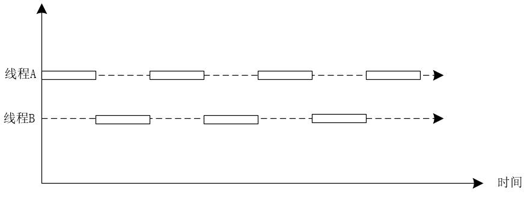
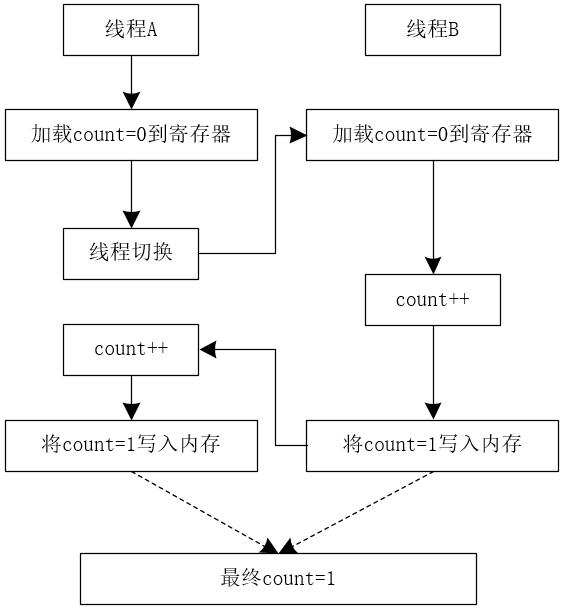
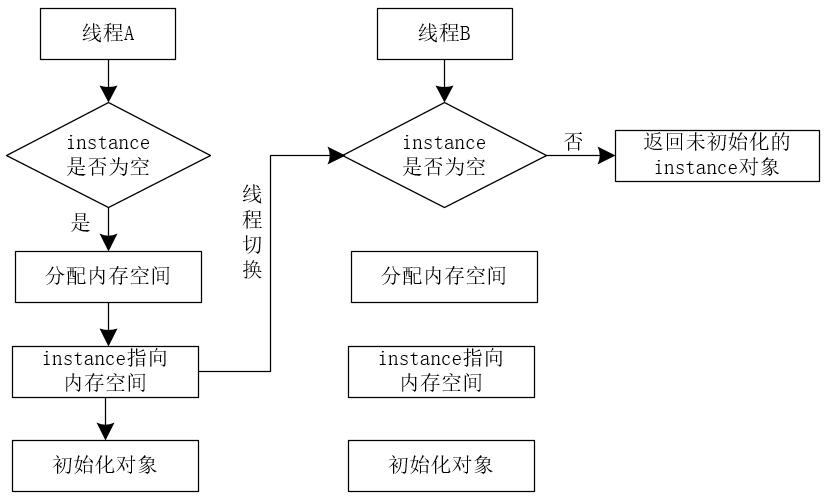

## 并发编程诡异的问题源头

首先，我们来看操作系统的制造商为了提升操作系统的整体性能，对操作系统做出的优化。

* 为了平衡CPU与内存的速度差异，CPU增加了缓存。
* 为了能够分时复用CPU，均衡CPU与I/O设备的速度差异，操作系统增加了进程和线程技术。
* 为了使CPU的缓存能够得到更加合理的利用，编译程序对CPU上指令的执行顺序进行了优化。

操作系统的制造商对操作系统进行的优化，所有运行在操作系统上的应用程序都在默默地使用着这些优化后的成果。但是这也无形当中造成了很多并发编程的问题。本质上，并发编程的很多诡异的问题源头也在于此。

### 【源头一】缓存导致的可见性问题

**可见性就是说一个线程对共享变量的修改，另一个线程能够立刻看到。**

在CPU单核时代，操作系统上所有的线程都是运行在同一个CPU上，操作同一个CPU的缓存。一个线程对缓存的写，对另外一个线程一定可见。我们可以简单的用下图来表示。



由上图我们可以看出，由于只有一个CPU内核，线程A和线程B无论谁修改了CPU中的变量V，另一个线程读到的变量V一定是最新的值。

也就是说，在单核CPU中，不存在线程的可见性问题。大家可以记住这个结论。

在多核CPU中上述的结论就不成立了。因为在多核CPU中，每个CPU内核都有自己的缓存。当多个线程在不同的CPU核心上运行时，这些线程操作的是不同的CPU缓存。一个线程对缓存的写，对另外一个线程不一定可见。我们可以将多线程在多核CPU上修改变量的过程总结成如下图所示。



由上图我们可以看出，由于CPU是多核的，线程A操作的是CPU-01上的缓存，线程B操作的是CPU-02上的缓存，此时，线程A对变量V的修改对线程B是不可见的，反之亦然。

这里，我们可以使用一段Java代码来验证多线程的可见性问题。在下面的代码中，定义了一个long类型的成员变量count。有一个名称为addCount的方法，这个方法中对count的值累加1000次。同时，execute方法中，启动两个线程，分别调用addCount方法，等待两个线程执行后，返回count的值。代码如下所示。

```java
package io.binghe.concurrent.lab01;

/**
 * @author binghe
 * @version 1.0.0
 * @description 测试线程的可见性
 */
public class TestThread {
    private long count = 0;

    //对count的值累加1000次
    private void addCount(){
        for(int i = 0; i < 1000; i++){
            count ++;
        }
    }

    public long execute() throws InterruptedException {
        //创建两个线程，执行count的累加操作
        Thread threadA = new Thread(() ->{
           addCount();
        });
        Thread threadB = new Thread(() ->{
           addCount();
        });
        //启动线程
        threadA.start();
        threadB.start();

        //等待线程执行结束
        threadA.join();
        threadB.join();

        //返回结果
        return count;
    }

    public static void main(String[] args) throws InterruptedException {
        TestThread testThread = new TestThread();
        long count = testThread.execute();
        System.out.println(count);
    }
}
```

在同一个线程中，连续调用两次addCount方法，count变量的值就是2000。但是实际上在两个线程中，调用addCount方法时，count的值最终是一个介于1000到2000之间的随机数。

我们一起来分析下这种情况：假设线程A和线程B同时执行，第一次都会将count = 0读取到各自的CPU缓存中，执行完count++之后，各自CPU缓存中的count的值为1。线程A和线程B同时将count写入内存后，内存中的count值为1，而不是2。在整个过程中，线程A和线程B都是基于各自CPU中缓存的count的值来进行计算的，最终会导致count的值小于或者等于2000。这就是缓存导致的可见性问题。

我们也可以使用如图来简单描述下线程A和线程B对于count变量的修改过程。



实际上，如果将上述的代码由循环1000次修改为循环1亿次，你会发现最终count的值会接近于1亿，而不是2亿。如果只是循环1000次，count的值就会接近于2000。不信，你自己可以运行尝试。造成这种结果的原因就是两个线程不是同时启动的，中间存在一个时间差。

### 【源头二】线程切换带来的原子性问题

**原子性是指一个或者多个操作在CPU中执行的过程不被中断的特性。**

在现代操作系统中，一般都提供了多进程和多线程的功能。操作系统允许进程执行一小段时间，过了这段时间，操作系统就会重新选择一个进程来执行。我们称这种情况叫做任务切换，这一小段时间被称为时间片。

在如今的操作系统中，大部分的任务切换都是基于线程来执行的，我们也可以将任务切换叫作线程切换。

我们可以简单的使用下图来表示操作系统中的线程切换过程。



图中存在两个线程，分别为线程A和线程B，其中线程A和线程B中的每个小方块代表此时线程占有CPU并执行任务，每个虚线部分代表此时的线程不占用CPU资源。CPU会在线程A和线程B之间频繁切换。

Java并发程序是基于多线程来编写的，这也会涉及到CPU对任务的切换。正是CPU中对任务的切换机制，造成了并发编程中的第二个诡异的问题。

在并发编程中，往往Java中的一条简单的语句，对应着CPU中的多条指令。例如，我们编写的TestThread类中的如下代码。

```java
count++
```

看似简单的一条count自增的代码，实际上对应着CPU中的多条指令。我们将CPU的指令简化成如下三步操作。

* 指令1：把变量count从内存加载的CPU寄存器。
* 指令2：在寄存器中执行count++操作。
* 指令3：将结果写入缓存（可能是CPU缓存，也可能是内存）。

在操作系统执行线程切换时，可能发生在任何一条CPU指令完成后，而不是程序中的某条语句完成后。如果线程A执行完指令1后，操作系统发生了线程切换，当两个线程都执行count++操作后，得到的结果是1而不是2。这里，我们可以使用下图来表示这个过程。



在上图中，线程A将count=0加载到CPU的寄存器后，发生了线程切换。此时内存中的count值仍然为0，线程B将count=0加载到寄存器，执行count++操作，并将count=1写到内存。此时，CPU切换到线程A，执行线程A中的count++操作后，线程A中的count值为1，线程A将count=1写入内存，此时内存中的count值最终为1。

综上：CPU能够保证的原子性是CPU指令级别的，而不是编程语言级别的。我们在编写高并发程序时，需要在编程语言级别保证程序的原子性。

### 【源头三】编译优化带来的有序性问题

**有序性是指程序按照代码的既定顺序执行。**

编译器或者解释器为了优化程序的执行性能，有时会改变程序的执行顺序。但是，编译器或者解释器对程序的执行顺序进行修改，可能会导致意想不到的问题！

在Java程序中，一个经典的案例就是使用双重检查机制来创建单例对象。例如，在下面的代码中，在getInstance()方法中获取对象实例时，首先判断instance对象是否为空，如果为空，则锁定当前类的class对象，并再次检查instance是否为空，如果instance对象仍然为空，则为instance对象创建一个实例。

```java
package io.binghe.concurrent.lab01;

/**
 * @author binghe
 * @version 1.0.0
 * @description 测试单例
 */
public class SingleInstance {

    private static SingleInstance instance;

    public static SingleInstance getInstance(){
        if(instance == null){
            synchronized (SingleInstance.class){
                if(instance == null){
                    instance = new SingleInstance();
                }
            }
        }
        return instance;
    }
}
```

如果编译器或者解释器不会对上面的程序进行优化，整个代码的执行过程如下所示。

假设此时有线程A和线程B两个线程同时调用getInstance()方法来获取对象实例，两个线程会同时发现instance对象为空，此时会同时对SingleInstance.class加锁，而JVM会保证只有一个线程获取到锁，这里我们假设是线程A获取到锁。则线程B由于未获取到锁而进行等待。接下来，线程A再次判断instance对象为空，从而创建instance对象的实例，最后释放锁。此时，线程B被唤醒，线程B再次尝试获取锁，获取锁成功后，线程B检查此时的instance对象已经不再为空，线程B不再创建instance对象。

上面的一切看起来很完美，但是这一切的前提是编译器或者解释器没有对程序进行优化，也就是说CPU没有对程序进行重排序。而实际上，这一切都只是我们自己觉得是这样的。

在真正高并发环境下运行上面的代码获取instance对象时，创建对象的new操作会因为编译器或者解释器对程序的优化而出现问题。也就是说，问题的根源在于如下一行代码。

```java
instance = new SingleInstance();
```

对于上面的一行代码来说，会有3个CPU指令与其对应。

1.分配内存空间。

2.初始化对象。

3.将instance引用指向内存空间。

正常执行的CPU指令顺序为1—>2—>3，CPU对程序进行重排序后的执行顺序可能为1—>3—>2。此时，就会出现问题。

当CPU对程序进行重排序后的执行顺序为1—>3—>2时，我们将线程A和线程B调用getInstance()方法获取对象实例的两种步骤总结如下所示。

**【第一种步骤】**

（1）假设线程A和线程B同时进入第一个if条件判断。

（2）假设线程A首先获取到synchronized锁，进入synchronized代码块，此时因为instance对象为null，所以，此时执行instance = new SingleInstance()语句。

（3）在执行instance = new SingleInstance()语句时，线程A会在JVM中开辟一块空白的内存空间。

（4）线程A将instance引用指向空白的内存空间，在没有进行对象初始化的时候，发生了线程切换，线程A释放synchronized锁，CPU切换到线程B上。

（5）线程B进入synchronized代码块，读取到线程A返回的instance对象，此时这个instance不为null，但是并未进行对象的初始化操作，是一个空对象。此时，线程B如果使用instance，就可能出现问题！！！

**【第二种步骤】**

（1）线程A先进入if条件判断，

（2）线程A获取synchronized锁，并进行第二次if条件判断，此时的instance为null，执行instance = new SingleInstance()语句。

（3）线程A在JVM中开辟一块空白的内存空间。

（4）线程A将instance引用指向空白的内存空间，在没有进行对象初始化的时候，发生了线程切换，CPU切换到线程B上。

（5）线程B进行第一次if判断，发现instance对象不为null，但是此时的instance对象并未进行初始化操作，是一个空对象。如果线程B直接使用这个instance对象，就可能出现问题！！！

**在第二种步骤中，即使发生线程切换时，线程A没有释放锁，则线程B进行第一次if判断时，发现instance已经不为null，直接返回instance，而无需尝试获取synchronized锁。**

我们可以将上述过程简化成下图所示。



### 总结

我们在介绍多线程编程时，往往会介绍并发编程的三大特性：可见性、原子性和有序性。在并发编程领域中，对于各种问题的追本溯源我们可以总结出如下问题的根源。

* **缓存带来了可见性问题。**
* **线程切换带来了原子性问题。**
* **编译优化带来了有序性问题。**

我们只有深刻的理解了并发编程的问题源头，才能编写出更加健壮的高并发程序！！

## 写在最后

> 如果你觉得冰河写的还不错，请微信搜索并关注「 **冰河技术** 」微信公众号，跟冰河学习高并发、分布式、微服务、大数据、互联网和云原生技术，「 **冰河技术** 」微信公众号更新了大量技术专题，每一篇技术文章干货满满！不少读者已经通过阅读「 **冰河技术** 」微信公众号文章，吊打面试官，成功跳槽到大厂；也有不少读者实现了技术上的飞跃，成为公司的技术骨干！如果你也想像他们一样提升自己的能力，实现技术能力的飞跃，进大厂，升职加薪，那就关注「 **冰河技术** 」微信公众号吧，每天更新超硬核技术干货，让你对如何提升技术能力不再迷茫！


