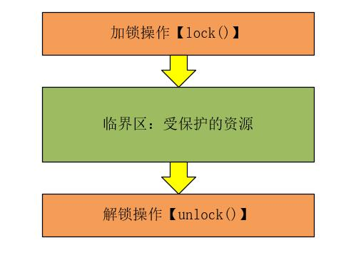
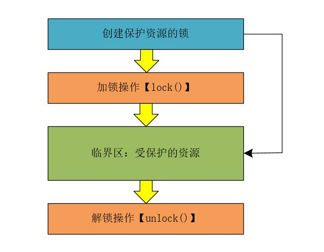
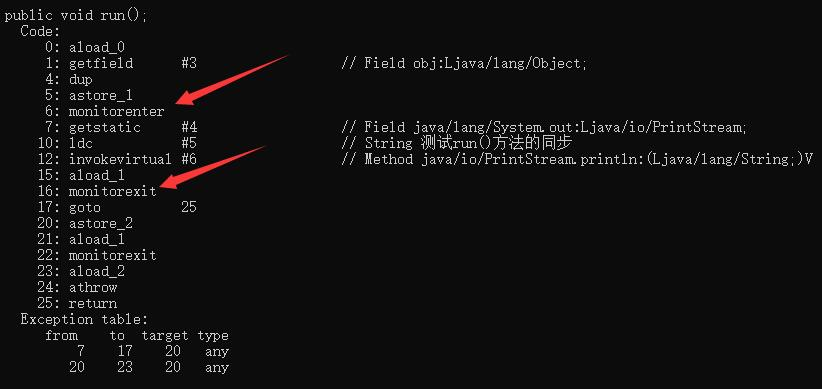
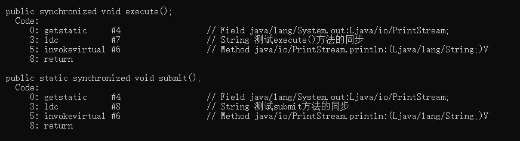
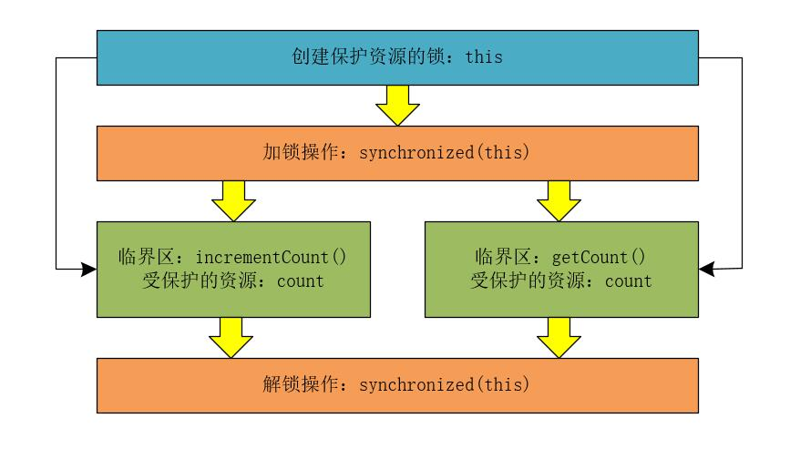
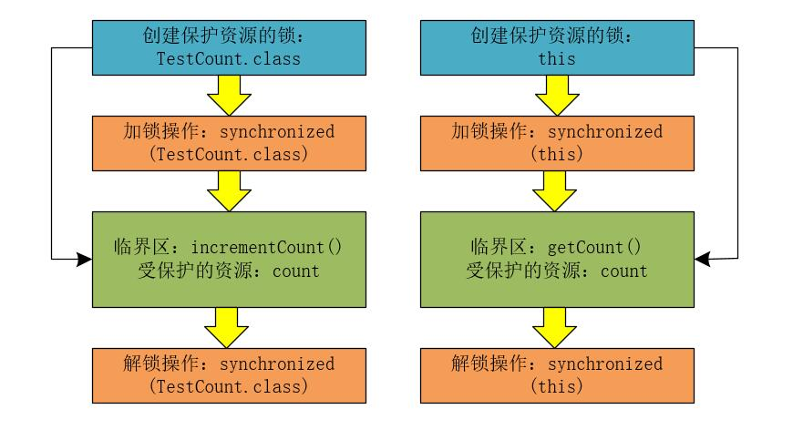

## 【高并发】如何使用互斥锁解决多线程的原子性问题？这次终于明白了！

## 前言

在《[【高并发】如何解决可见性和有序性问题？这次彻底懂了！](https://blog.csdn.net/l1028386804/article/details/105145207)》一文中，我们了解了Java是如何解决多线程之间的可见性和有序性问题。另外，通过《[【高并发】为何在32位多核CPU上执行long型变量的写操作会出现诡异的Bug问题？看完这篇我懂了！](https://blog.csdn.net/l1028386804/article/details/105255006)》一文，我们得知在32位多核CPU上读写long型数据出现问题的根本原因是**线程切换带来的原子性问题**。

## 如何保证原子性？

那么，如何解决线程切换带来的原子性问题呢？答案是**保证多线程之间的互斥性。也就是说，在同一时刻只有一个线程在执行！**如果我们能够保证对共享变量的修改是互斥的，那么，无论是单核CPU还是多核CPU，都能保证多线程之间的原子性了。

## 锁模型

说到线程之间的互斥，我们可以想到在并发编程中使用锁来保证线程之前的互斥性。我们可以锁模型简单的使用下图来表示。



我们可以将上图中受保护的资源，也就是需要多线程之间互斥执行的代码称为临界区。线程进入临界区之前，会首先尝试加锁操作lock()，如果加锁成功，则进入临界区执行临界区中的代码，则当前线程持有锁；如果加锁失败，就会等待，直到持有锁的线程释放锁后，当前线程获取到锁进入临界区；进入临界区的线程执行完代码后，会执行解锁操作unlock()。

<font color="#FF0000">**其实，在这个锁模型中，我们忽略了一些非常重要的内容：那就是我们对什么东西加了锁？需要我们保护的资源又是什么呢？**</font>

## 改进的锁模型

在并发编程中对资源进行加锁操作时，我们需要明确对什么东西加了锁？而需要我们保护的资源又是什么？只有明确了这两点，才能更好的利用Java中的互斥锁。所以，我们需要将锁模型进行修改，修改后的锁模型如下图所示。



在改进的锁模型中，首先创建一把保护资源的锁，使用这个保护资源的锁进行加锁操作，然后进入临界区执行代码，最后进行解锁操作释放锁。其中，创建的保护资源的锁，就是对临界区特定的资源进行保护。

这里需要注意的是：我们在改进的锁模型中，特意将创建保护资源的锁用箭头指向了临界区中的受保护的资源。目的是为了说明特定资源的锁是为了保护特定的资源，如果一个资源的锁保护了其他的资源，那么就会出现诡异的Bug问题，这样的Bug非常不好调试，因为我们自身会觉得，我明明已经对代码进行了加锁操作，可为什么还会出现问题呢？如果出现了这种问题，你就要排查下你创建的锁，是不是真正要保护你需要保护的资源了。

## Java中的synchronized锁

说起，Java中的synchronized锁，相信大家并不陌生了，synchronized关键字可以用来修饰方法，也可以用来修饰代码块。例如，下面的代码片段所示。

```java
public class LockTest{
    //创建需要加锁的对象
    private Object obj = new Object();
    //修饰代码块
    public void run(){
        synchronized(obj){
            //临界区：受保护的资源
            System.out.println("测试run()方法的同步");
        }
    }
    //使用synchronized修饰非静态方法
    public synchronized void execute(){
        //临界区：受保护的资源
        System.out.println("测试execute()方法的同步");
    }

    //使用synchronized修饰静态方法
    public synchronized static void submit(){
        //临界区：受保护的资源
        System.out.println("测试submit方法的同步");
    }
}
```

在上述的代码中，我们只是对方法（包括静态方法和非静态方法）和代码块使用了synchronized关键字，并没有执行lock()和unlock()操作。本质上，synchronized的加锁和解锁操作都是由JVM来完成的，Java编译器会在synchronized修饰的方法或代码块的前面自动加上加锁操作，而在其后面自动加上解锁操作。

在使用synchronized关键字加锁时，Java规定了一些隐式的加锁规则。

* 当使用synchronized关键字修饰代码块时，锁定的是实际传入的对象。

* 当使用synchronized关键字修饰非静态方法时，锁定的是当前实例对象this。
* 当使用synchronized关键字修饰静态方法时，锁定的是当前类的Class对象。

## synchronized揭秘

使用synchronized修饰代码块和方法时JVM底层实现的JVM指令有所区别，我们以LockTest类为例，对LockTest类进行反编译，如下所示。

```java
D:/>javap -c LockTest.class
Compiled from "LockTest.java"
public class io.mykit.concurrent.lab03.LockTest {
  public io.mykit.concurrent.lab03.LockTest();
    Code:
       0: aload_0
       1: invokespecial #1                  // Method java/lang/Object."<init>":()V
       4: aload_0
       5: new           #2                  // class java/lang/Object
       8: dup
       9: invokespecial #1                  // Method java/lang/Object."<init>":()V
      12: putfield      #3                  // Field obj:Ljava/lang/Object;
      15: return

  public void run();
    Code:
       0: aload_0
       1: getfield      #3                  // Field obj:Ljava/lang/Object;
       4: dup
       5: astore_1
       6: monitorenter
       7: getstatic     #4                  // Field java/lang/System.out:Ljava/io/PrintStream;
      10: ldc           #5                  // String 测试run()方法的同步
      12: invokevirtual #6                  // Method java/io/PrintStream.println:(Ljava/lang/String;)V
      15: aload_1
      16: monitorexit
      17: goto          25
      20: astore_2
      21: aload_1
      22: monitorexit
      23: aload_2
      24: athrow
      25: return
    Exception table:
       from    to  target type
           7    17    20   any
          20    23    20   any

  public synchronized void execute();
    Code:
       0: getstatic     #4                  // Field java/lang/System.out:Ljava/io/PrintStream;
       3: ldc           #7                  // String 测试execute()方法的同步
       5: invokevirtual #6                  // Method java/io/PrintStream.println:(Ljava/lang/String;)V
       8: return

  public static synchronized void submit();
    Code:
       0: getstatic     #4                  // Field java/lang/System.out:Ljava/io/PrintStream;
       3: ldc           #8                  // String 测试submit方法的同步
       5: invokevirtual #6                  // Method java/io/PrintStream.println:(Ljava/lang/String;)V
       8: return
}
```

### 分析反编译代码块

从反编译的结果来看，synchronized在run()方法中修饰代码块时，使用了monitorenter 和monitorexit两条指令，如下所示。



**对于monitorenter指令，查看JVM的技术规范后，可以得知：**

每个对象有一个监视器锁（monitor）。当monitor被占用时就会处于锁定状态，线程执行monitorenter指令时尝试获取monitor的所有权，过程如下：

1、如果monitor的进入数为0，则该线程进入monitor，然后将进入数设置为1，该线程即为monitor的所有者。

2、如果线程已经占有该monitor，只是重新进入，则进入monitor的进入数加1.

3.如果其他线程已经占用了monitor，则该线程进入阻塞状态，直到monitor的进入数为0，再重新尝试获取monitor的所有权。

**对于monitorexit指令，JVM技术规范如下：**

执行monitorexit的线程必须是objectref所对应的monitor的所有者。

指令执行时，monitor的进入数减1，如果减1后进入数为0，那线程退出monitor，不再是这个monitor的所有者。其他被这个monitor阻塞的线程可以尝试去获取这个 monitor 的所有权。

通过这两段描述，我们应该能很清楚的看出synchronized的实现原理，synchronized的语义底层是通过一个monitor的对象来完成，其实wait/notify等方法也依赖于monitor对象，这就是为什么只有在同步的块或者方法中才能调用wait/notify等方法，否则会抛出java.lang.IllegalMonitorStateException的异常的原因。

### 分析反编译方法

从反编译的代码来看，synchronized无论是修饰非静态方法还是修饰静态方法，其执行的流程都是一样，例如，我们这里对非静态方法execute()和静态方法submit()的反编译结果如下所示。



**注意：我这里使用的JDK版本为1.8，其他版本的JDK可能结果不同。**

## 再次深究count+=1的问题

如果多个线程并发的对共享变量count执行加1操作，就会出现问题。此时，我们可以使用synchronized锁来尝试解决下这个问题。

例如，TestCount类中有两个方法，一个是getCount()方法，用来获取count的值；另一个是incrementCount()方法，用来给count值加1，并且incrementCount()方法使用synchronized关键字修饰，如下所示。

```java
public class TestCount{
    private long count = 0L;
    public long getCount(){
        return count;
    }
    public synchronized void incrementCount(){
        count += 1;
    }
}
```

通过上面的代码，我们肯定的是incrementCount()方法被synchronized关键字修饰后，无论是单核CPU还是多核CPU，此时只有一个线程能够执行incrementCount()方法，所以，incrementCount()方法一定可以保证原子性。

<font color="#FF0000">**这里，我们还要思考另一个问题：上面的代码是否存在可见性问题呢？**</font>回答这个问题之间，我们还需要看下《[【高并发】如何解决可见性和有序性问题？这次彻底懂了！](https://blog.csdn.net/l1028386804/article/details/105145207)》一文中，Happens-Before原则的【原则四】锁定规则：**对一个锁的解锁操作 Happens-Before于后续对这个锁的加锁操作。**

在上面的代码中，使用synchronized关键字修饰的incrementCount()方法是互斥的，也就是说，在同一时刻只有一个线程执行incrementCount()方法中的代码；而Happens-Before原则的【原则四】锁定规则：**对一个锁的解锁操作 Happens-Before于后续对这个锁的加锁操作。**指的是前一个线程的解锁操作对后一个线程的加锁操作可见，再综合Happens-Before原则的【原则三】传递规则：**如果A Happens-Before B，并且B Happens-Before C，则A Happens-Before C。**我们可以得出一个结论<font color="#FF0000">**：前一个线程在临界区修改的共享变量（该操作在解锁之前），对后面进入这个临界区（该操作在加锁之后）的线程是可见的。**</font>

经过上面的分析，如果多个线程同时执行incrementCount()方法，是可以保证可见性的，也就是说，如果有100个线程同时执行incrementCount()方法，count变量的最终结果为100。

<font color="##FF0000">**但是，还没完，TestCount类中还有一个getCount()方法，如果执行了incrementCount()方法，count变量的值对getCount()方法是可见的吗？**</font>

在《[【高并发】如何解决可见性和有序性问题？这次彻底懂了！](https://blog.csdn.net/l1028386804/article/details/105145207)》一文中，Happens-Before原则的【原则四】锁定规则：**对一个锁的解锁操作 Happens-Before于后续对这个锁的加锁操作。**只能保证后续对这个锁的加锁的可见性。而getCount()方法没有执行加锁操作，所以，无法保证incrementCount()方法的执行结果对getCount()方法可见。

如果需要保证incrementCount()方法的执行结果对getCount()方法可见，我们也需要为getCount()方法使用synchronized关键字修饰。所以，TestCount类的代码如下所示。

```java
public class TestCount{
    private long count = 0L;
    public synchronized long getCount(){
        return count;
    }
    public synchronized void incrementCount(){
        count += 1;
    }
}
```

此时，为getCount()方法也添加了synchronized锁，而且getCount()方法和incrementCount()方法锁定的都是this对象，线程进入getCount()方法和incrementCount()方法时，必须先获得this这把锁，所以，getCount()方法和incrementCount()方法是互斥的。也就是说，此时，incrementCount()方法的执行结果对getCount()方法可见。

我们也可以简单的使用下图来表示这个互斥的逻辑。



## 修改测试用例

我们将上面的测试代码稍作修改，将count的修改为静态变量，将incrementCount()方法修改为静态方法。此时的代码如下所示。

```java
public class TestCount{
    private static long count = 0L;
    public synchronized long getCount(){
        return count;
    }
    public synchronized static void incrementCount(){
        count += 1;
    }
}
```

**那么，问题来了，getCount()方法和incrementCount()方法是否存在并发问题呢？**

接下来，我们一起分析下这段代码：其实这段代码中是在用两个不同的锁来保护同一个资源count，两个锁分别为this对象和TestCount.class对象。也就是说，getCount()方法和incrementCount()方法获取的是两个不同的锁，二者的临界区没有互斥关系，incrementCount()方法对count变量的修改无法保证对getCount()方法的可见性。所以，<font color="#FF0000">**修改后的代码会存在并发问题**。</font>

我们也可以使用下图来简单的表示这个逻辑。



## 总结

<font color="#FF0000">**保证多线程之间的互斥性。也就是说，在同一时刻只有一个线程在执行！如果我们能够保证对共享变量的修改是互斥的，那么，无论是单核CPU还是多核CPU，都能保证多线程之间的原子性了。**</font>

<font color="#FF0000">**注意：在Java中，也可以使用Lock锁来实现多线程之间的互斥，大家可以自行使用Lock锁实现。**</font>

> 如果觉得文章对你有点帮助，请微信搜索并关注「 **冰河技术** 」微信公众号，跟冰河学习高并发编程技术。

最后，附上并发编程需要掌握的核心技能知识图，祝大家在学习并发编程时，少走弯路。


## 写在最后

> 如果你觉得冰河写的还不错，请微信搜索并关注「 **冰河技术** 」微信公众号，跟冰河学习高并发、分布式、微服务、大数据、互联网和云原生技术，「 **冰河技术** 」微信公众号更新了大量技术专题，每一篇技术文章干货满满！不少读者已经通过阅读「 **冰河技术** 」微信公众号文章，吊打面试官，成功跳槽到大厂；也有不少读者实现了技术上的飞跃，成为公司的技术骨干！如果你也想像他们一样提升自己的能力，实现技术能力的飞跃，进大厂，升职加薪，那就关注「 **冰河技术** 」微信公众号吧，每天更新超硬核技术干货，让你对如何提升技术能力不再迷茫！


