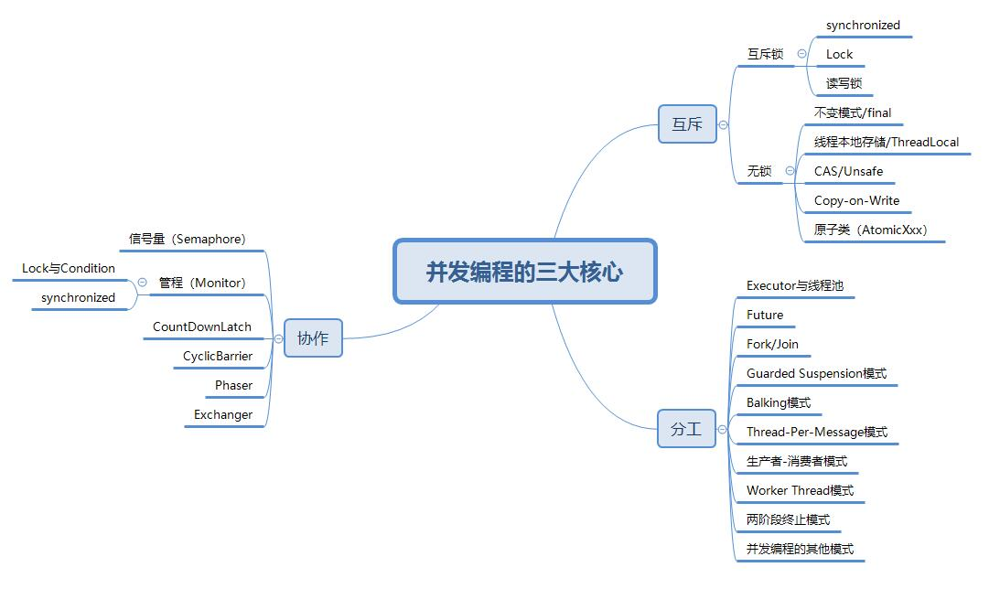

## 【高并发】ThreadLocal学会了这些，你也能和面试官扯皮了！

## 前言

我们都知道，在多线程环境下访问同一个共享变量，可能会出现线程安全的问题，为了保证线程安全，我们往往会在访问这个共享变量的时候加锁，以达到同步的效果，如下图所示。


对共享变量加锁虽然能够保证线程的安全，但是却增加了开发人员对锁的使用技能，如果锁使用不当，则会导致死锁的问题。而**ThreadLocal能够做到在创建变量后，每个线程对变量访问时访问的是线程自己的本地变量**。

## 什么是ThreadLocal？

> ThreadLocal是JDK提供的，支持线程本地变量。也就是说，如果我们创建了一个ThreadLocal变量，则访问这个变量的每个线程都会有这个变量的一个本地副本。如果多个线程同时对这个变量进行读写操作时，实际上操作的是线程自己本地内存中的变量，从而避免了线程安全的问题。


## ThreadLocal使用示例

例如，我们使用ThreadLocal保存并打印相关的变量信息，程序如下所示。

```java
public class ThreadLocalTest {

    private static ThreadLocal<String> threadLocal = new ThreadLocal<String>();

    public static void main(String[] args){
        //创建第一个线程
        Thread threadA = new Thread(()->{
            threadLocal.set("ThreadA：" + Thread.currentThread().getName());
            System.out.println("线程A本地变量中的值为：" + threadLocal.get());
        });
        //创建第二个线程
        Thread threadB = new Thread(()->{
            threadLocal.set("ThreadB：" + Thread.currentThread().getName());
            System.out.println("线程B本地变量中的值为：" + threadLocal.get());
        });
        //启动线程A和线程B
        threadA.start();
        threadB.start();
    }
}
```

运行程序，打印的结果信息如下所示。

```bash
线程A本地变量中的值为：ThreadA：Thread-0
线程B本地变量中的值为：ThreadB：Thread-1
```

此时，我们为线程A增加删除ThreadLocal中的变量的操作，如下所示。

```java
public class ThreadLocalTest {

    private static ThreadLocal<String> threadLocal = new ThreadLocal<String>();

    public static void main(String[] args){
        //创建第一个线程
        Thread threadA = new Thread(()->{
            threadLocal.set("ThreadA：" + Thread.currentThread().getName());
            System.out.println("线程A本地变量中的值为：" + threadLocal.get());
            threadLocal.remove();
            System.out.println("线程A删除本地变量后ThreadLocal中的值为：" + threadLocal.get());
        });
        //创建第二个线程
        Thread threadB = new Thread(()->{
            threadLocal.set("ThreadB：" + Thread.currentThread().getName());
            System.out.println("线程B本地变量中的值为：" + threadLocal.get());
            System.out.println("线程B没有删除本地变量：" + threadLocal.get());
        });
        //启动线程A和线程B
        threadA.start();
        threadB.start();
    }
}
```

此时的运行结果如下所示。

```bash
线程A本地变量中的值为：ThreadA：Thread-0
线程B本地变量中的值为：ThreadB：Thread-1
线程B没有删除本地变量：ThreadB：Thread-1
线程A删除本地变量后ThreadLocal中的值为：null
```

通过上述程序我们可以看出，**线程A和线程B存储在ThreadLocal中的变量互不干扰，线程A存储的变量只能由线程A访问，线程B存储的变量只能由线程B访问。**


## ThreadLocal原理

首先，我们看下Thread类的源码，如下所示。

```java
public class Thread implements Runnable {
    /***********省略N行代码*************/
    ThreadLocal.ThreadLocalMap threadLocals = null;
    ThreadLocal.ThreadLocalMap inheritableThreadLocals = null;
     /***********省略N行代码*************/
}
```

由Thread类的源码可以看出，在ThreadLocal类中存在成员变量threadLocals和inheritableThreadLocals，这两个成员变量都是ThreadLocalMap类型的变量，而且二者的初始值都为null。只有当前线程第一次调用ThreadLocal的set()方法或者get()方法时才会实例化变量。

这里需要注意的是：**每个线程的本地变量不是存放在ThreadLocal实例里面的，而是存放在调用线程的threadLocals变量里面的。**也就是说，调用ThreadLocal的set()方法存储的本地变量是存放在具体线程的内存空间中的，而ThreadLocal类只是提供了set()和get()方法来存储和读取本地变量的值，当调用ThreadLocal类的set()方法时，把要存储的值放入**调用线程**的threadLocals中存储起来，当调用ThreadLocal类的get()方法时，从当前线程的threadLocals变量中将存储的值取出来。

接下来，我们分析下ThreadLocal类的set()、get()和remove()方法的实现逻辑。

### set()方法

set()方法的源代码如下所示。

```java
public void set(T value) {
    //获取当前线程
    Thread t = Thread.currentThread();
    //以当前线程为Key，获取ThreadLocalMap对象
    ThreadLocalMap map = getMap(t);
    //获取的ThreadLocalMap对象不为空
    if (map != null)
        //设置value的值
        map.set(this, value);
    else
        //获取的ThreadLocalMap对象为空，创建Thread类中的threadLocals变量
        createMap(t, value);
}
```

在set()方法中，首先获取调用set()方法的线程，接下来，使用当前线程作为Key调用getMap(t)方法来获取ThreadLocalMap对象，getMap(Thread t)的方法源码如下所示。

```java
ThreadLocalMap getMap(Thread t) {
    return t.threadLocals;
}
```

可以看到，getMap(Thread t)方法获取的是线程变量自身的threadLocals成员变量。

在set()方法中，如果调用getMap(t)方法返回的对象不为空，则把value值设置到Thread类的threadLocals成员变量中，而传递的key为当前ThreadLocal的this对象，value就是通过set()方法传递的值。

如果调用getMap(t)方法返回的对象为空，则程序调用createMap(t, value)方法来实例化Thread类的threadLocals成员变量。

```java
void createMap(Thread t, T firstValue) {
    t.threadLocals = new ThreadLocalMap(this, firstValue);
}
```

也就是创建当前线程的threadLocals变量。

### get()方法

get()方法的源代码如下所示。

```java
public T get() {
    //获取当前线程
    Thread t = Thread.currentThread();
    //获取当前线程的threadLocals成员变量
    ThreadLocalMap map = getMap(t);
    //获取的threadLocals变量不为空
    if (map != null) {
        //返回本地变量对应的值
        ThreadLocalMap.Entry e = map.getEntry(this);
        if (e != null) {
            @SuppressWarnings("unchecked")
            T result = (T)e.value;
            return result;
        }
    }
    //初始化threadLocals成员变量的值
    return setInitialValue();
}
```

通过当前线程来获取threadLocals成员变量，如果threadLocals成员变量不为空，则直接返回当前线程绑定的本地变量，否则调用setInitialValue()方法初始化threadLocals成员变量的值。

```java
private T setInitialValue() {
    //调用初始化Value的方法
    T value = initialValue();
    Thread t = Thread.currentThread();
    //根据当前线程获取threadLocals成员变量
    ThreadLocalMap map = getMap(t);
    if (map != null)
        //threadLocals不为空，则设置value值
        map.set(this, value);
    else
        //threadLocals为空,创建threadLocals变量
        createMap(t, value);
    return value;
}
```

其中，initialValue()方法的源码如下所示。

```java
protected T initialValue() {
    return null;
}
```

通过initialValue()方法的源码可以看出，这个方法可以由子类覆写，在ThreadLocal类中，这个方法直接返回null。

### remove()方法

remove()方法的源代码如下所示。

```java
public void remove() {
    //根据当前线程获取threadLocals成员变量
    ThreadLocalMap m = getMap(Thread.currentThread());
    if (m != null)
        //threadLocals成员变量不为空，则移除value值
        m.remove(this);
}
```

remove()方法的实现比较简单，首先根据当前线程获取threadLocals成员变量，不为空，则直接移除value的值。

**注意：如果调用线程一致不终止，则本地变量会一直存放在调用线程的threadLocals成员变量中，所以，如果不需要使用本地变量时，可以通过调用ThreadLocal的remove()方法，将本地变量从当前线程的threadLocals成员变量中删除，以免出现内存溢出的问题。**


## ThreadLocal变量不具有传递性

> 使用ThreadLocal存储本地变量不具有传递性，也就是说，同一个ThreadLocal在父线程中设置值后，在子线程中是无法获取到这个值的，这个现象说明ThreadLocal中存储的本地变量不具有传递性。

接下来，我们来看一段代码，如下所示。

```java
public class ThreadLocalTest {

    private static ThreadLocal<String> threadLocal = new ThreadLocal<String>();

    public static void main(String[] args){
        //在主线程中设置值
        threadLocal.set("ThreadLocalTest");
        //在子线程中获取值
        Thread thread = new Thread(new Runnable() {
            @Override
            public void run() {
                System.out.println("子线程获取值：" + threadLocal.get());
            }
        });
        //启动子线程
        thread.start();
        //在主线程中获取值
        System.out.println("主线程获取值：" + threadLocal.get());
    }
}
```

运行这段代码输出的结果信息如下所示。

```bash
主线程获取值：ThreadLocalTest
子线程获取值：null
```

通过上述程序，我们可以看出在主线程中向ThreadLocal设置值后，在子线程中是无法获取到这个值的。**那有没有办法在子线程中获取到主线程设置的值呢？此时，我们可以使用InheritableThreadLocal来解决这个问题。**

## InheritableThreadLocal使用示例

InheritableThreadLocal类继承自ThreadLocal类，它能够让子线程访问到在父线程中设置的本地变量的值，例如，我们将ThreadLocalTest类中的threadLocal静态变量改写成InheritableThreadLocal类的实例，如下所示。

```java
public class ThreadLocalTest {

    private static ThreadLocal<String> threadLocal = new InheritableThreadLocal<String>();

    public static void main(String[] args){
        //在主线程中设置值
        threadLocal.set("ThreadLocalTest");
        //在子线程中获取值
        Thread thread = new Thread(new Runnable() {
            @Override
            public void run() {
                System.out.println("子线程获取值：" + threadLocal.get());
            }
        });
        //启动子线程
        thread.start();
        //在主线程中获取值
        System.out.println("主线程获取值：" + threadLocal.get());
    }
}
```

此时，运行程序输出的结果信息如下所示。

```java
主线程获取值：ThreadLocalTest
子线程获取值：ThreadLocalTest
```

可以看到，**使用InheritableThreadLocal类存储本地变量时，子线程能够获取到父线程中设置的本地变量。**


## InheritableThreadLocal原理

首先，我们来看下InheritableThreadLocal类的源码，如下所示。

```java
public class InheritableThreadLocal<T> extends ThreadLocal<T> {
    protected T childValue(T parentValue) {
        return parentValue;
    }

    ThreadLocalMap getMap(Thread t) {
       return t.inheritableThreadLocals;
    }

    void createMap(Thread t, T firstValue) {
        t.inheritableThreadLocals = new ThreadLocalMap(this, firstValue);
    }
}
```

由InheritableThreadLocal类的源代码可知，InheritableThreadLocal类继承自ThreadLocal类，并且重写了ThreadLocal类的childValue()方法、getMap()方法和createMap()方法。也就是说，当调用ThreadLocal的set()方法时，创建的是当前Thread线程的inheritableThreadLocals成员变量而不再是threadLocals成员变量。

这里，**我们需要思考一个问题：InheritableThreadLocal类的childValue()方法是何时被调用的呢？**这就需要我们来看下Thread类的构造方法了，如下所示。

```java
public Thread() {
     init(null, null, "Thread-" + nextThreadNum(), 0);
 }

public Thread(Runnable target) {
    init(null, target, "Thread-" + nextThreadNum(), 0);
}

Thread(Runnable target, AccessControlContext acc) {
    init(null, target, "Thread-" + nextThreadNum(), 0, acc, false);
}

public Thread(ThreadGroup group, Runnable target) {
    init(group, target, "Thread-" + nextThreadNum(), 0);
}

public Thread(String name) {
    init(null, null, name, 0);
}

public Thread(ThreadGroup group, String name) {
    init(group, null, name, 0);
}

public Thread(Runnable target, String name) {
    init(null, target, name, 0);
}

public Thread(ThreadGroup group, Runnable target, String name) {
    init(group, target, name, 0);
}

public Thread(ThreadGroup group, Runnable target, String name,
              long stackSize) {
    init(group, target, name, stackSize);
}
```

可以看到，Thread类的构造方法最终调用的是init()方法，那我们就来看下init()方法，如下所示。

```java
private void init(ThreadGroup g, Runnable target, String name,
                      long stackSize, AccessControlContext acc,
                      boolean inheritThreadLocals) {
       /************省略部分源码************/
        if (inheritThreadLocals && parent.inheritableThreadLocals != null)
            this.inheritableThreadLocals =
                ThreadLocal.createInheritedMap(parent.inheritableThreadLocals);
        /* Stash the specified stack size in case the VM cares */
        this.stackSize = stackSize;

        /* Set thread ID */
        tid = nextThreadID();
    }
```

可以看到，在init()方法中会判断传递的inheritThreadLocals变量是否为true，同时父线程中的inheritableThreadLocals是否为null，如果传递的inheritThreadLocals变量为true，同时，父线程中的inheritableThreadLocals不为null，则调用ThreadLocal类的createInheritedMap()方法。

```java
static ThreadLocalMap createInheritedMap(ThreadLocalMap parentMap) {
    return new ThreadLocalMap(parentMap);
}
```

在createInheritedMap()中，使用父线程的inheritableThreadLocals变量作为参数创建新的ThreadLocalMap对象。然后在Thread类的init()方法中会将这个ThreadLocalMap对象赋值给子线程的inheritableThreadLocals成员变量。

接下来，我们来看看ThreadLocalMap的构造函数都干了啥，如下所示。

```java
private ThreadLocalMap(ThreadLocalMap parentMap) {
    Entry[] parentTable = parentMap.table;
    int len = parentTable.length;
    setThreshold(len);
    table = new Entry[len];

    for (int j = 0; j < len; j++) {
        Entry e = parentTable[j];
        if (e != null) {
            @SuppressWarnings("unchecked")
            ThreadLocal<Object> key = (ThreadLocal<Object>) e.get();
            if (key != null) {
                //调用重写的childValue方法
                Object value = key.childValue(e.value);
                Entry c = new Entry(key, value);
                int h = key.threadLocalHashCode & (len - 1);
                while (table[h] != null)
                    h = nextIndex(h, len);
                table[h] = c;
                size++;
            }
        }
    }
}
```

在ThreadLocalMap的构造函数中，调用了InheritableThreadLocal类重写的childValue()方法。而InheritableThreadLocal类通过重写getMap()方法和createMap()方法，让本地变量保存到了Thread线程的inheritableThreadLocals变量中，线程通过InheritableThreadLocal类的set()方法和get()方法设置变量时，就会创建当前线程的inheritableThreadLocals变量。此时，如果父线程创建子线程，在Thread类的构造函数中会把父线程中的inheritableThreadLocals变量里面的本地变量复制一份保存到子线程的inheritableThreadLocals变量中。

> 如果觉得文章对你有点帮助，请微信搜索并关注「 **冰河技术** 」微信公众号，跟冰河学习高并发编程技术。

最后，附上并发编程需要掌握的核心技能知识图，祝大家在学习并发编程时，少走弯路。

