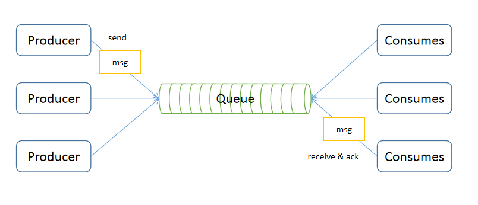
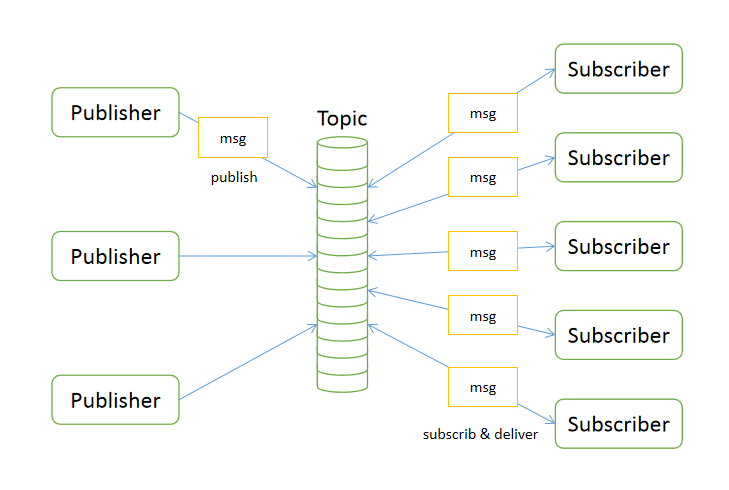

## 【高并发】为何高并发系统中都要使用消息队列？这次彻底懂了！

## 写在前面

> 很多高并发系统中都会使用到消息队列中间件，那么，问题来了，为什么在高并发系统中都会使用到消息队列中间件呢？立志成为资深架构师的你思考过这个问题吗？
>
> 本文集结了众多技术大牛的编程思想，由冰河汇聚并整理而成，在此，感谢那些在技术发展道理上默默付出的前辈们！
>
> 本文已收录到：[https://github.com/sunshinelyz/technology-binghe](https://github.com/sunshinelyz/technology-binghe) 和 [https://gitee.com/binghe001/technology-binghe](https://gitee.com/binghe001/technology-binghe)

## 场景分析

现在假设这样一个场景，用户下单成功需要给用户发短信，如果没有消息队列，我们会选择同步调用发短信的接口并等待短信发送成功。现在假设短信接口实现出现了问题或者短信发送短时间内达到了上限，这个时候是选择重试几次还是放弃发送呢？这里的设计会很复杂。如果使用了消息队列，我们选择将发短信的操作封装成一条消息发送到消息队列，消息队列通知一个服务去发送一条短信，即使出现了上述的问题，可以选择把消息重新放到消息队列里等待处理。

## 消息队列的好处

通过上述了例子，我们看到消息队列完成了一个异步解耦的过程，短信发送时我们只要保证短信发到消息队列成功就可以了，接下来就可以去做别的事情；其次，设计变得更简单，在下单的场景下，我们不用过多考虑发送短信的问题，交给消息队列管理就行了，可能短信发送会有延迟，但是保证了**最终的一致性。**

## 消息队列特性

* 业务无关，只做消息分发。
* FIFO，先投递先到达。
* 容灾：节点动态增删和消息持久化。
* 性能：吞吐量提升，系统内部通信效率提高

## 消息队列两种模式

### 点对点模式

点对点模型用于消息生产者和消息消费者之间点到点的通信。

### Pub/Sub发布订阅模式

多个发布者将消息发送到Topic，系统将这些消息传递给多个订阅者。

## 高并发系统为何使用消息队列？

**（1）业务解耦**

成功完成了一个异步解耦的过程。短信发送时只要保证放到消息队列中就可以了，接着做后面的事情就行。一个事务只关心本质的流程，需要依赖其他事情但是不那么重要的时候，有通知即可，无需等待结果。每个成员不必受其他成员影响，可以更独立自主，只通过一个简单的容器来联系。

对于我们的订单系统，订单最终支付成功之后可能需要给用户发送短信积分什么的，但其实这已经不是我们系统的核心流程了。如果外部系统速度偏慢（比如短信网关速度不好），那么主流程的时间会加长很多，用户肯定不希望点击支付过好几分钟才看到结果。那么我们只需要通知短信系统“我们支付成功了”，不一定非要等待它处理完成。

**（2）最终一致性**

主要是用记录和补偿的方式来处理；在做所有的不确定事情之前，先把事情记录下来，然后去做不确定的事，它的结果通常分为三种：成功，失败或者不确定；如果成功，我们就可以把记录的东西清理掉，对于失败和不确定，我们可以采用定时任务的方式把所有失败的事情重新做一遍直到成功为止。

保证了最终一致性，通过在队列中存放任务保证它最终一定会执行。

最终一致性指的是两个系统的状态保持一致，要么都成功，要么都失败。当然有个时间限制，理论上越快越好，但实际上在各种异常的情况下，可能会有一定延迟达到最终一致状态，但最后两个系统的状态是一样的。
业界有一些为“最终一致性”而生的消息队列，如Notify（阿里）、QMQ（去哪儿）等，其设计初衷，就是为了交易系统中的高可靠通知。

以一个银行的转账过程来理解最终一致性，转账的需求很简单，如果A系统扣钱成功，则B系统加钱一定成功。反之则一起回滚，像什么都没发生一样。

然而，这个过程中存在很多可能的意外：

* A扣钱成功，调用B加钱接口失败。

* A扣钱成功，调用B加钱接口虽然成功，但获取最终结果时网络异常引起超时。

* A扣钱成功，B加钱失败，A想回滚扣的钱，但A机器down机。

可见，想把这件看似简单的事真正做成，真的不那么容易。所有跨JVM的一致性问题，从技术的角度讲通用的解决方案是：

* 强一致性，分布式事务，但落地太难且成本太高。

* 最终一致性，主要是用“记录”和“补偿”的方式。在做所有的不确定的事情之前，先把事情记录下来，然后去做不确定的事情，结果可能是：成功、失败或是不确定，“不确定”（例如超时等）可以等价为失败。成功就可以把记录的东西清理掉了，对于失败和不确定，可以依靠定时任务等方式把所有失败的事情重新搞一遍，直到成功为止。

回到刚才的例子，系统在A扣钱成功的情况下，把要给B“通知”这件事记录在库里（为了保证最高的可靠性可以把通知B系统加钱和扣钱成功这两件事维护在一个本地事务里），通知成功则删除这条记录，通知失败或不确定则依靠定时任务补偿性地通知我们，直到我们把状态更新成正确的为止。

**消息可能重复，注意消息的重复和幂等。**

**（3）广播**

如果没有消息队列，每当一个新的业务接入时，我们都需要连接一个新接口；有了消息队列，我们只需要关系消息是否送到到消息队列，新接入的接口订阅相关的消息，自己去做处理就行了。

**（4）错峰与流控**

利用消息队列，转储两个系统的通信内容，并在下游系统有能力处理这些消息的时候再处理这些消息。试想上下游对于事情的处理能力是不同的。比如，Web前端每秒承受上千万的请求，并不是什么神奇的事情，只需要加多一点机器，再搭建一些LVS负载均衡设备和Nginx等即可。但数据库的处理能力却十分有限，即使使用SSD加分库分表，单机的处理能力仍然在万级。由于成本的考虑，我们不能奢求数据库的机器数量追上前端。

这种问题同样存在于系统和系统之间，如短信系统可能由于短板效应，速度卡在网关上（每秒几百次请求），跟前端的并发量不是一个数量级。但用户晚上个半分钟左右收到短信，一般是不会有太大问题的。如果没有消息队列，两个系统之间通过协商、滑动窗口等复杂的方案也不是说不能实现。但系统复杂性指数级增长，势必在上游或者下游做存储，并且要处理定时、拥塞等一系列问题。而且每当有处理能力有差距的时候，都需要单独开发一套逻辑来维护这套逻辑。所以，利用中间系统转储两个系统的通信内容，并在下游系统有能力处理这些消息的时候，再处理这些消息，是一套相对较通用的方式。

## 实现分布式事务

在上一篇《[12张图带你彻底理解分布式事务产生的场景和解决方案！！](https://mp.weixin.qq.com/s?__biz=Mzg4MjU0OTM1OA==&mid=2247489572&idx=1&sn=283f24189f3add773ffa2f8a314ac8d1&chksm=cf55af25f822263342c3d67490d803b1de9a7199ee765c8614f7dda90441480877d2af02c8ef&token=739666743&lang=zh_CN#rd)》中，有小伙伴留言说要案例demo，这里，我就把我开源的基于最终消息一致性的分布式事务框架mykit-transaction-message的地址发出来，框架中有很完善的demo示例。mykit-transaction-message是基于猫大人写的myth框架演化而来，站在巨人的肩膀上才能看的更远！！小伙伴们要讲武德呀，不要白嫖，记得在github和gitee上给个Star。有啥想说的可以在文末留言吐槽！！

github：[https://github.com/sunshinelyz/mykit-transaction-message](https://github.com/sunshinelyz/mykit-transaction-message)
gitee：[https://gitee.com/binghe001/mykit-transaction-message](https://gitee.com/binghe001/mykit-transaction-message)

## 总结

**总而言之，消息队列不是万能的。对于需要强事务保证而且延迟敏感的，RPC是优于消息队列的。**

对于一些无关痛痒，或者对于别人非常重要但是对于自己不是那么关心的事情，可以利用消息队列去做。

支持最终一致性的消息队列，能够用来处理延迟不那么敏感的“分布式事务”场景，而且相对于笨重的分布式事务，可能是更优的处理方式。

当上下游系统处理能力存在差距的时候，利用消息队列做一个通用的“漏斗”。在下游有能力处理的时候，再进行分发。
如果下游有很多系统关心你的系统发出的通知的时候，果断地使用消息队列吧。

## 冰河原创PDF

关注 **冰河技术** 微信公众号：

回复 “**并发编程**” 领取《深入理解高并发编程（第1版）》PDF文档。

回复 “**并发源码**” 领取《并发编程核心知识（源码分析篇 第1版）》PDF文档。

回复 ”**限流**“ 领取《亿级流量下的分布式解决方案》PDF文档。

回复 “**设计模式**” 领取《深入浅出Java23种设计模式》PDF文档。

回复 “**Java8新特性**” 领取 《Java8新特性教程》PDF文档。

回复 “**分布式存储**” 领取《跟冰河学习分布式存储技术》 PDF文档。

回复 “**Nginx**” 领取《跟冰河学习Nginx技术》PDF文档。

回复 “**互联网工程**” 领取《跟冰河学习互联网工程技术》PDF文档。

## 重磅福利

微信搜一搜【冰河技术】微信公众号，关注这个有深度的程序员，每天阅读超硬核技术干货，公众号内回复【PDF】有我准备的一线大厂面试资料和我原创的超硬核PDF技术文档，以及我为大家精心准备的多套简历模板（不断更新中），希望大家都能找到心仪的工作，学习是一条时而郁郁寡欢，时而开怀大笑的路，加油。如果你通过努力成功进入到了心仪的公司，一定不要懈怠放松，职场成长和新技术学习一样，不进则退。如果有幸我们江湖再见！       

另外，我开源的各个PDF，后续我都会持续更新和维护，感谢大家长期以来对冰河的支持！！

## 写在最后

> 如果你觉得冰河写的还不错，请微信搜索并关注「 **冰河技术** 」微信公众号，跟冰河学习高并发、分布式、微服务、大数据、互联网和云原生技术，「 **冰河技术** 」微信公众号更新了大量技术专题，每一篇技术文章干货满满！不少读者已经通过阅读「 **冰河技术** 」微信公众号文章，吊打面试官，成功跳槽到大厂；也有不少读者实现了技术上的飞跃，成为公司的技术骨干！如果你也想像他们一样提升自己的能力，实现技术能力的飞跃，进大厂，升职加薪，那就关注「 **冰河技术** 」微信公众号吧，每天更新超硬核技术干货，让你对如何提升技术能力不再迷茫！

