## 【高并发】工作了3年的程序员小菜面试高并发岗位被吊打虐哭。。。

## 写在前面

程序员小菜是一家互联网公司的开发人员，主要负责后端Java技术开发，平时的工作中以CRUD为主。从刚毕业来到公司，一转眼3年过去了，小菜突然觉得在这家公司工作没啥意思了，整天做CRUD的工作没啥挑战。于是，小菜童鞋优化了下自己的简历，并在网上投递了自己的简历，不一会，一个电话打过来，对方传来一个软萌妹纸的声音。

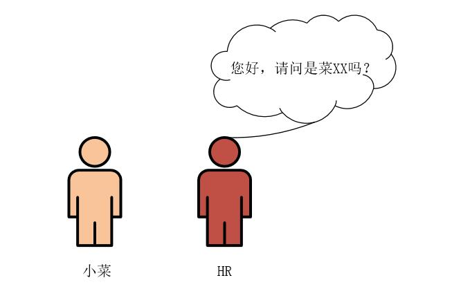

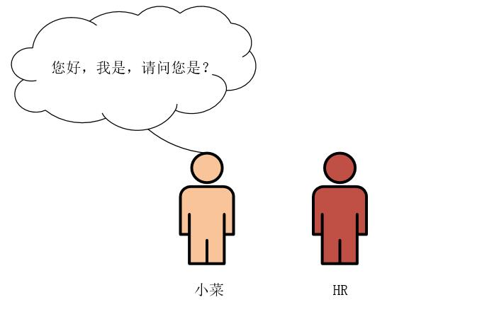

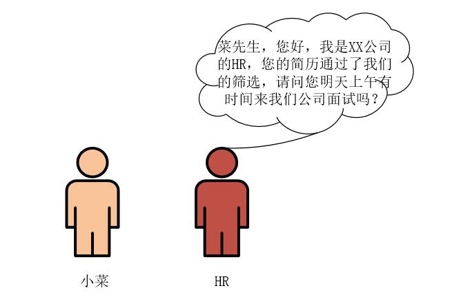

小菜心中一阵狂喜！！！

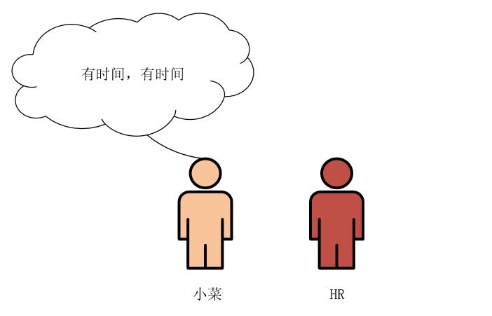

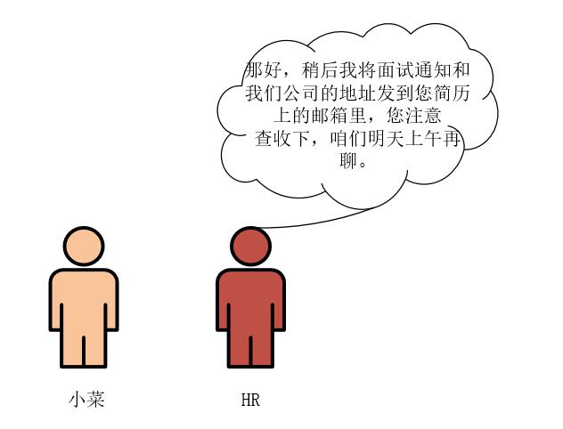

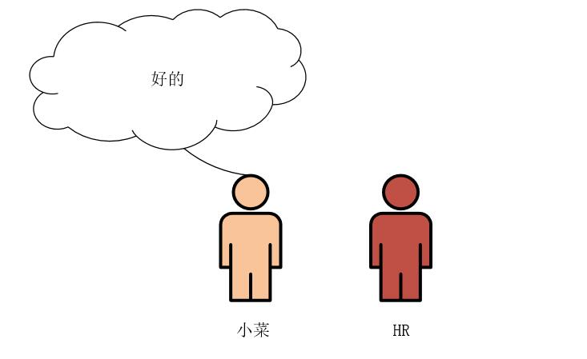

。。。嘟嘟嘟，电话已挂掉。。。

小菜童鞋心中一阵狂喜，并果断向部门领导请了一天假，信心满满的去面试了。

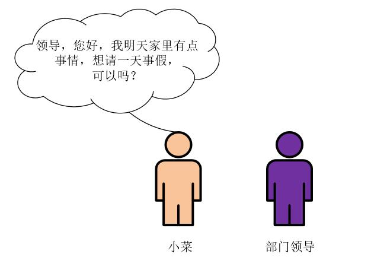

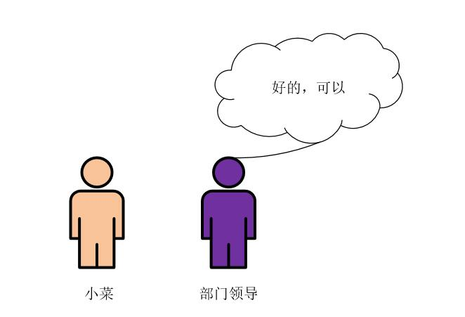

## 面试经过

小菜按时来到了XX公司，迎接他的正式昨天打电话通知他来面试的HR妹纸。

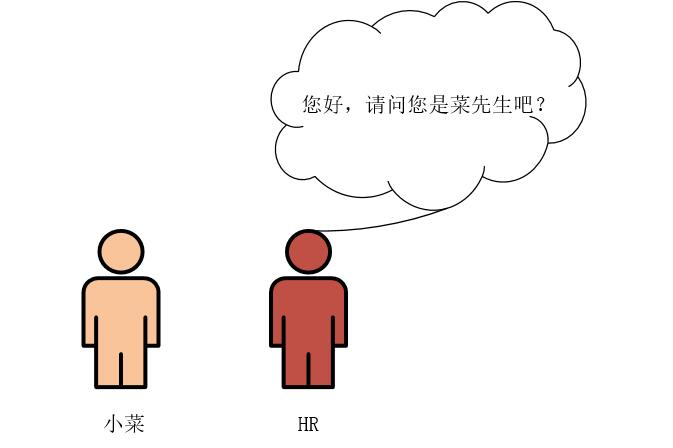

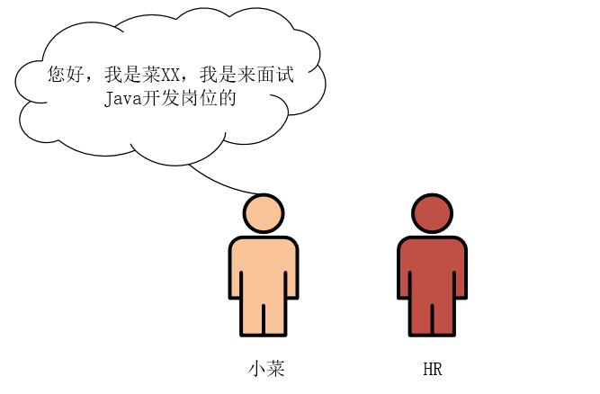

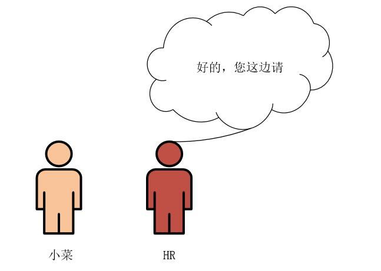

小菜被带进了部门经理的办公室，一进门，小菜就看见办公桌对面坐着一个"地中海式"发型的大牛，一看就是大神级别的啊！头发都没了，脑门油光油光的！部门经理冲小菜笑了笑。

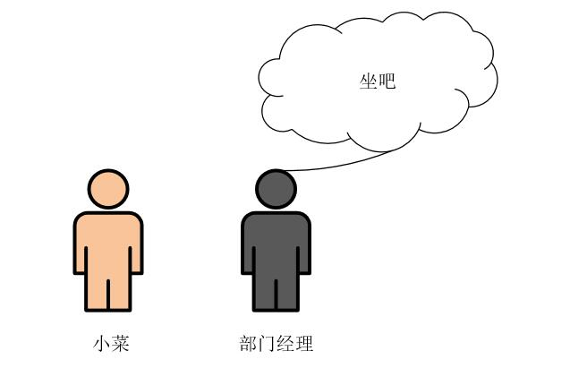

面对这样的大神，此时的小菜心里还是有点紧张的，小菜在部门经理的对面坐了下来，并双手递上了自己的简历。

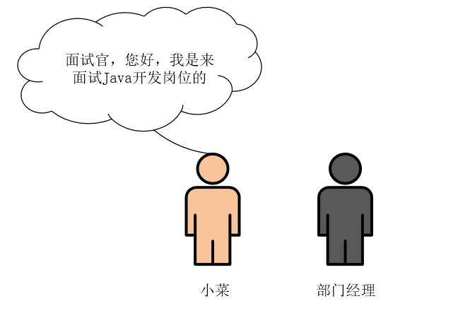

部门经理结果简历，边看边说。

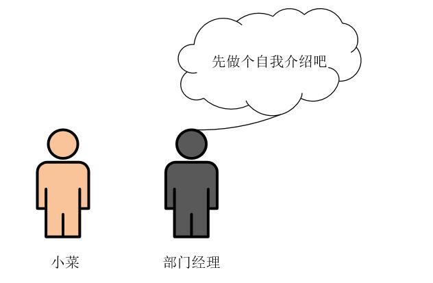

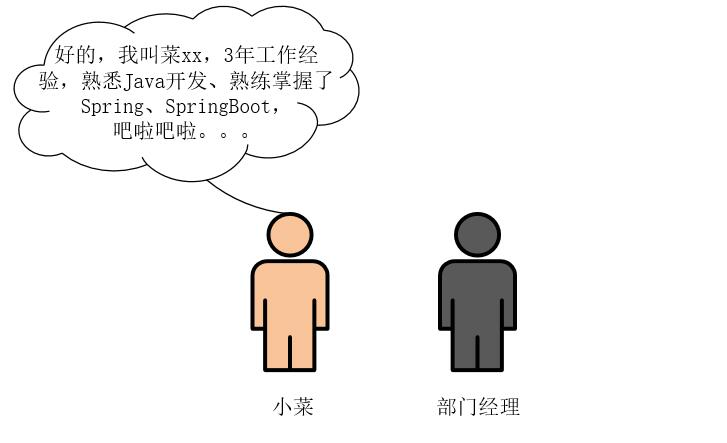

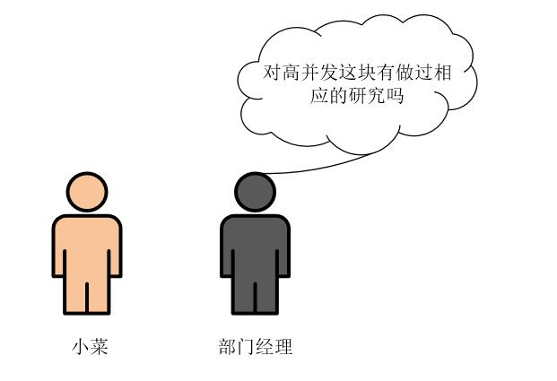

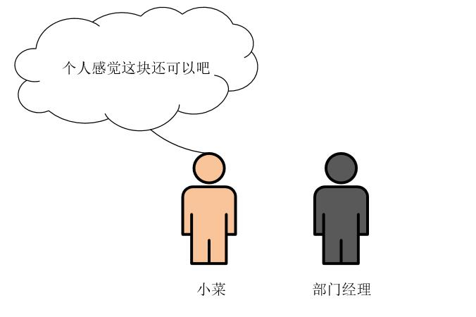

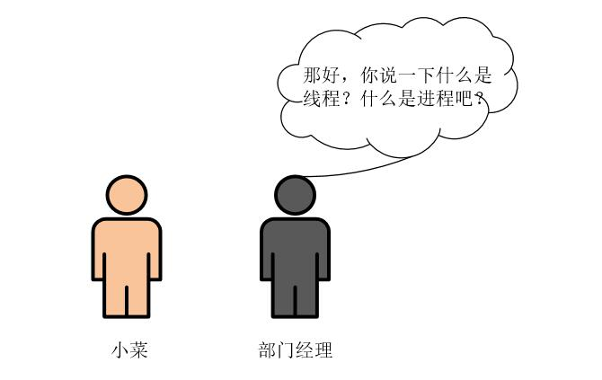

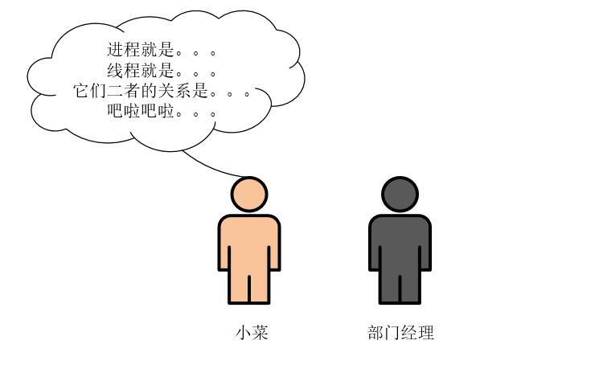

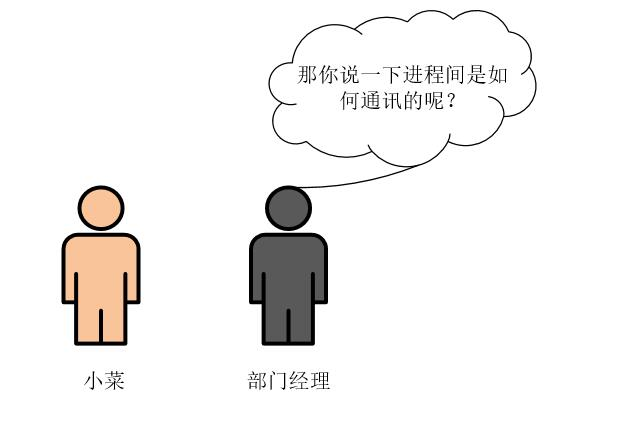

小菜一听，完了，这个根本就不知道啊。。。

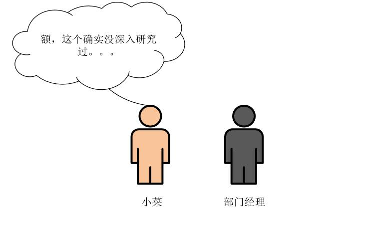

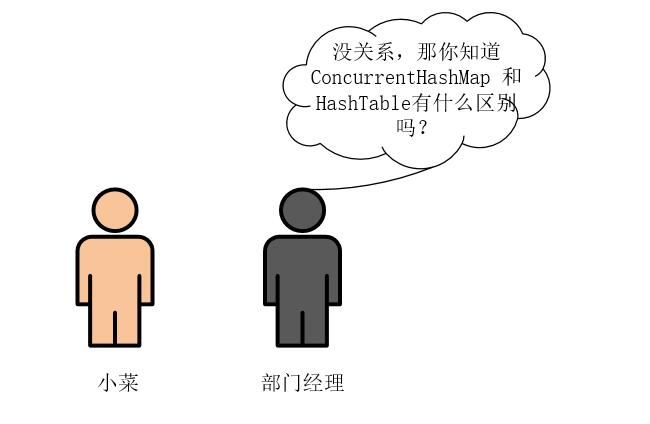

小菜心里有点慌。。。

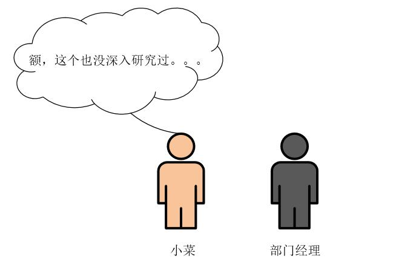

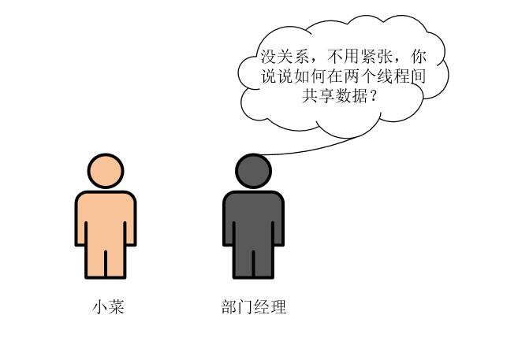

小菜感觉自己脑门开始冒汗了。。。

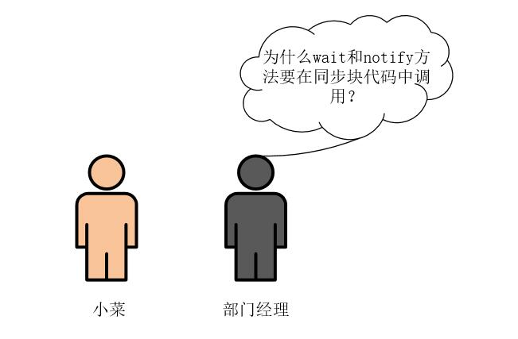

小菜俨然一脸懵逼。。。

此时，部门经理抬起头，笑着对小菜说。

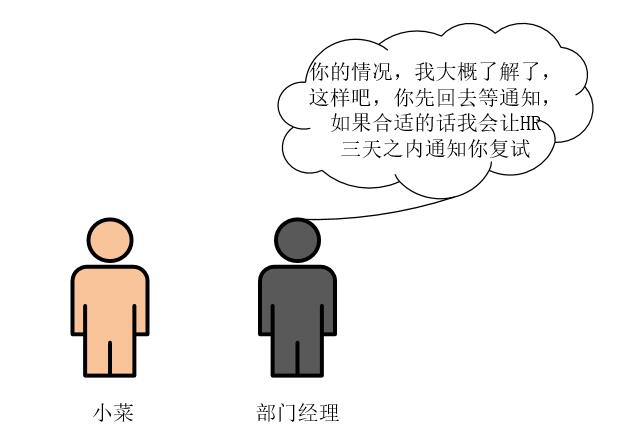

小菜一听就知道这次面试肯定是黄了，问的问题自己啥都不会，心里很不是个滋味！简直是欲哭无泪啊！小菜从座位上起来，走出办公室，径直走出了这家公司。在回去的路上，小菜心情沉重，想想十几分钟之前，还信心满满的过来面试，没想到Java并发编程会涉及到这么多的知识，自己在工作中完全没接触到啊！

此时，小菜突然想起来自己的好朋友——大冰，一个工作经验丰富的大神级别的人物，小菜决定要跟他学习高并发编程的知识！努力提升自己的编程技能！从此，小菜踏上了高并发学习的道路。

## 总结

并发编程一直是让人很头疼的事情，很多人总觉得自己似乎掌握了并发编程的知识，就像文中的小菜那样，信心满满的去面试，却被面试官吊打虐哭。所以，并发编程需要我们静下心来，认真研读每一个知识点，将每个知识点研究透彻，由点到线，再由线连成面，形成自己的知识体系。深入掌握并发编程的技能之后，到时候，就是你吊打面试官了！

> 如果觉得文章对你有点帮助，请微信搜索并关注「 **冰河技术** 」微信公众号，跟冰河学习高并发编程技术。

最后，附上并发编程需要掌握的核心技能知识图，祝大家在学习并发编程时，少走弯路。

## 写在最后

> 如果你觉得冰河写的还不错，请微信搜索并关注「 **冰河技术** 」微信公众号，跟冰河学习高并发、分布式、微服务、大数据、互联网和云原生技术，「 **冰河技术** 」微信公众号更新了大量技术专题，每一篇技术文章干货满满！不少读者已经通过阅读「 **冰河技术** 」微信公众号文章，吊打面试官，成功跳槽到大厂；也有不少读者实现了技术上的飞跃，成为公司的技术骨干！如果你也想像他们一样提升自己的能力，实现技术能力的飞跃，进大厂，升职加薪，那就关注「 **冰河技术** 」微信公众号吧，每天更新超硬核技术干货，让你对如何提升技术能力不再迷茫！

