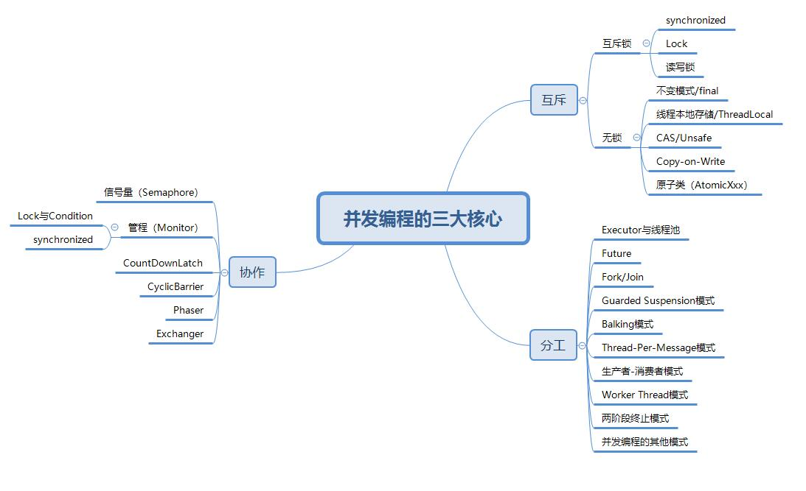

## 【高并发】高并发环境下如何优化Tomcat配置？看完我懂了！

## 写在前面

> Tomcat作为最常用的Java Web服务器，随着并发量越来越高，Tomcat的性能会急剧下降，那有没有什么方法来优化Tomcat在高并发环境下的性能呢？

## Tomcat运行模式

**Tomcat的运行模式有3种。**

**1.bio模式**

默认的模式,性能非常低下,没有经过任何优化处理和支持。

**2.nio模式**

利用java的异步io护理技术,noblocking IO技术。要想运行在该模式下，则直接修改server.xml里的Connector节点,修改protocol为如下配置。

```properties
protocol="org.apache.coyote.http11.Http11NioProtocol"
```

重启Tomcat后，就可以生效。

**3.apr模式**

安装起来最困难,但是从操作系统级别来解决异步的IO问题,大幅度的提高性能。此种模式下，必须要安装apr和native，直接启动就支持apr。如nio修改模式，修改protocol为org.apache.coyote.http11.Http11AprProtocol，如下所示。

```properties
protocol="org.apache.coyote.http11.Http11AprProtocol"
```

## Tomcat并发优化

### 安装APR

```bash
[root@binghe ~]# yum -y install apr apr-devel openssl-devel
[root@binghe ~]# tar zxvf tomcat-native.tar.gz
[root@binghe ~]# cd tomcat-native-1.1.24-src/jni/native
[root@binghe native]# ./configure --with-apr=/usr/bin/apr-1-config --with-ssl=/usr/include/openssl/
[root@binghe native]# make && make install
```

安装完成之后 会出现如下提示信息

```bash
Libraries have been installed in:
/usr/local/apr/lib
```

安装成功后还需要对tomcat设置环境变量，方法是在catalina.sh文件中增加1行：

在这段代码下面添加：

```bash
# OS specific support.  $var _must_ be set to either true or false.
cygwin=false
darwin=false
==============
CATALINA_OPTS=”-Djava.library.path=/usr/local/apr/lib”
```

修改server.xml的配置，如下所示。

```properties
protocol=”org.apache.coyote.http11.Http11AprProtocol”
```

启动tomcat之后，查看日志，如下所示。

```bash
more TOMCAT_HOME/logs/catalina.out
2020-04-17 22:34:56 org.apache.catalina.core.AprLifecycleListener init
INFO: Loaded APR based Apache Tomcat Native library 1.1.31 using APR version 1.3.9.
2020-04-17 22:34:56 org.apache.catalina.core.AprLifecycleListener init
INFO: APR capabilities: IPv6 [true], sendfile [true], accept filters [false], random [true].
2020-04-17 22:34:56 org.apache.catalina.core.AprLifecycleListener initializeSSL
INFO: OpenSSL successfully initialized (OpenSSL 1.0.1e 11 Feb 2013)
2020-04-17 22:34:58 AM org.apache.coyote.AbstractProtocol init
INFO: Initializing ProtocolHandler [“http-apr-8080”]
2020-04-17 22:34:58 AM org.apache.coyote.AbstractProtocol init
INFO: Initializing ProtocolHandler [“ajp-apr-8009”]
2020-04-17 22:34:58 AM org.apache.catalina.startup.Catalina load
INFO: Initialization processed in 1125 ms
```

### Tomcat优化

**1.JVM 调优**

在TOMCAT_HOME/bin/catalina.sh 增加如下语句，具体数值视情况而定。
添加到上面CATALINA_OPTS的后面即可，如下所示。

```bash
JAVA_OPTS=-Xms512m -Xmx1024m -XX:PermSize=512M -XX:MaxNewSize=1024m -XX:MaxPermSize=1024m
```

参数详解

* -Xms：JVM初始化堆内存大小。

* -Xmx：JVM堆的最大内存。

* -Xss：线程栈大小。

* -XX:PermSize：JVM非堆区初始内存分配大小。

* -XX:MaxPermSize：JVM非堆区最大内存。

**建议和注意事项:**

-Xms和-Xmx选项设置为相同堆内存分配，以避免在每次GC 后调整堆的大小，堆内存建议占内存的60%~80%；非堆内存是不可回收内存，大小视项目而定;线程栈大小推荐256k。

**32G内存配置如下：**

```bash
JAVA_OPTS=-Xms20480m -Xmx20480m -Xss1024K -XX:PermSize=512m -XX:MaxPermSize=2048m
```

**2.关闭DNS反向查询**

在<Connector port=”8080″ 中加入如下参数。

```properties
enableLookups=”false”
```

**3.优化tomcat参数**

在server.xml文件中进行如下配置。

```xml
<Connector port=”8080″
protocol=”org.apache.coyote.http11.Http11AprProtocol”
connectionTimeout=”20000″ //链接超时时长
redirectPort=”8443″
maxThreads=”500″//设定处理客户请求的线程的最大数目，决定了服务器可以同时响应客户请求的数,默认200
minSpareThreads=”20″//初始化线程数，最小空闲线程数，默认为10
acceptCount=”1000″ //当所有可以使用的处理请求的线程数都被使用时，可以被放到处理队列中请求数，请求数超过这个数的请求将不予处理，默认100
enableLookups=”false”
URIEncoding=”UTF-8″ />
```

## 写在最后

> 如果觉得文章对你有点帮助，请微信搜索并关注「 **冰河技术** 」微信公众号，跟冰河学习高并发编程技术。

最后，附上并发编程需要掌握的核心技能知识图，祝大家在学习并发编程时，少走弯路。

